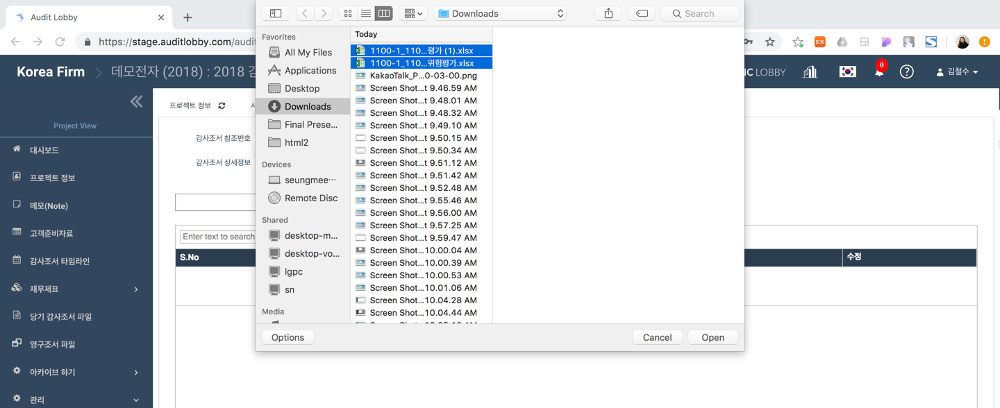
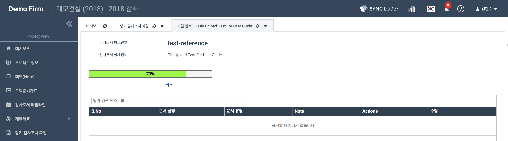
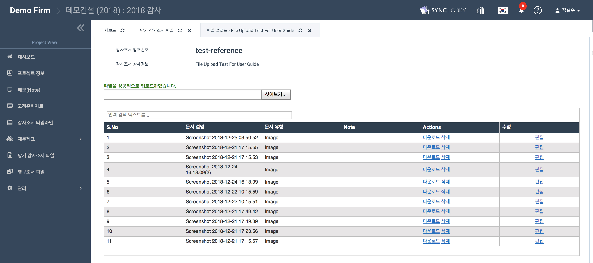
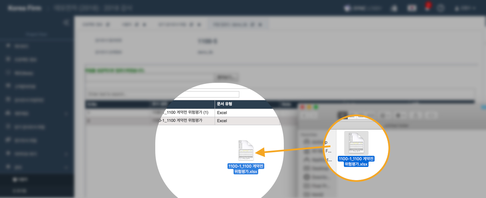

# 2-2-3. 첨부파일 업로드 하기

1. 업로드할 파일들을 준비합니다. 

2. 프로젝트 화면\(Project View\) 의 화면 왼쪽 메뉴 목록에서 '당기 감사조서 파일'을 선택합니다. 

3. '당기 감사조서 파일' 화면에서 파일을 업로드할 폴더를 선택하여 열어줍니다.

4. 폴더명 우측의 문서 모양 아이콘을 클릭합니다.

5. 팝업창 상단의 '**새로운 파일**'을 선택합니다. 

6. 감사조서 유형을 **'파일 업로드'**로 선택합니다.

7. 감사조서 이름과 참조번호를 입력합니다.

8. 다음과 같은 '**파일 업로드**' 화면이 나타납니다. 

8-1. '**찾아보기**' 버튼을 눌러서 원하는 파일을 업로드합니다.\(다중 파일 업로드 가능\)

9. 드래그 앤 드랍을 통해서도 파일을 업로드 할 수 있습니다. 

