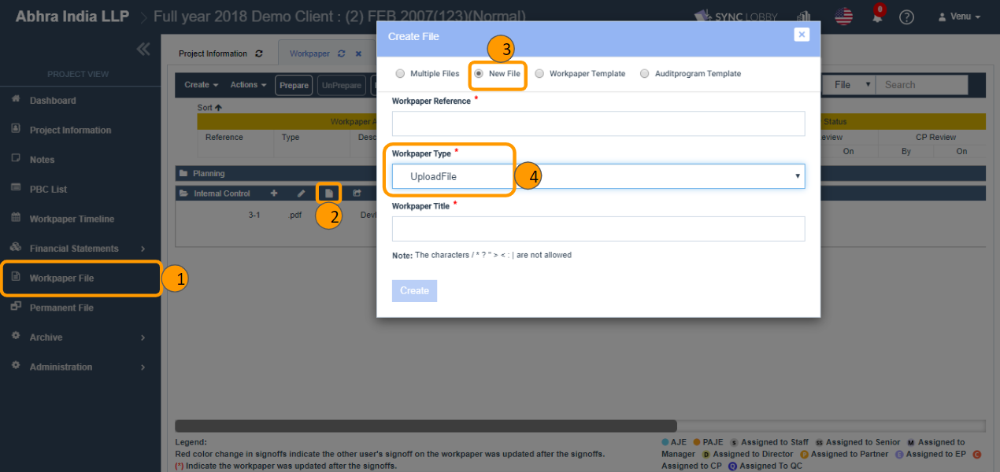
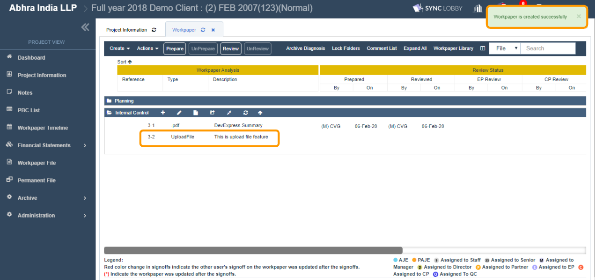
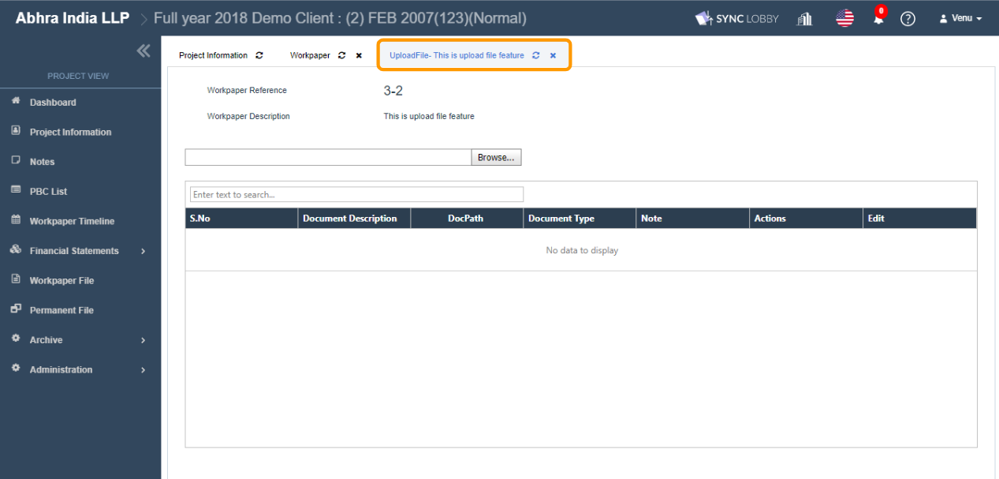
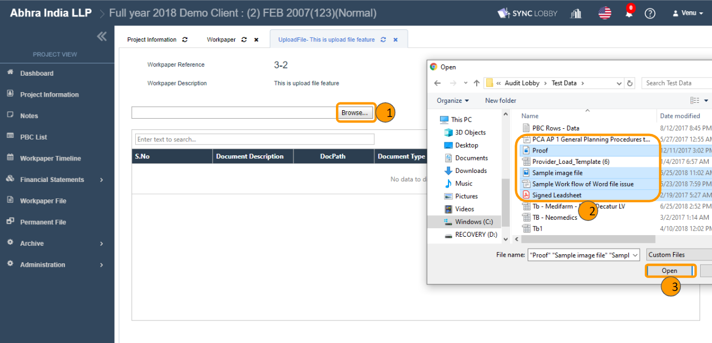
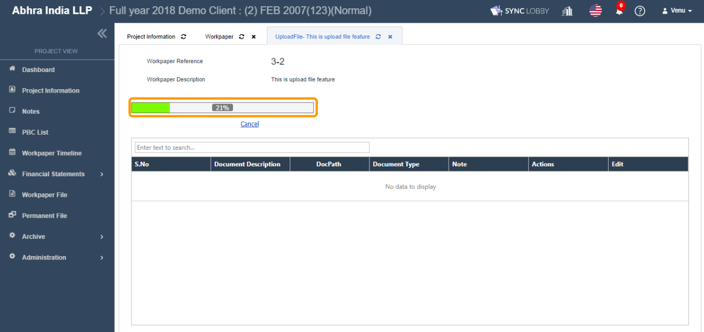
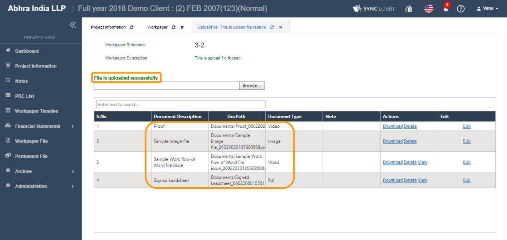
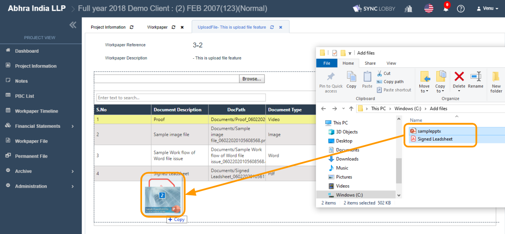
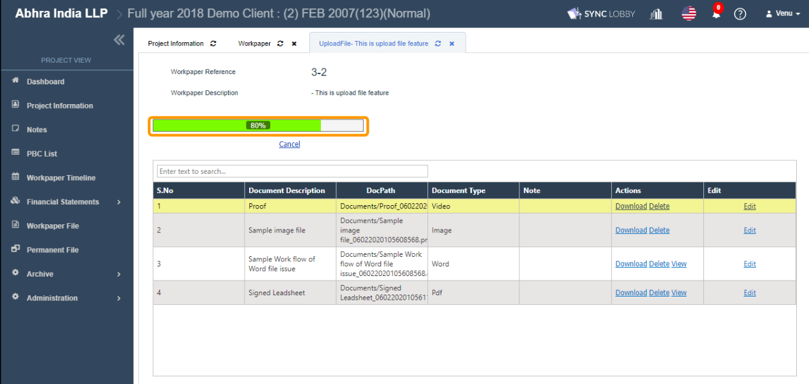

# \(Venu/Done\)2-2-5. Add multiple files as a single file

## 1. Go to Workpaper and create the file of type 'Upload File' 

1. Click the 'Workpaper File' on the left navigation menu of the Project View.
2. Expand the folder that you wish to add a file of type 'Upload File'.
3. Click the 'Create File' icon next to the folder name.
4. The 'Create File' dialog will be displayed.
5. Select the 'Workpaper Type' as 'UploadFile'.
6. Fill out reference number & title.
7. Click the 'Create' button.
8. You can view the file of type 'Upload File' on the screen.

## 2. Double-click the file to add/view its child files

1. The file of type 'Upload File' will be opened in a new tab automatically as soon as it gets created.
2. You can also manually open the file by double-clicking it.
3. You can add files in two ways.
   1. Using the 'Browse' button.
   2. Using the 'Drag & Drop' facility.


You can add files of any type into the 'Upload File' feature type.


### 2.1. Add files using the 'Browse' button

1. Click the 'Browse' button.
2. The file explorer window will be displayed.
3. Select one or more files of any file extension.
4. Click the 'Open' button \(or hit ENTER key\).
5. You can view the file uploading progress on the screen.
6. Once the upload is finished, a success message will be displayed and you can view the files that are uploaded.

### 2.2. Add files using the 'Drag & Drop' facility

1. From your computer, open the folder that contains the files you wish to add.
2. Select files.
3. Drag and drop onto the drop zone of 'Upload File' feature type.
4. You can view the file uploading progress on the screen.
5. Once the upload is finished, a success message will be displayed and you can view the files that are uploaded.

