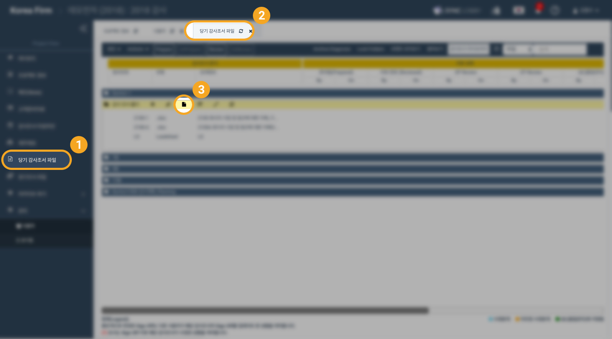
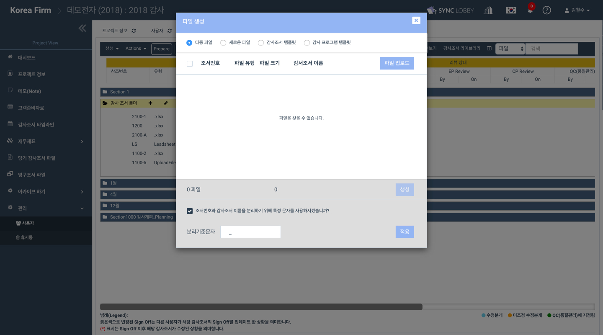
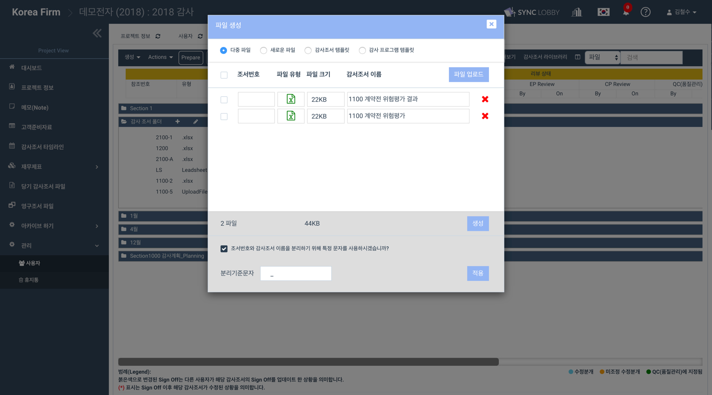
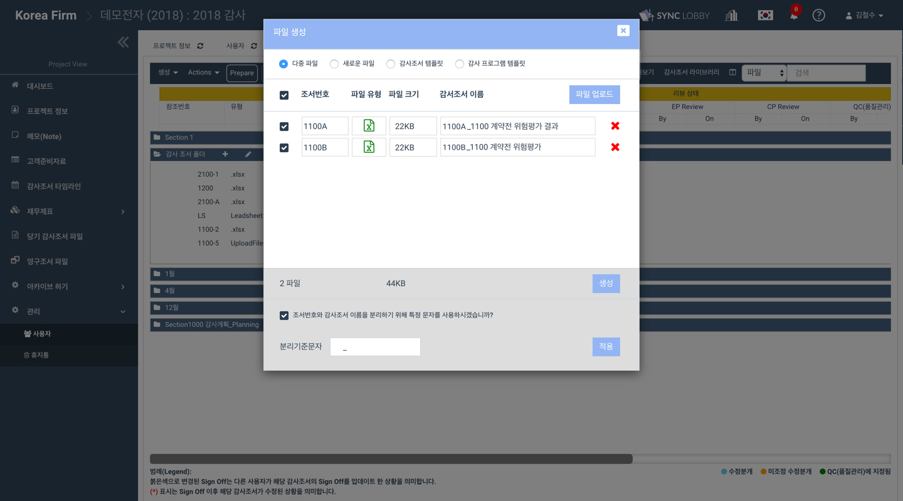
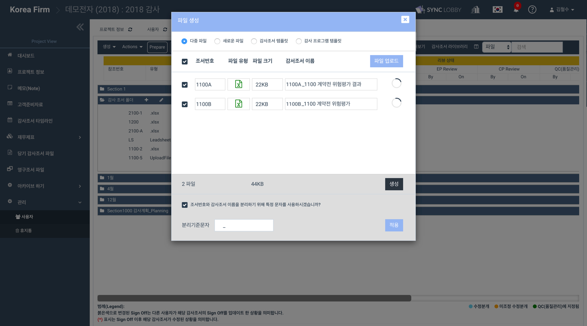

# \(ENG\)2-2-4. 다중 파일 업로드 하기

## 1. 프로젝트 뷰 &gt; 당기감사조서파일 메뉴 &gt; 파일 생성

1. 프로젝트 화면의 왼쪽 메뉴 목록에서 '당기감사조서파일\(Workpaper  file\)'을 선택합니다.
2. 화면 좌측 상단의 '파일 생성' 버튼을 누릅니다.  
3. '파일 생성' 창의 상단에서 '다중 파일'을 선택합니다.  

## 2. 다중 파일 선택

1. '파일 생성' 창 우측 상단의 '파일 업로드' 버튼을 눌러 여러개의 파일을 선택합니다. 

## 3. '분리기준 문자' 를 사용하여 기존 감사조서 이름에서 '참조 번호'를 분리합니다.

## 4. '생성' 버튼을 누릅니다.

1. '생성' 버튼을 누르고 잠시 기다립니다.
2. 각각의 파일 옆에 업로드 진행상황이 표시됩니다.  

