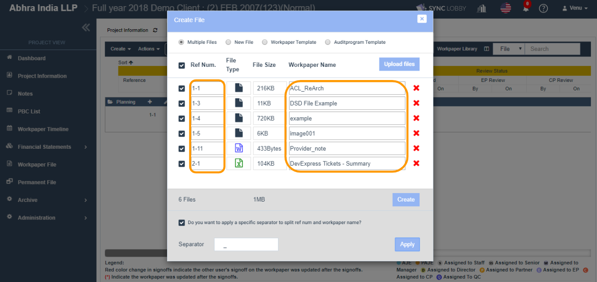

# \(Venu/Done\)2-2-2. Upload Multiple Files

## 1. Go to 'Project View &gt; Workpaper File menu &gt; Create File'

1. Click the 'Workpaper File' on the left navigation menu of the Project View.
2. Click the folder that you wish to add files.
3. Click the 'Create File' icon next to the folder name.
4. The 'Create File' dialog will be displayed.
5. Select 'Multiple Files' radio button in the dialog.

## 2. Select Multiple Files

1. Click the 'Upload files' button on the right of the 'Create File' dialog.
2. The file selection window will be displayed.
3. Select one or more files using the CTRL key and hit the ENTER key.
4. Chosen files will be added to the ‘Create File’ dialog.


You can select at most 10 files and the max size of each file should be 30 MB only.


## 3. Enter reference number

1. Enter the reference number in the 'Ref Num.' column.
2. Revise the file name if required in the 'Workpaper Name' column.


Files with the duplicate reference numbers cannot be allowed in the 'Multiple Files' dialog.


## 4. Use the 'Separator' feature to split the 'Ref Num.' from origin workpaper title

* Let's assume the original Workpaper Name is ‘1-1\_This is Sample excel file’.
* Select the checkbox \(left to the Ref Num\) for the files that you wish to split.
* Select the checkbox ‘Do you want to apply a specific separator to split ref num and workpaper name?’.
* Enter the '\_' \(underscore\) in the 'Separator' field.
* Click the 'Apply' button.
* You can view ‘1-1’ in the ‘Ref Num’ column, and ‘This is Sample excel file’ in the ‘Workpaper Name’ column respectively.

## 4. Click 'Create' button' 

1. Click the 'Create' button and wait a moment.
2. The progress of the upload gets displayed next to each file.
3. Once upload gets finished to all files, the 'Create File' will be closed.
4. On the screen, you can view the success message and the files that are created.

