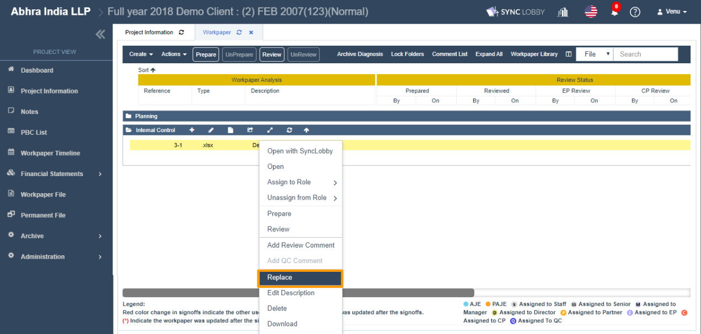
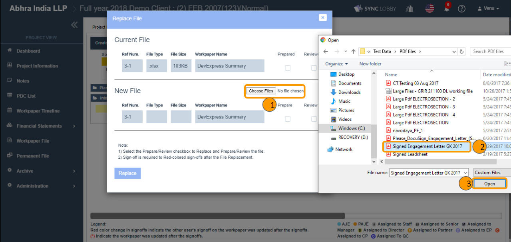

# \(Venu/Done\)2-2-4. Replace a File

> Using this feature, a workpaper file can be replaced with any other file type or the same file type. For instance, the excel file can be replaced with word/ pdf/ zip/ image/ video… etc. and vice-versa.

## 1. Right-click the workpaper and select Replace.

1. Click the 'Workpaper File' on the left navigation menu of the Project View.
2. Expand the folder that contains the file that you wish to replace.
3. Right-click the file.
4. Click the 'Replace'.
5. The 'Replace File' dialog be will be opened.

## 2. Browse file for the replace

1. You can view the old file details in the 'Current File' section.
2. Click the 'Choose Files' button.
3. The file explorer window will be opened.
4. Select the file of any type and click the Open button \(or hit ENTER key\).
5. You can view the new file type and size details in the 'New File' section.
6. Select the 'Prepare & Review' check-boxes if you wish the file to be Prepared & Reviewed automatically after the replacement.


QC cannot review the file unless there is a Review to a file. So the 'Review' checkbox will be disabled when the file was not reviewed and QC opens the Replace File dialog.


## 3. Click the 'Replace' button

1. Click the 'Replace' button.
2. You can view the success message.
3. You can view the sign-off under the Prepared and Reviewed columns if the check-boxes are selected while Replace time.


If Prepare/Review checkbox is NOT selected, then only the Red star ‘\*’ will be displayed to all sign-offs.

If Prepare/ Review checkbox is selected, Red star \(\*\) will be displayed to all sign-offs and for higher-level sign-offs changed to Red color.


