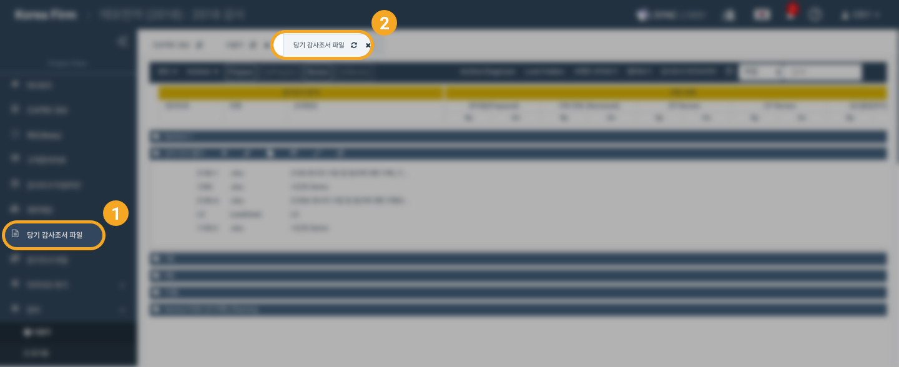
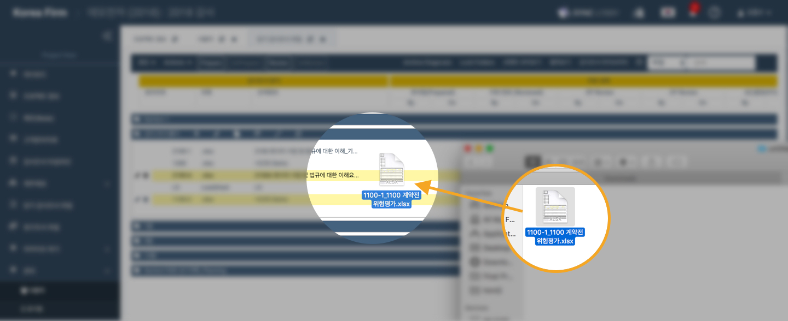
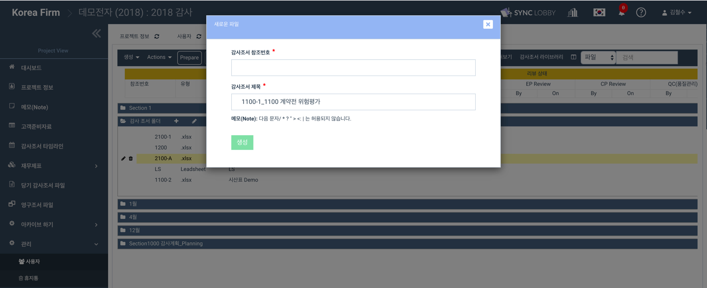
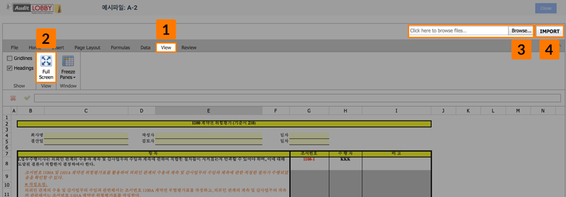
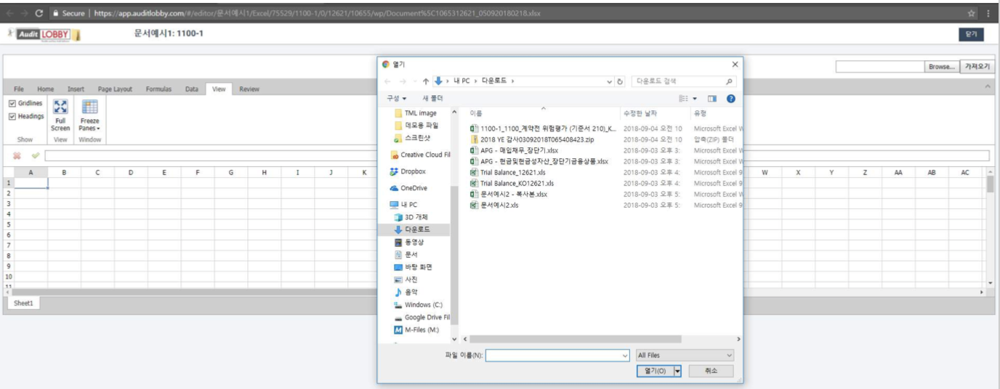

# \(Venu/Pending\)2-2-1. Different ways of uploading workpaper files

In addition to creating workpaper files in online directly from Audit Lobby, you can upload files in four ways.

1. Use Multiple Files upload \(Refer '2-2-2. Upload Multiple Files'\)
2. Use the drag and drop facility \(Refer '2-2-3. Upload workpaper using Drag & Drop facility'\)
3. Replace the file \(Refer '2-2-4. Replace a File'\)
4. Use the Import function inside the online editor \(Refer 2-2-5. Upload Attachment File'\)

## 1.  Upload workpaper files using Multiple File upload


For details on uploading multiple files, refer to '2-2-4 Uploading Multiple Files'. 


## 2. Upload workpaper using Drag and Drop facility

## 3. Uploading Workpaper Replacing The File

1. On the online Excel editing screen, select the 'view' menu
2. When you click 'Full Screen', 'Browse' and 'Import' buttons appear on the upper right of the screen
3. Click the 'Browse' button to select the files on your personal computer
4. Click the 'Open' button to select the file Click the 'Import' button to import the file into online Excel

  

