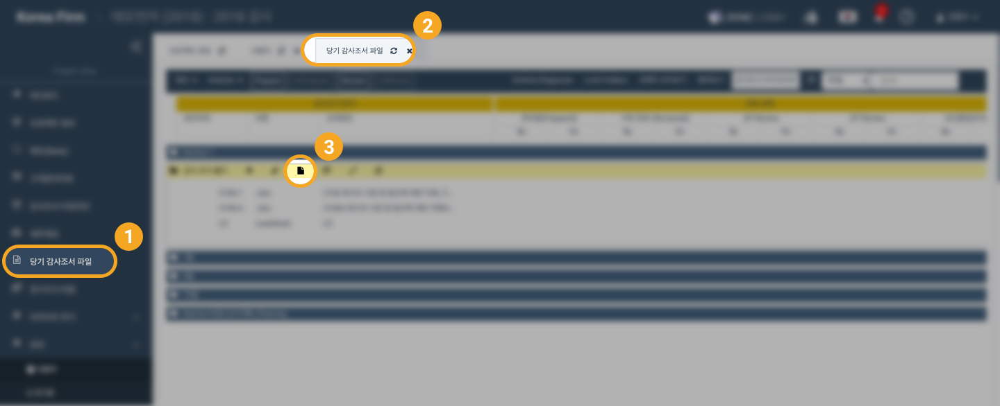

# \(ENG\)2-2-1. Uploading Workpaper File

In addition to creating audit statements online directly from Audit lobby, you can upload files created on your personal computer as audit records. You can upload audit statements in four ways.

1. Use multiple files upload
2. Use the drag and drop facility
3. Replace the file
4. Use the Import function inside the online editor

## 1.  Uploading Workpaper Using Multiple File Uploads


For details on uploading multiple files, refer to '2-2-4 Uploading Multiple Files'. 


## 2. Uploading Workpaper Using Drag and Drop Facility

## 3. Uploading Workpaper Replacing The File

1. On the online Excel editing screen, select the 'view' menu
2. When you click 'Full Screen', 'Browse' and 'Import' buttons appear on the upper right of the screen
3. Click the 'Browse' button to select the files on your personal computer
4. Click the 'Open' button to select the file Click the 'Import' button to import the file into online Excel

  

