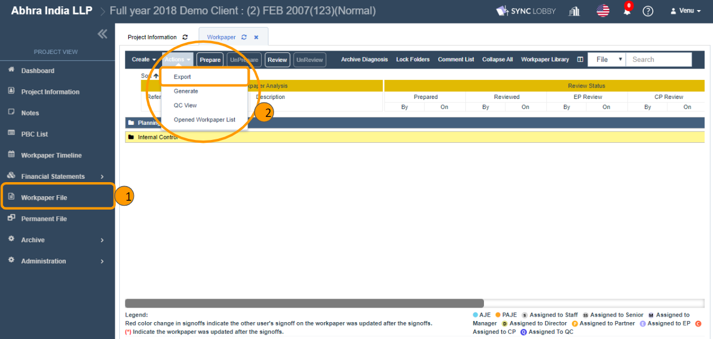
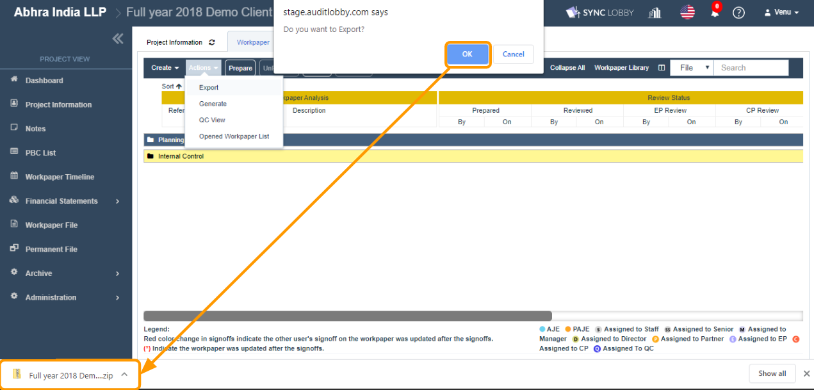
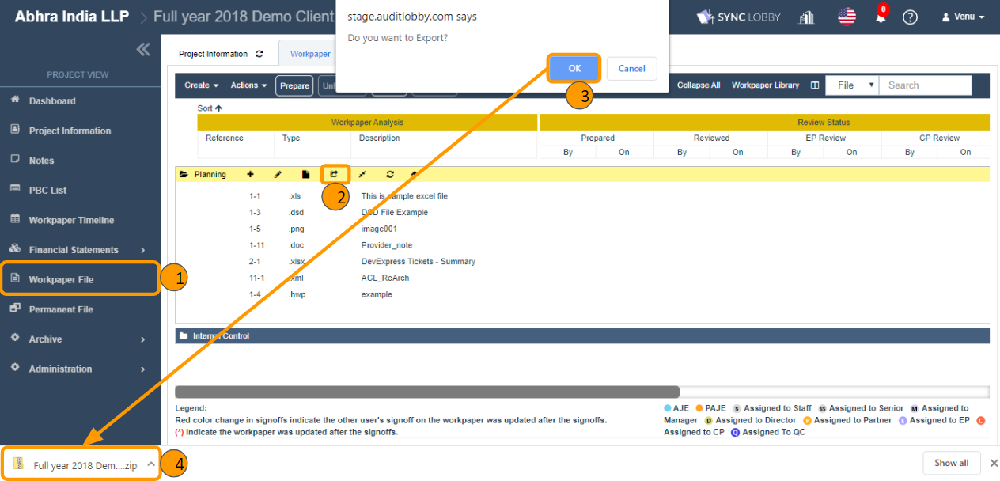
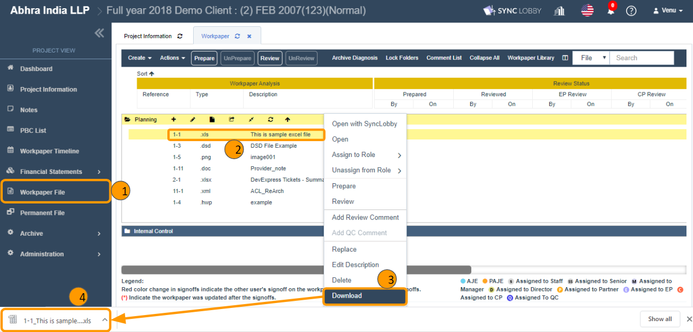
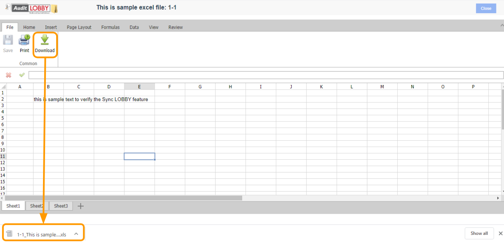

# \(Venu/Done\)2-3 Download the document

You can download audit reports in three ways on the Workpaper File screen.

1. Download the entire Workpaper File screen \(Full export\)
2. Folder Download \(Partial export\)
3. Download individual files

## 1. Download the entire Workpaper File screen \(Full export\)

> Using this feature, the entire Workpaper screen’s visible folders & files can be exported into a zip file format.

1. Click the 'Workpaper File' on the left navigation menu of the Project View.
2. Click the 'Actions' button at the top left of the 'Workpaper File' screen.
3. Click the 'Export' from the menu list that appears.
4. Click the 'OK' button in the export confirmation alert.
5. Wait till the zip file gets downloaded that contains the entire folders & files of the Workpaper File screen.

## 2. Folder Download \(Partial export\)

> Using this feature, the folders and files reside the respective folder can be exported into a zip file format.

1. Click the 'Workpaper File' on the left navigation menu of the Project View.
2. Find the folder that you wish to download.
3. Click the 'Export' icon next to the folder name.
4. Click the 'OK' button in the export confirmation alert.
5. Wait till the zip file gets downloaded that contains the folders & files of the respective folder.

## 3. Download individual files

You can download the individual file in two ways.

1. Download file from the right context menu.
2. Open file and Download.

### 3.1. Download file from the right context menu

1. Click the 'Workpaper File' on the left navigation menu of the Project View.
2. Find the file that you wish to download.
3. Right-click the file to view the context menu options.
4. Click the 'Download' option.
5. The file will be downloaded into your computer.

### 3.1. Open the file and Download

1. Click the 'Workpaper File' on the left navigation menu of the Project View.
2. Double-click the file that you wish to download.
3. It will be opened in a new tab.
4. Click the 'Download' button at the top of the screen.
5. The file will be downloaded into your computer.

