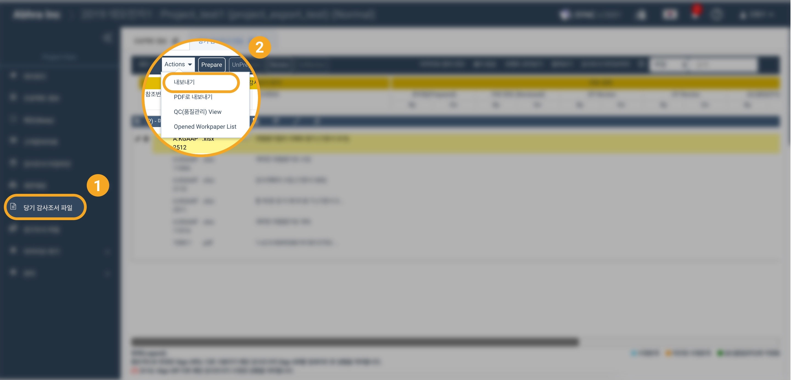
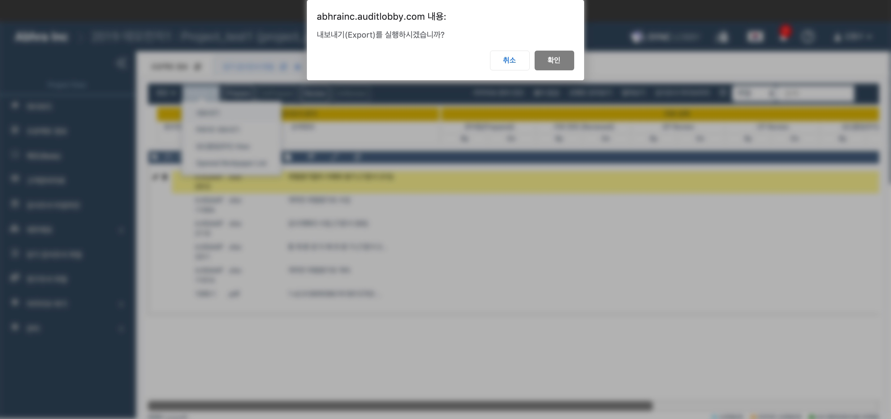
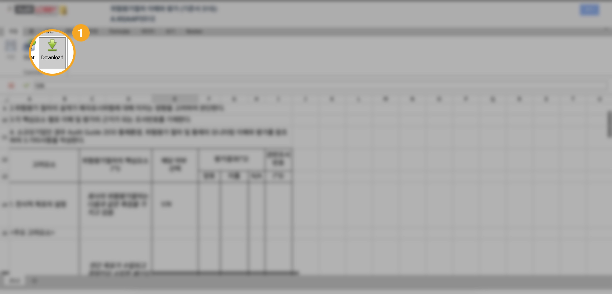

# \(ENG\)2-3 Download the document

You can download audit reports in three ways from adobe.

1. Download the entire article
2. Folder Download
3. Download individual files

## 1. Download the entire article

* From the menu list on the left side of the Project Home screen, select 'current audit report file'/'Workpaper File'
* Press the 'Actions' button on the top left to bring up the menu.
* Select 'Export' from the menu list that appears.

* If a popup window appears, press the OK button.

## 2. Folder Download

* From the menu list on the left side of the Project Home screen, select 'current audit report file'/'Workpaper File'.
* Select the folder you want to download.
* Click the 4th button among the buttons to the right of the folder name.

* If a popup window appears, press the OK button.

## 3. Download individual files

### 3.1. Open file and Download using Double click

* From the menu list on the left side of the Project Home screen, select 'current audit report file'.  
* Click on the folder of the file you wish to download and the files will appear.
* Double-click a file to download from the file list.
  * The file will be downloaded directly if it can not be opened in Online Editor
  * If the file can be opened through online editor, then click on the Download button in the upper left corner when it opens

### 3.2 Download file from the right context menu

* From the menu list on the left side of the Project Home screen, select 'current audit report file'.  
* Click on the folder of the file you wish to download and the files will appear.
* Select the required file, then right click on it
  * Download option is visible, click on it download the file

