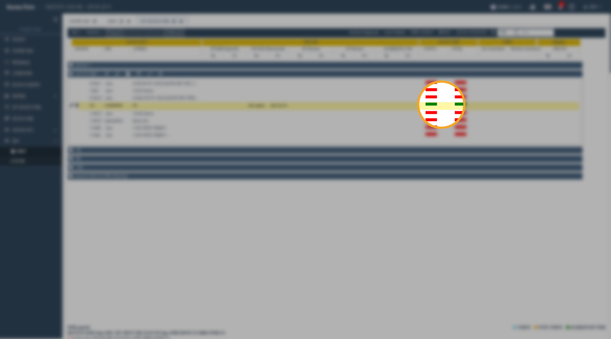

# \(ENG\)\(+\) Attention Status

Even if the review is completed and the sign-off has been done, the project team may need to follow up on the finalizing the audit documentation internally. In this case, you can set the status of attention, share it with your team, and manage the completion of workpapers more easily.

## Attention Status of the workpaper

1. Attention Status
   * Not Started
   * In Progress
   * Completed

