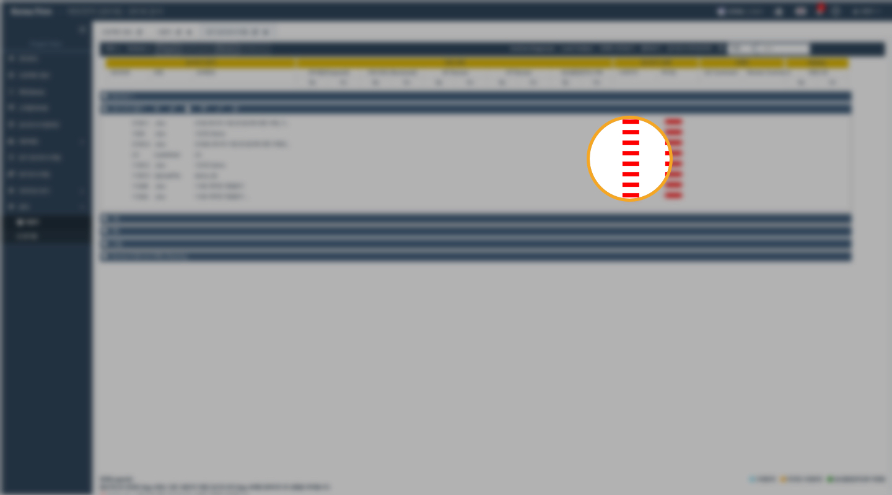
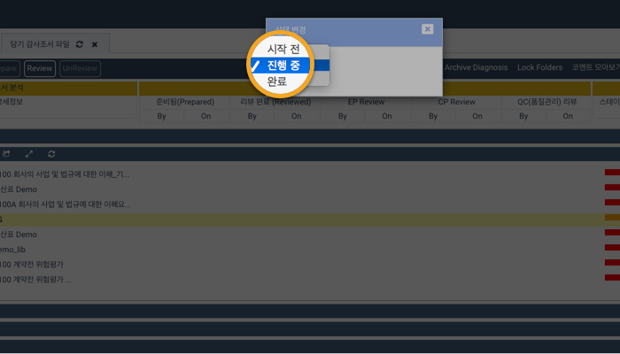

# \(ENG\)\(+\) Attention Status

조서의 검토\(review\)를 완료하고 Sign Off 하더라도 회계법인 내부적으로 후속작업이 필요한 경우가 있습니다. 이런 경우 감사조서의 상태를 설정하여 팀원들과 공유하고, 보다 손쉽게 조서를 관리할 수 있습니다.

Even if the review is completed and the sign-off has been done, the project team may need to follow up on the finalizing the audit documentation internally. In this case, you can set the status of attention, share it with your team, and manage the completion of workpapers more easily.

## Attention Status of the workpaper

1. Attention Status
   * Not Started
   * In Progress
   * Completed

