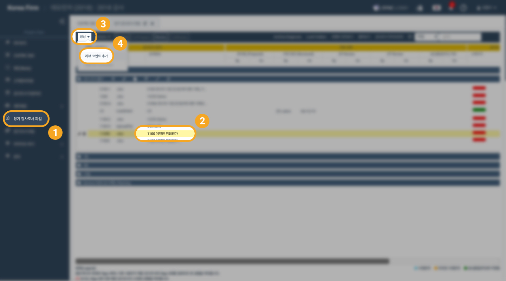

# \(Razia-Done\)\(+\) Using Comments

Comments are used to share opinions with collaborators when writing audits.

In the system,there are two types of comments.

1. **Comment for Review**

   It is a comment that records and provides the information needed to complete the review.

2. **Comments by Quality Control**

   The type of comment to use if follow-up is absolutely necessary during QC review.                                                                                                     Team members can't add QC comments

If the situation you recorded as a comment is resolved or completed, use **'Comment Sign Off'** to indicate that the comment has been resolved.

## 1. Create a Comment

## 2. Check comments

## 3. Reply to comment

