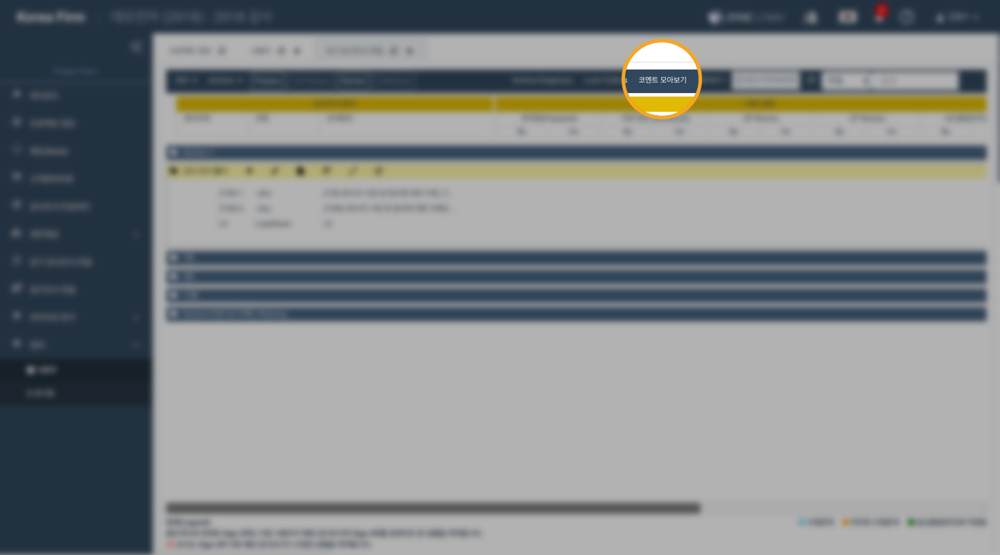

# \(ENG\)\(+\) 코멘트 사용하기

감사조서 작성시 공동작업자들과 의견을 공유하기 위해 코멘트를 사용합니다.

어딧로비에서 코멘트는 두가지 종류로 나누어 집니다.

1. **Comment for Review**

   조서 검토\(Review\)를 완료하기 위해 필요한 사항을 기록하고 공하는 코멘트입니다.

2. **Comment for Follow Up**

   후속 조치가 반드시 필요한 경우 사용하는 코멘트의 유형입니다.

코멘트로 기록한 상황이 해결 또는 완료된 경우 **'Comment Sign Off'**를 통해 코멘트가 해결되었음을 표시합니다.

## 1. 코멘트 등록하기

## 2. 코멘트 확인하기

## 3. 코멘트 답변하기

