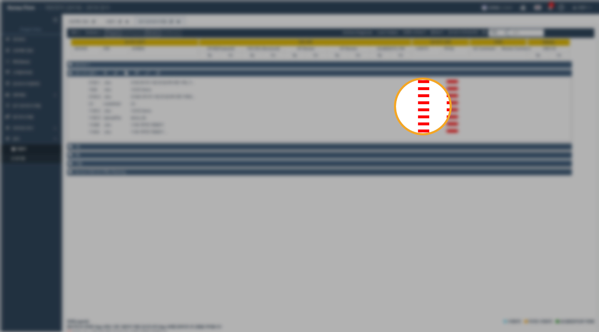
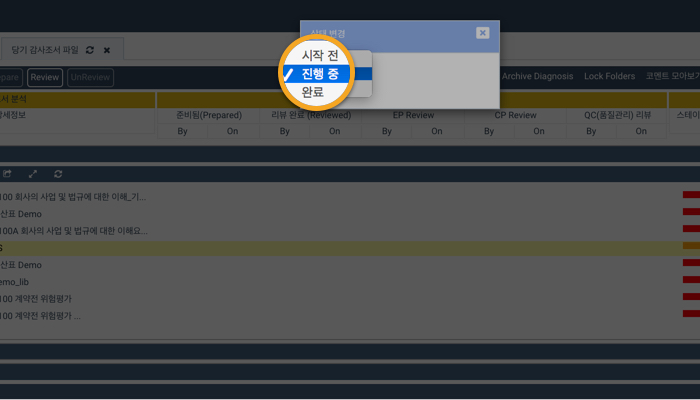
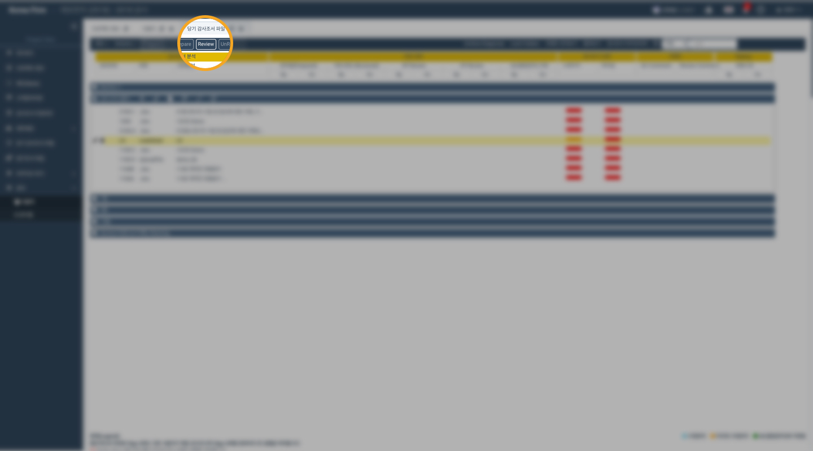
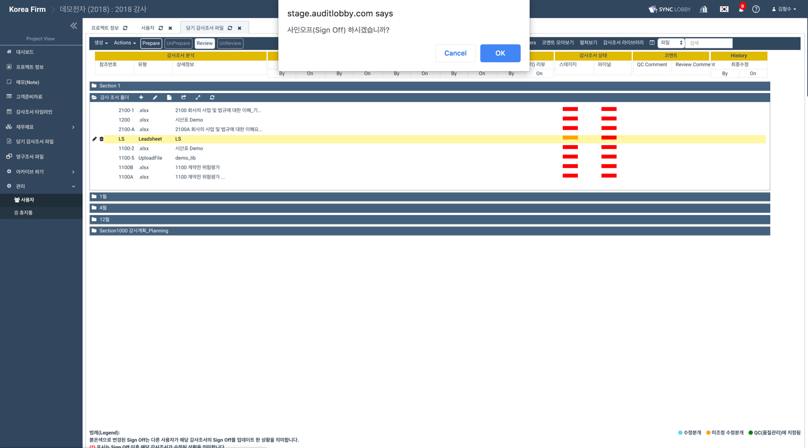
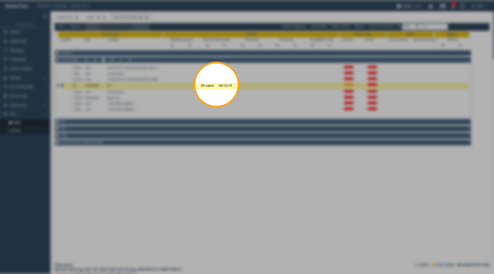
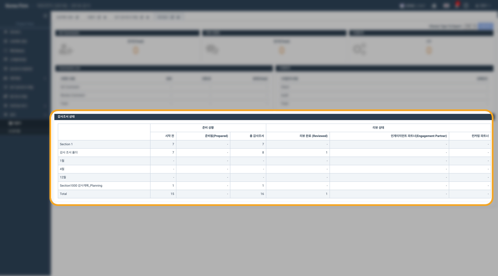
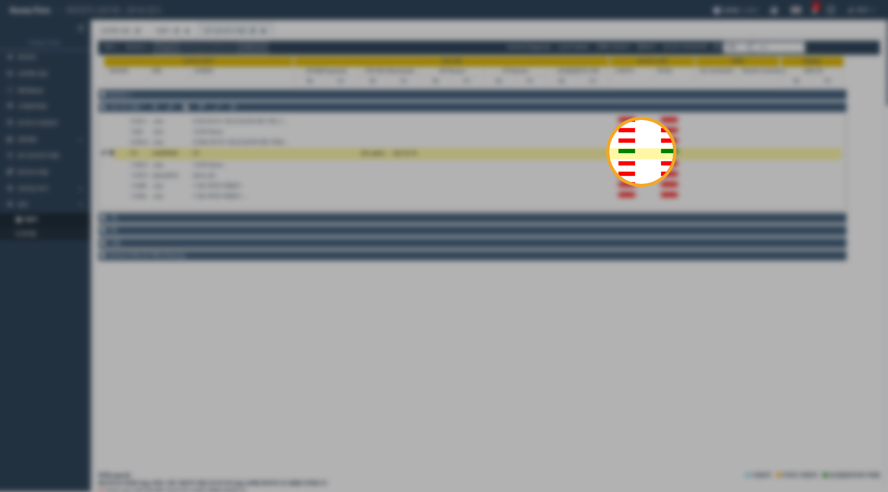

# \(ENG\)3-1. 조서 작성 후 확인 \(Prepare\)

## \[감사팀원\] 에 해당하는 내용입니다.

1. 감사 조서\(workpaper\)를 완성합니다. 
2. 해당 감사 조서의 감사조서 상태에서 스테이지에서 빨간 버튼을 클릭합니다
3. 변경 상태를 **&lt;시작안함&gt;**에서  **&lt;진행중&gt;**으로 변경합니다. 버튼 색이 주황색으로 변합니다.
4. **화면 상단의 &lt;리뷰&gt;**버튼을 클릭합니다. 
5. 사인오프 여부를 묻는 팝업이 뜨면 확인을 클릭합니다.
6. 해당 조서에 감사인의 &lt;**sign-off&gt;** 여부와 일자가 등록됩니다. 
7. 감사조서 상태 대시보드에서 전체 상황을 확인할 수 있습니다. 
8. 조서 작업 완료 후 조서의 상태를 &lt;**completed&gt;**로 변경합니다. 

> 조서의 상태\(stage status\)는 회계법인 내부의 업무관리를 돕기 위한 기능으로, archive또는 export 시 외부에 노출되지 않습니다.

