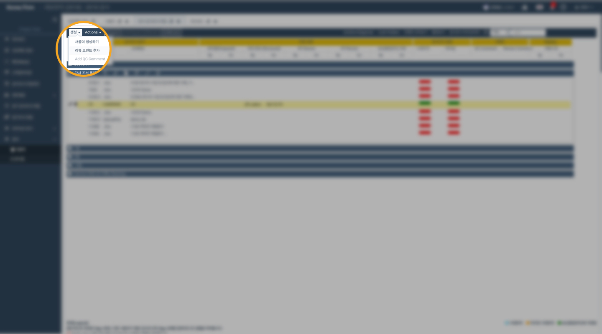
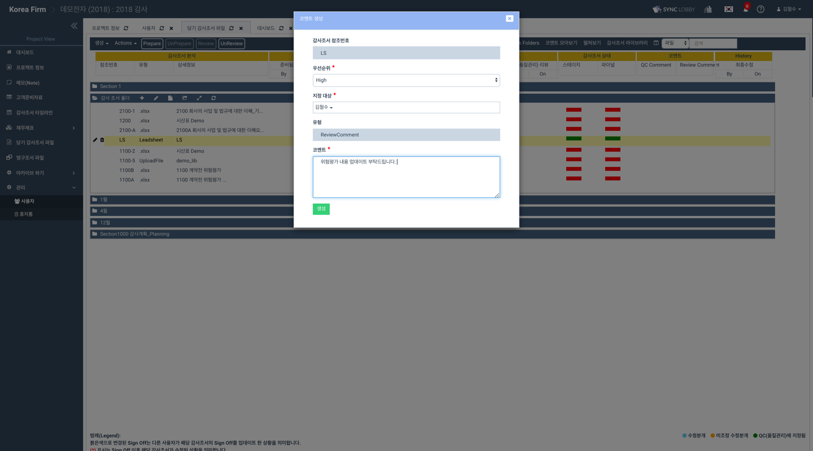
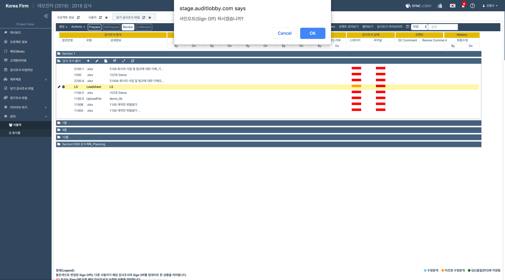

# \(ENG\)3-2. Review Workpaper \(Review Sign-off\)

## \[업무책임자\] 에 해당하는 내용입니다.

1. 감사팀원이 작성하고 검토를 마친 감사조서\(workpaper\)를 검토합니다. \(이 때 감사팀원의 검토가 끝난 감사조서는 '**completed**'로 상태가 표시됩니다. \)
2. 감사조서를 검토하여, 필요한 경우 코멘트를 등록하여 감사팀원에게 알립니다. 
3. 검토가 완료되면 **&lt;Review&gt;** 버튼을 눌러 감사조서를 Sign Off 합니다. 
   1. 코멘트가 처리 완료 되지 않은 경우 조서의 상태는 '**in progress**'로 변경합니다.
   2. 모든 검토가 완료되면 조서의 상태를 '**completed**'로 변경합니다. 

1. Review the workpaper with "Prepare" sign-off considering tha the workpaper has been completely prepared by the audit team member. 
2. When reviewing the workpaper if necessary, create a review comments and assign the comment to a designated team member. The audit team member will be automatically notified.
3. When the review is completed, complete the "Review" sign-off of the workpaper with the three ways as follows:
   1. Review by clicking the button on the upper bar
   2. Review by clicking right-click of mouse button
   3. Review by using short-cut \("R"\)

