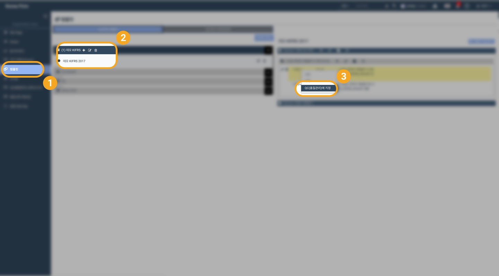
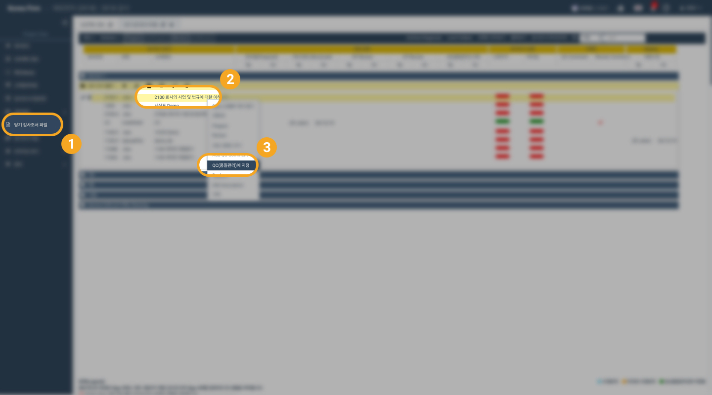
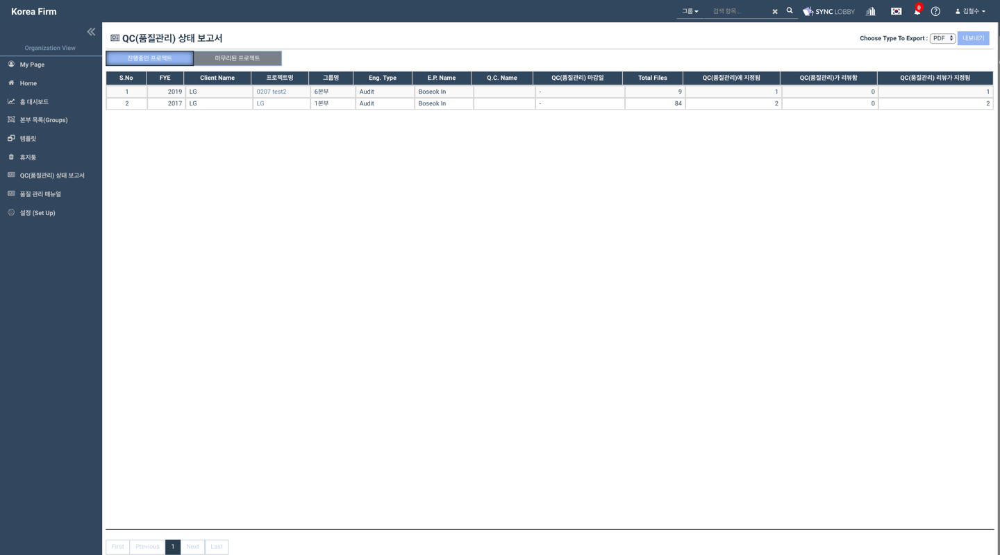

# \(ENG\)3-3. 검수 \(Q.C.\)

### \[품질관리팀\]에 해당하는 내용입니다.

1. **품질관리 대상 조서를 설정합니다.** 설정하는 방법은 두 가지로, 다음과 같습니다. 
   1. 서식 라이브러리 \(Template Library\) 에서 품질관리가 필요한 조서를 설정합니다. 
   2. 감사조서 목록에서 품질관리가 필요한 조서를 설정합니다.  
2. **품질관리 업무를 진행합니다.** 품질관리를 진행하는 방법은 두 가지로, 다음과 같습니다. 
   1. 품질관리상태 리포트 화면\(QC Report\)을 이용하여 품질관리 대상 조서를 검토합니다. 
      1. 품질관리상태 리포트 화면에서 품질관리 대상 조서의 잔여 수, 총 배정 조서 수, 팀의 전체 감사 진행상황등을 확인할 수 있습니다. 
   2. 감사조서 목록에서 품질관리 대상 조서를 검토합니다. 
      1. 조서 목록\(workpaper list\)에서 품질관리화면\(QC view\)을 선택하여 품질관리 대상으로 지정된 조서를 확인할 수 있습니다. 
3. **품질관리 업무를 마치면 &lt;Review&gt;버튼을 눌러 Sign Off 합니다.** 

## 품질관리대상 조서 설정 - 서식 라이브러리\(Template Library\)에서

## 품질관리대상 조서 설정 - 당기 감사조서 파일\(Workpaper\) 화면에서

## 품질관리 현황 보고서

