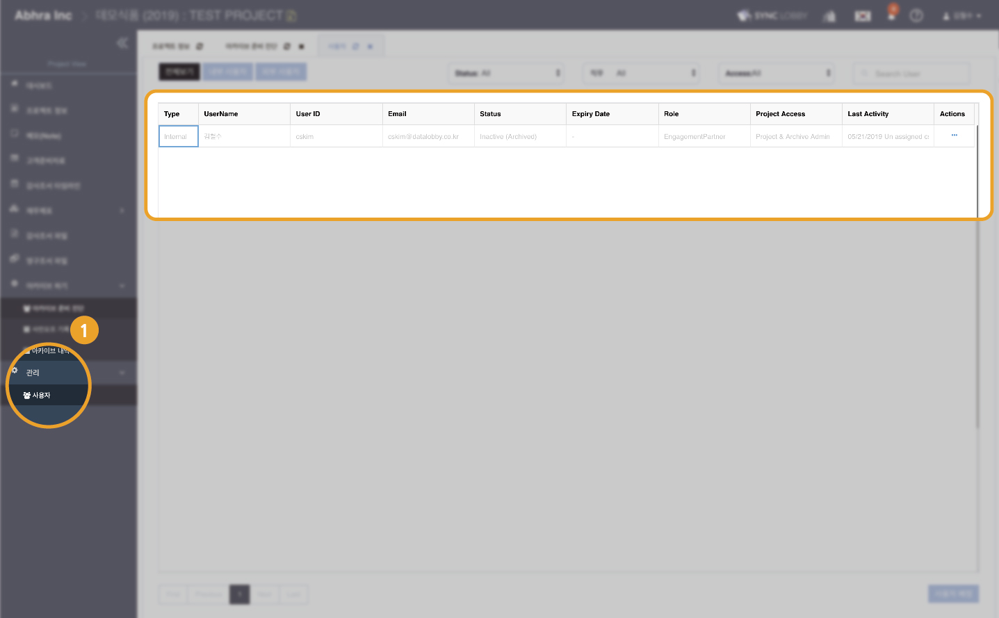
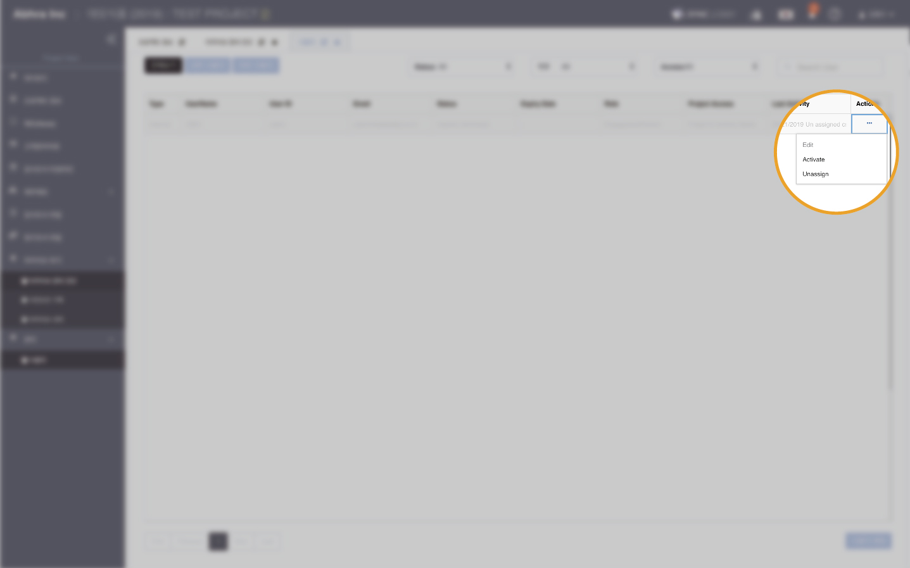
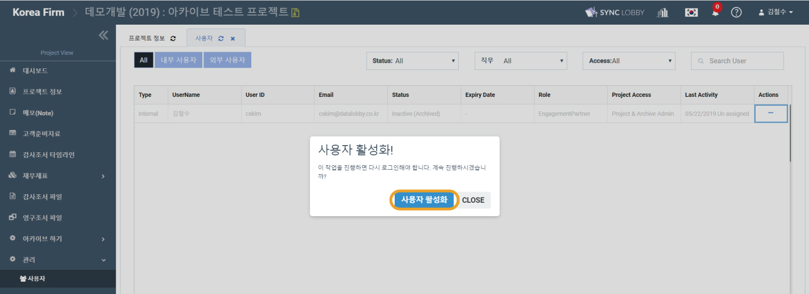
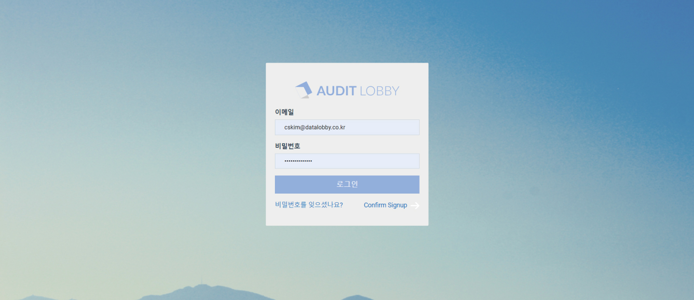
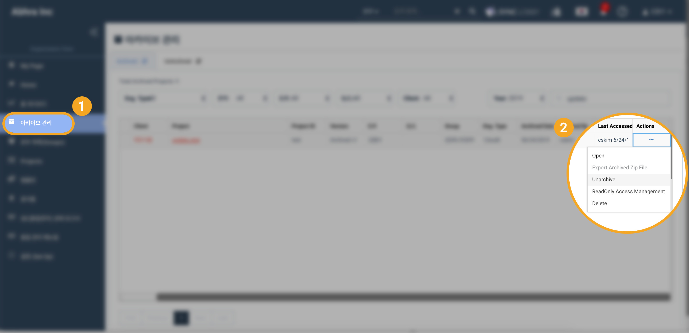
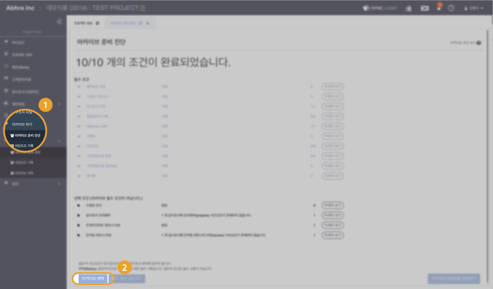
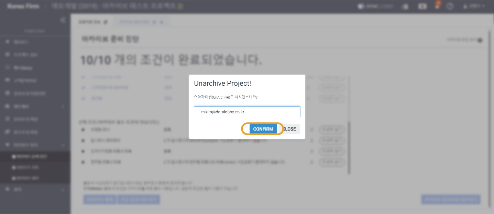

# \(ENG\)5-1. 아카이브 해제하기

## 요약보기

1. 사용자 활성화
2. 아카이브 해제하기  


**관리자용** 아카이브 해제하기 입니다.


## 1. **사용자 활성화**

1. **아카이브를 해제하고자 하는 프로젝트로 들어갑니다.** 
2. Project Home 화면의 왼쪽 메뉴 목록에서 '관리’ &gt; ‘사용자’를 선택합니다. Status열에서 활성화를 원하는 사용자의 상태를 확인합니다.

\*\*\*\*

활성화를 원하는 사용자의 Actions에서 ‘Activate’을 클릭합니다.

팝업창이 나타나면 ‘사용자 활성화’를 클릭합니다.

\*\*\*\*

스스로를 활성화 하는 경우 다시 로그인 해야 합니다.

> 다른 팀원을 활성화 하는 경우 해당 팀원에게 이메일로 알림이 전송됩니다.

* 활성화된 사용자는  아카이브된 프로젝트를 열어 내용을 확인할 수 있습니다. 
* 활성화된 사용자에게  아카이브 권한이 있는 경우 해당 프로젝트의 아카이브를 해제할 수 있습니다. 

## 2. **아카이브 해제하기**

1. 아카이브를 해제하고자 하는 프로젝트로 이동합니다. 
2. 아카이브 준비 진단 페이지 하단의 ‘아카이브 해제’ 버튼을 클릭합니다.


* 활성화 처리되지 않은 사용자는 아카이브된 프로젝트를 열 수 없습니다.  
* 프로젝트 내부에서 아카이브 권한이 없으면 활성화 된 사용자인 경우에도 아카이브를 해제할 수 없습니다.  



아카이브를 해제하면 진행자의 정보와 일시가 기록됩니다.주의하여 주십시오.


* 아카이브 해제 버튼을 누르면 본인 확인을 위해 이메일 입력창이 나타납니다. 
* 본인의 이메일 주소를 입력한 뒤 ‘CONFIRM’ 버튼을 클릭합니다.

* 아카이브 해제에 성공하면 알림 메시지가 나타납니다. 


아카이브를 해제하더라도 프로젝트 팀원들은 모두 비활성화 상태로 유지됩니다. 꼭 필요한 사용자만을 활성화하는 것을 추천드립니다.


