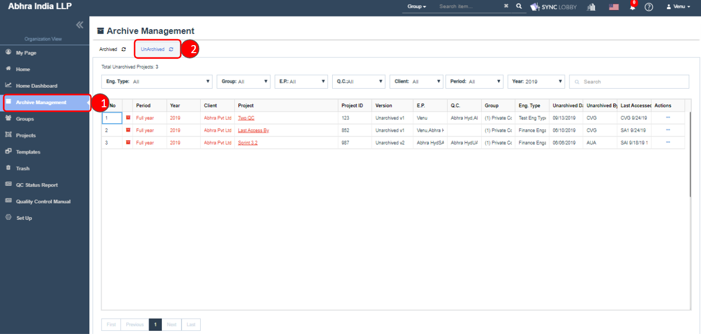
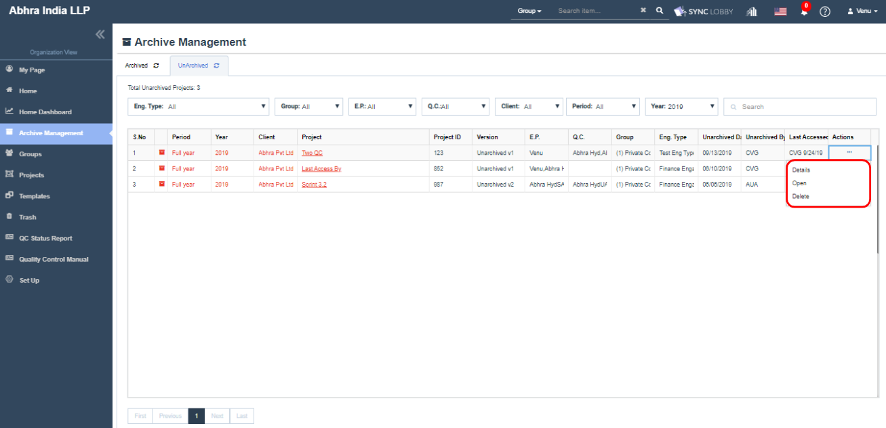
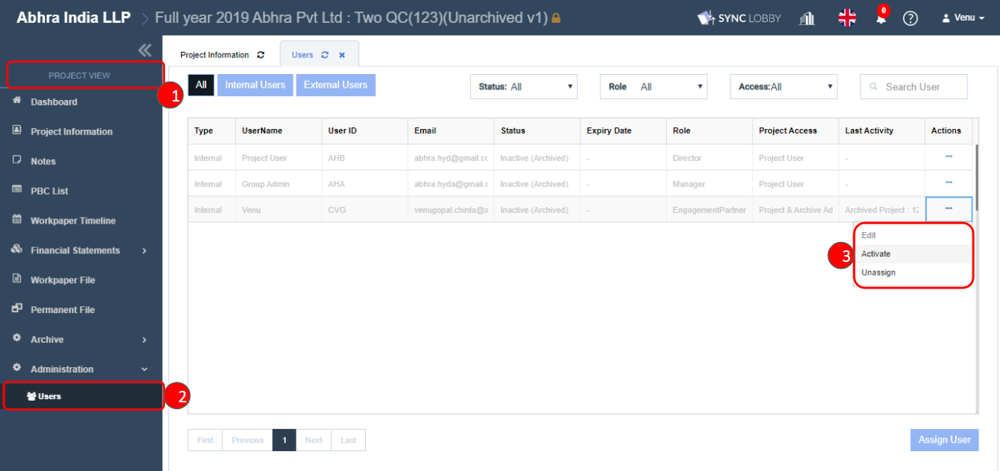
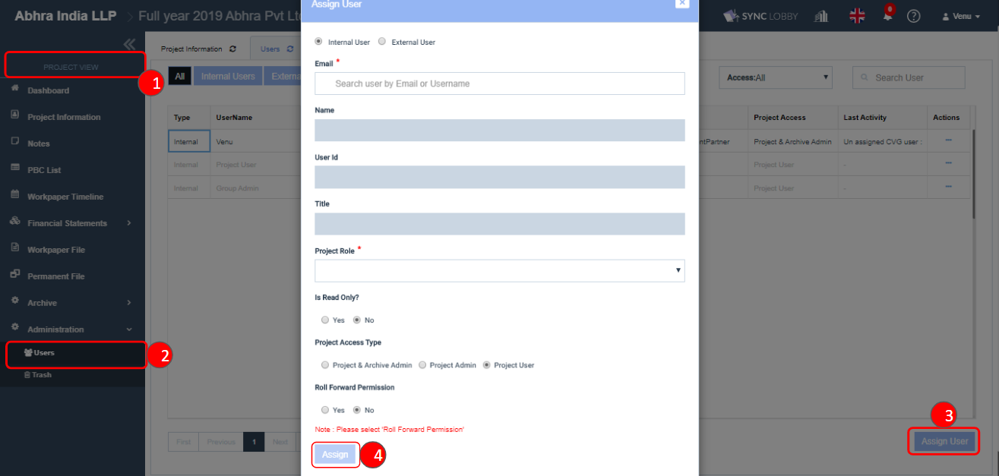

# \(Venu/Pending\)5-1. Unarchive

## Summary of Unarchived projects

1. View Unrchived projects from ‘Archive Management &gt; Archived’ screen.
2. Activate / Assign users in the Unarchived project.
3. Archive the unarchived project.
4. Delete unarchived project.

## 1. **View Unrchived projects from ‘Archive Management’ screen**

Initially, the Unarchived projects can be accessed by both Archive Manager and Super Admin \(SA can access from other screens such as ‘Projects &gt; Unarchived’\) users only. The Archive Manager can manage the archived projects using various options available in the Actions column \(...\).

### The context menu options available on the unarchived project are

* Clicking the option ‘Details’ displays the ‘Project Details’ window that shows the information of the Unarchived project and the users who worked on the project before it got archived.
* The option ‘Open’ is used to visit the Unarchived project.
* The option ‘Delete’ is used to delete the Unarchived project when needed.

## 2. **Activate / Assign users in the Unarchived project**

> Activate existing user

> Assign new user

1. You can visit the unarchived project using ‘Open’ option from Unarchived tab.
2. The default status of the Unarchived project is ‘Locked’.
3. By default, all project team members remain inactive in the ‘Administration &gt; Users’ screen of unarchived project. We recommend activate only the users you really need.
4. You can assign your record or activate the existing deactivated record. But, after the assign or activation, re-login is required.
5. The administrator of the project can unlock the project by clicking ‘Unlock this project’ button from the ‘Archive Diagnosis’ screen.
6. After unlock, the activated users can work on the project.

### **3. Archive the unarchived project**

1. After the work is done, the archive administrator of the project can visit ‘Archive &gt; Archive Diagnosis’ screen and clicks the ‘Archive’ button for re-archiving the project.
2. An email input window will appear to verify your identity.
3. Enter your email address and click the "Archive" button to Archive the project


After the re-archive, 

1. The Unarchived project turns as Archived vx and disappears from the ‘Unarchived’ tab \(The version is  incremented based on the prior one\).
2. All the team active members of project gets auto-deactivated, so no one can access except Archive Manager.
3. A Replica vx gets created \(The version is incremented based on the prior one\).
4. A success notification message appears and link to archived zip file of the project will be sent via email notification to the user who archived the project.


### **4. Delete the unarchived project**

If the unarchived project is no longer required or not in use or mistakenly unarchived, then you can delete the project using Delete option. Only Archive Manager can Delete the Unarchived Project. Self-assignment to the Unarchived project is not required in order to Delete it. 

1. Navigate to the ‘Archive Management &gt; UnArchived’ screen.
2. Click ‘Actions &gt; Delete’ option at the right side of unarchived project that you want to delete.
3. An email input window will appear to verify your identity.
4. Enter your email address and click the "CONFIRM" button.
5. If the delete is successful, a success notification message appears.


Note: If you want to restore the project, you can restore it from the ‘Trash’ left navigation menu of Organization View.

Note: Only Archive Managers can restore or permanently delete the deleted unarchived projects.


