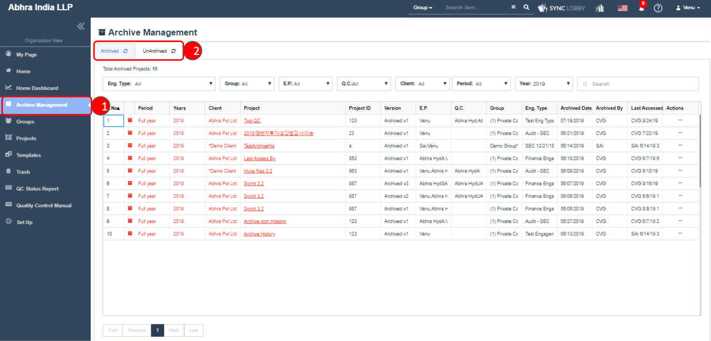
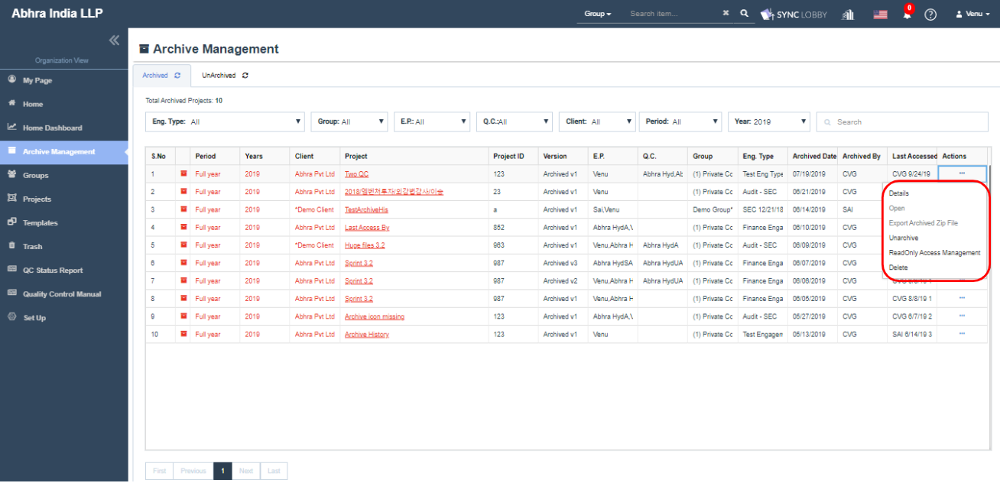
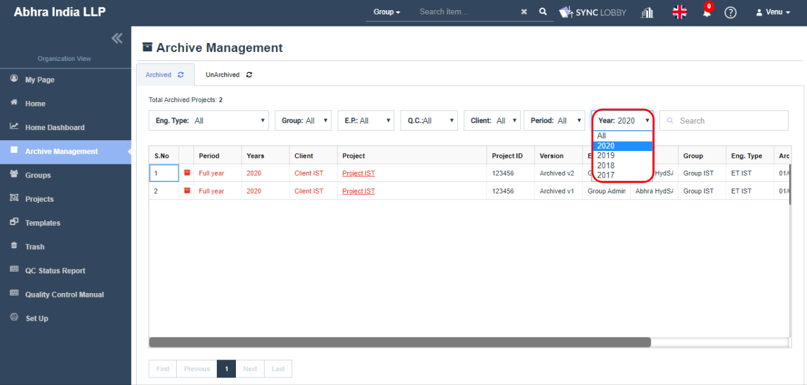
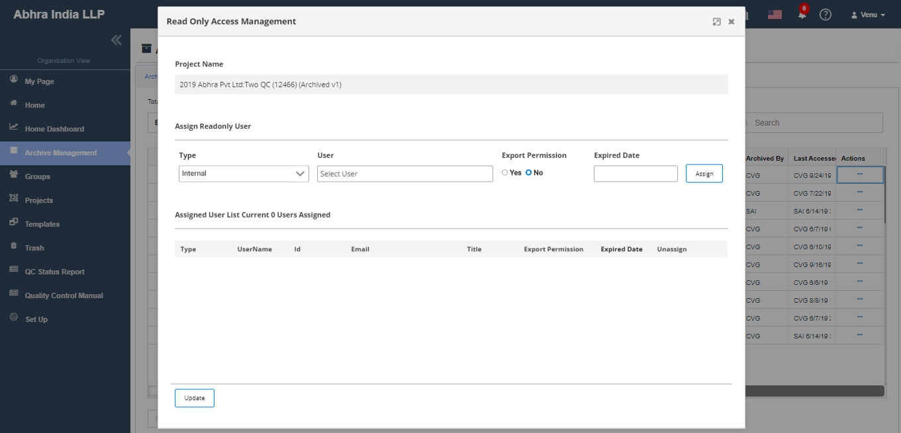
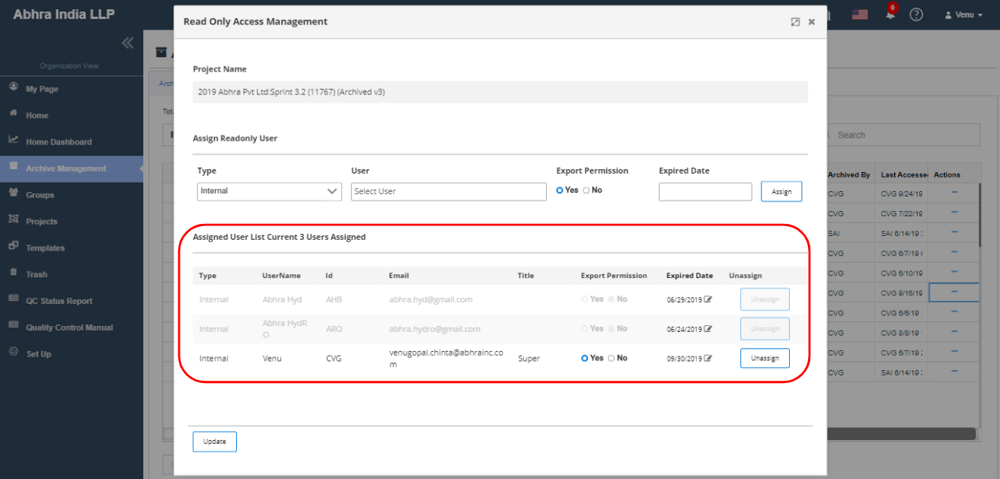
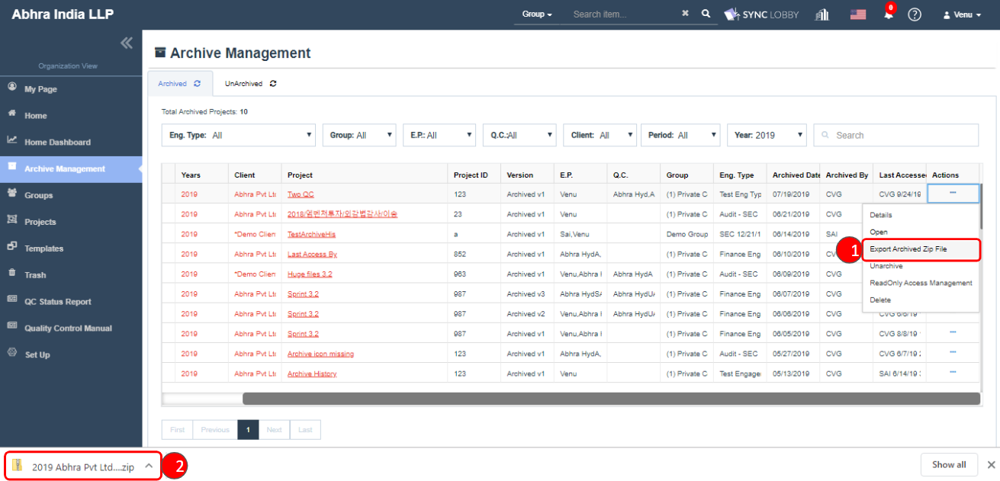
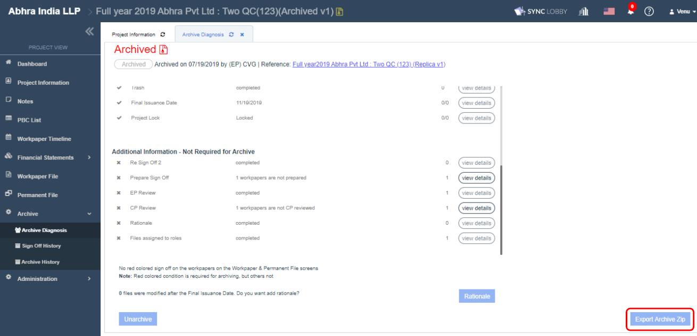
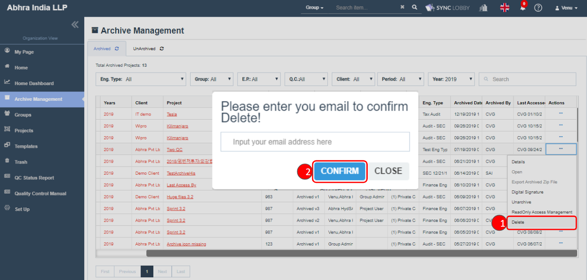

# \(Venu/Done\)5. \(For Managers\) Managing Archived and Unarchived Projects

## Summary

* The ‘Archive Management’ is visible only to the Super Admin who is an Archive Manager \(AM\) of the organization.
* Click the 'Archive Management' option from the left navigation menu of the Organization View.
* The ‘Archive Management’ screen will be opened.
* It contains ​two tabs​ named ‘Archived’ and ​’UnArchived’.
* Archived tab shows all archived projects and UnArchived tab shows all unarchived projects.

## Major components of Archived projects

1. View Archived projects from ‘Archive Management’ screen.
2. Assign users to the Archived projects.
3. Download ZIP file of an Archived project.
4. Unarchive the Archived project.
5. Delete the Archived project. 

## 1. **View Archived projects from the ‘Archive Management’ screen**

> The ‘Archived’ tab shows all archived projects irrespective of the project assignment to the Archive Manager \(AM\).
>
> AM can manage the archived projects using various options available in the Actions column \(...\) at right side of the screen.

**Various options available in the Actions column:**

* The **Details** option displays the ‘Project Details’ dialog that shows archived project's information and the users who worked on it.
* The options **Open** and **Export Archived Zip File** are enabled only when you are assigned to the archived project.
  * 'Open' is used to visit the project.
  * 'Export Archived Zip File' is used to download the archived zip file.
* The **Unarchive** option is used to unarchive the Archived project when needed.
* The **Read Only Access Management** option is used to assign intended users to the Archived projects.
* The **Delete** option is used to delete the Archived project when needed.

> Note: Current year \(2020\) is the default selection in the Year drop-down. To check the previous year's projects, set the Year to 2019.

## **2**. Assign users to the archived project

> Access to the archived project is given to the user when s\(he\) requests to Visit or Export an archived project.

### **2-1. Assign Readonly User**

1. Find the archived project that you wish to assign users.
2. Click three dots button under Actions column.
3. Click the ‘Read Only Access Management’ option.
4. The ‘Read Only Access Management’ screen will be displayed.
5. Enter the following details.
   * 'Type' is a drop-down contains two values: Internal, External.
   * 'User' is an search & selected field. Based on the Type selection user records get displayed.
   * Export Permission can be selected as Yes or No.
   * Expired Date can be selected as current or above date.
6. Click the 'Assign' button.
7. You can view the assign success message at the top-right of the screen.
8. The assigned user will be displayed on the 'Assigned User' section.

Using this section, Archive Manager can ‘Assign’ Internal or External users of an organization to Archived project with Export permission & Expired Date..


* The ‘Export Permission’ can be set with ‘Yes/No’.
* Users with Export permission ‘Yes’ are able to download the Zip file and users with ‘No’ can’t download the zip file.
* The ‘Expired Date’ can be set as the current date to any future date. Once the date gets expired, the assigned users can’t access the archived project.
* Selecting user record and clicking the ‘Assign’ button will assign user record to the project.


### 2-2.  **Assigned User List**

> This section displays all assigned user records to the Archived project and their total count.

* The assigned users only can access the archived projects from the ‘Projects &gt; Archived’ screen of Organization View.
* At any time, the AM can change the 'Export Permission' and 'Expired Date' of the user record and save by hitting 'Save' button.
* When the Current Date exceeds the Expired Date, then the user record will be grayed-out and the respective user can’t access the project.
* The AM can remove archived project’s access to any assigned users using the ‘Unassign’ button and such users cannot access the project.


* The assigned user record who is Suspended/Removed in the Organization will be grayed-out automatically. Updating the Expired Date won’t work for these user records due to Suspend or Remove, but the user record can be unassigned.
* The last modified details such as who and when the ‘Read Only Access Management’ screen is modified gets recorded.
* Note-1: These assigned user records will not be displayed under the ‘Administration &gt; Users’ screen of the archived project in the Project View.
* Note-2: While assigning users to the project, in the User dropdown, the Suspended user record is grayed-out and the Removed user record will not be displayed.


## 3. Download ZIP file of archived project

####  3.1. Download Zip file from Archive Management screen

The ‘Actions &gt; Export Archived Zip File’ option of Archived project will be enabled to Archive Manager only when the following conditions are met:

* Archive Manager is assigned to the ‘Read Only Access Management’ screen of archived Project.
* ‘Export Permission’ will be set as ‘Yes’.
* The ‘Expiry Date’ is not expired \(Greater than or equal to the Current Date\).

#### 3.2. Download Zip file from Archive Diagnosis screen

The other assigned users who are not Archive Manager can download the archived zip file only from the Archive Diagnosis screen of Project View, and only when the following conditions are met:

* Archive Manager is assigned to the ‘Read Only Access Management’ screen of archived Project.
* ‘Export Permission’ will be set as ‘Yes’.
* The ‘Expiry Date’ is not expired \(Greater than or equal to the Current Date\).


When the above three conditions are met, the Archive Manager can also download the archived zip file using ‘Export Archive Zip’ button in the Archive Diagnosis screen of Project View.


## 4. Unarchive the archived project


If you need to modify an archived project, you need to release the archive by Unarchiving the project. ****Only Archive Manager can Unarchive the Archived Project and it can be done in two ways:

1. Unarchive from the ‘Archive Management &gt; Archived’ screen.
2. Unarchive from the ‘Archive &gt; Archive Diagnosis’ screen of Project View. 


#### **4-1. Unarchive from the ‘Archive Management &gt; Archived’ screen**

Self-assignment to the archived project is not required when you unarchive the project from the ‘Archive Management &gt; Archived’ screen.

1. Navigate to the ‘Archive Management &gt; Archived’ screen.
2. Click ‘Actions &gt; Unarchive’ option at the right side of archived project that you want to unarchive.
3. An email input window will appear to verify your identity.
4. Enter your email address and click the "Unarchive" button.
5. If the Unarchive is successful, a success notification message appears.


After the Unarchive,

* The Archived project remains exist under the ‘Archive Management &gt; Archived’ screen.
* An unarchived project gets created and displayed under the 'Archive Management &gt; UnArchive' screen.
* All project team members remain inactive on the ‘Administration &gt; Users’ screen of Unarchvied project. We recommend activate only the users you really need.
* The unarchied project contains all the logs of Archived project.


#### **4-2. Unarchive from the ‘Archive &gt; Archive Diagnosis’ screen of Project View**

You \(Archive Manager\) can unarchive the project from the Archive Diagnosis screen of Project View only when you are assigned and active in the Read Only Access Management of Archived Project.

1. Navigate to the ‘Archive Management &gt; Archived’ screen.
2. Clicking ‘Actions &gt; Open’ option of archived project that you want to unarchive takes you to the Project View.
3. Navigate to the ‘Archive &gt; Archive Diagnosis’ screen.
4. Click the "Unarchive" button.
5. An email input window appears to verify your identity.
6. Enter your email address and click the "Unarchive" button.
7. If the Unarchive is successful, a success notification message appears and clicking it will take you to the ‘My Page &gt; Recently Visited Projects’ of Organization View.


After the Unarchive,

* The Archived project remains exist under the ‘Archived’ tab.
* An Unarchived project gets created and displayed under the 'Unarchive' tab.
* All project team members remain inactive. We recommend activate only the users you really need.
* The unarchied project contains all the logs of Archived project.
* If you release the archive, the unarchive information and date and time will be recorded.


> Note: Unarchive can be done only on the latest version of Archived project. Relevant alerts are displayed while unarchiving the older versions of archived projects.

## **5. Delete the archived project**

If the archived project is no longer required or not in use, then you can delete the project using Delete option. Only Archive Manager can Delete the Archived Project. Self-assignment to the archived project is not required in order to Delete the project. 

1. Navigate to the ‘Archive Management &gt; Archived’ screen.
2. Click ‘Actions &gt; Delete’ option at the right side of archived project that you want to delete.
3. An email input window will appear to verify your identity.
4. Enter your email address and click the "CONFIRM" button.
5. If the delete is successful, a success notification message appears.
6. If you want to restore the project, you can restore the project from the ‘Trash’ left navigation menu of Organization View. 


Note: Only Archive Managers can restore or permanently delete the deleted archived projects.


