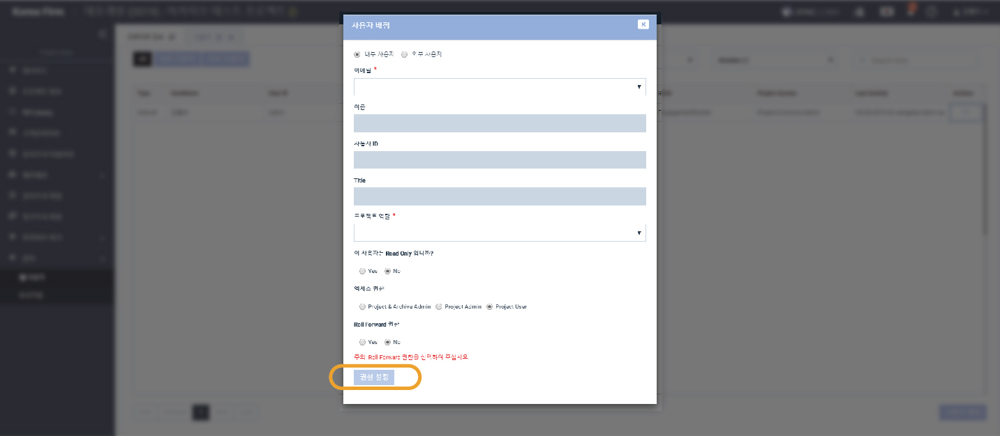

# \(ENG\)5. 아카이브된 프로젝트의 관리 \(관리자용\)

## 요약보기

1. '아카이브 관리' 화면에서 아카이브 된 프로젝트 보기 
2. 아카이브 된 프로젝트에 사용자 설정하기  
3. 아카이브 된 프로젝트 압축파일 다운로드 하기 
4. 아카이브 된 프로젝트 아카이브 해제하기 

## 1. '아카이브 관리' 화면에서 아카이브 된 프로젝트 보기

Organization Home 화면의 왼쪽 메뉴 목록에서 '아카이브 관리'를 선택합니다. 아카이브 관리 화면은 법인의 Super Admin과 Archive Manager 에게만 보여지는 화면입니다. \(Group Admin과 User Access 에게는 보여지지 않습니다.\)

> 주의: 2019년\(현재의 연도\)이 기본값으로 설정되어 있습니다. 전년도 프로젝트를 확인하시려면 연도를 2018년으로 설정하여 주십시오.

아카이브 관리 화면에는 배정 여부와 상관없이 모든 아카이브된 프로젝트가 나타납니다. 아카이브 관리자는 아카이브 된 프로젝트를 열어 내용을 확인할 수 있습니다. 단, 다른 사용자의 권한을 수정하거나 압축파일을 다운받기 위해서는 스스로를 해당 프로젝트에 배정하거나 활성화 해야합니다.

## **2**. **아카이브 된 프로젝트에 사용자 설정하기**

> * 아카이브 된 프로젝트에 Super Admin이 아닌 사용자가 열람 또는 반출 요청을 했을 때 
> * 관리자 스스로 프로젝트를 아카이브 해제 하거나 압축파일을 다운받아야 할 때

### **2-1. 프로젝트 열기**

Organization Home 화면의 왼쪽 메뉴 목록에서 '아카이브 관리'를 선택합니다. 목록에서 사용자 설정을 원하는 프로젝트의 Open을 선택합니다.

### 2-2. 사용자 활성화 또는 사용자 신규 배정

#### 2-2-1. 기존 사용자 활성화

아카이브가 완료된 프로젝트의 모든 사용자는 비활성화 처리되어있습니다. \(비활성화 된 사용자는 프로젝트에 접근할 수 없습니다.\) 사용자를 활성화 하면 해당 사용자가 다시 아카이브 된 프로젝트를 열람할 수 있게 됩니다. 기존 사용자의 권한에 따라 사용자가 아카이브 된 프로젝트 내부에서 다른 사용자의 설정을 변경할 수 있으므로 반드시 사용자의 권한을 확인하여 주십시오. \(이 부분은 6월 업데이트에서 아카이브 관리자만 설정이 가능하도록 변경됩니다.\)


* 사용자의 우측에서 'Activate'를 클릭하면 사용자가 프로젝트 내에서 활성화됩니다. 
* 사용자의 우측에서 'Deactivate'를 클릭하면 사용자가 프로젝트 내에서 비활성화 됩니다.  



관리자 역시 프로젝트의 사용자 정보를 수정하거나, 압축파일을 다운받거나, 아카이브를 해제하려면 스스로를 프로젝트에 배정해야 합니다.



권한\(Archive Permission, Roll Forward Permission 등\) 이 수정되지 않는 경우 스스로를 배정 해제\(Unassign\) 한 후 다시 배정하면서 권한을 수정할 수 있습니다.


* **프로젝트 관리자 + 아카이브 권한 + 롤 포워드 권한**을 가진 사용자를 활성화 한 경우  
  * 해당 사용자가 다른 팀원을 활성화/비활성화/배정/배정해제 할 수 있습니다. 
  * 해당 사용자가 아카이브 된 프로젝트를 롤 포워드 할 수 있습니다. 
  * 해당 사용자가 아카이브를 해제할 수 있습니다. 
* **프로젝트 관리자 + 아카이브 권한**을 가진 사용자를 활성화 한 경우 
  * 해당 사용자가 다른 팀원을 활성화/비활성화/배정/배정해제 할 수 있습니다. 
  * 해당 사용자가 아카이브를 해제할 수 있습니다. 
* **프로젝트 관리자 권한**을 가진 사용자를 활성화 한 경우 
  * 해당 사용자가 다른 팀원을 활성화/비활성화/배정/배정해제 할 수 있습니다. 
* **프로젝트 참여자** \(Project User\) 권한의 사용자를 활성화 한 경우 
  * 해당 사용자는 프로젝트를 열람할 수 있습니다. 

#### 2-2-2. 신규 사용자 배정

1. 아카이브 된 프로젝트의 '관리' 메뉴를 선택합니다. 
2. 관리 &gt; 사용자 화면 우측 하단의 ‘사용자 배정’ 버튼을 클릭합니다.

이하 내용은 일반 사용자 배정 방식과 동일합니다. 아카이브 권한 및 롤 포워드 설정에 주의하여 주십시오.

#### 2-2-3 아카이브된 프로젝트에 대한 접근/다운로드/기한 설정

* 법인의 아카이브 관리자는 아카이브된 프로젝트에 대한 일반 사용자의 열람/다로드 권한 및 권한의 만료기한을 설정할 수 있습니다.
* 법인의 아카이브 관리자도 스스로에게 프로젝트 열람 권한을 설정해야 아카이브된 프로젝트를 열 수 있습니다.


사용자 검색시 한글 이름으로 검색하여 주십시오.


## 3. 아카이브 된 프로젝트 압축파일 다운로드 하기


법인의 아카이브 관리자인 경우에도 아래 조건을 충족해야 압축파일을 다운로드 할 수 있습니다.

* 아카이브된 프로젝트에 배정되어 있다.
* 아카이브된 프로젝트 내부에서 활성화 되어 있다. 
* 아카이브된 프로젝트 내부에서 아카이브 권한을 가지고 있다. 


### 3-1. 목록에서 압축파일 다운로드 하기

> 관리자인 경우에도 프로젝트에 배정 및 활성화 되어 있지 않으면 압축파일을 다운로드 할 수 없습니다.

### 3-2. 프로젝트 내부 - 아카이브 준비진단 화면에서 압축파일 다운로드 하기

## 4. 아카이브 된 프로젝트 아카이브 해제하기


법인의 아카이브 관리자인 경우에도 아래 조건을 충족해야 아카이브를 해제할 수 있습니다.

* 아카이브된 프로젝트에 배정되어 있다.
* 아카이브된 프로젝트 내부에서 활성화 되어 있다. 
* 아카이브된 프로젝트 내부에서 아카이브 권한을 가지고 있다. 


