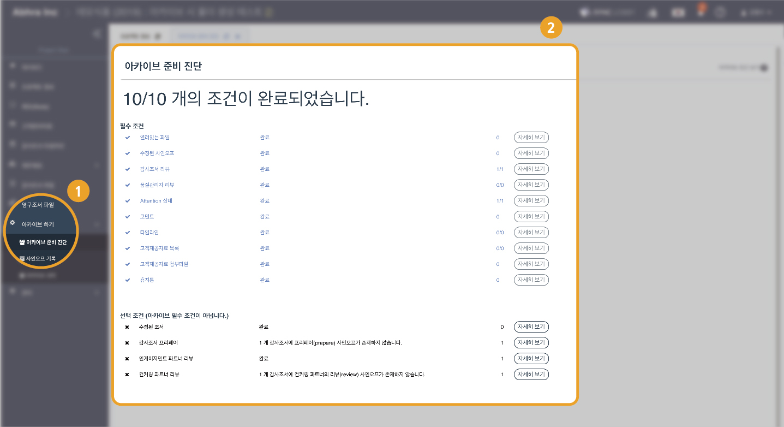
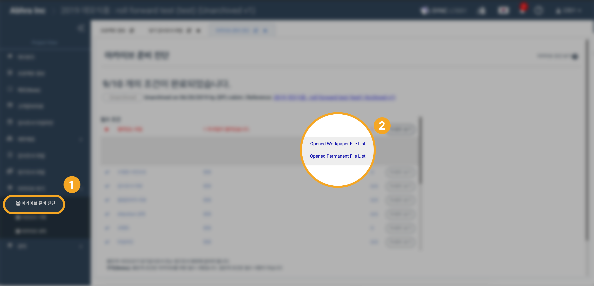
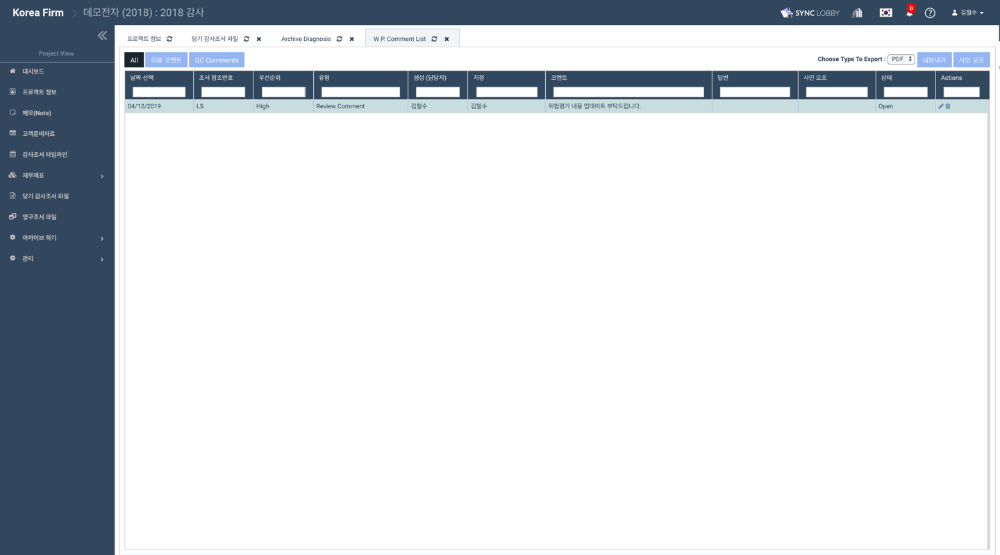
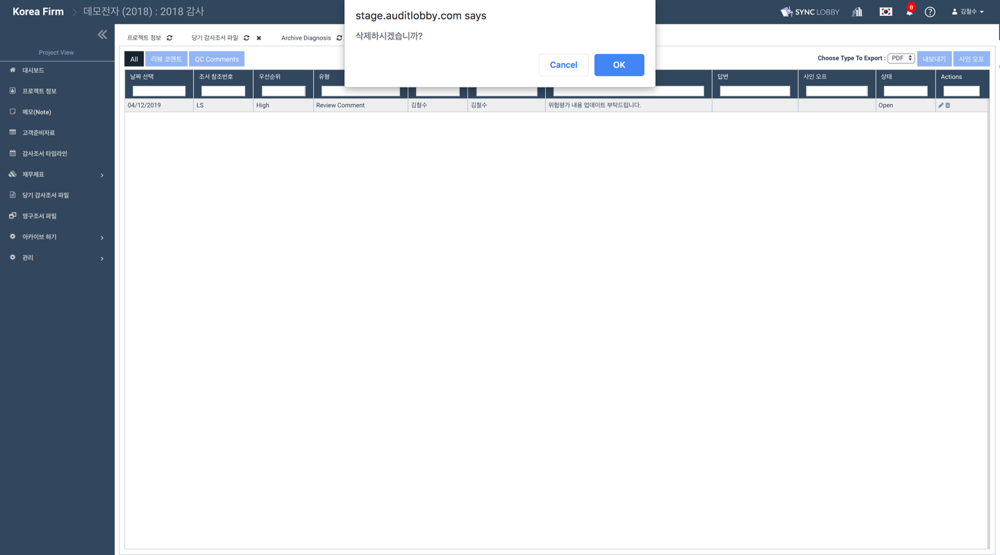
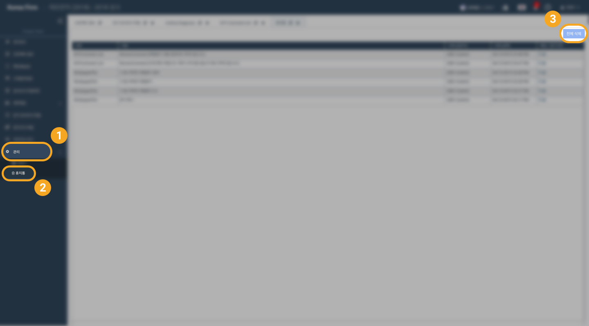
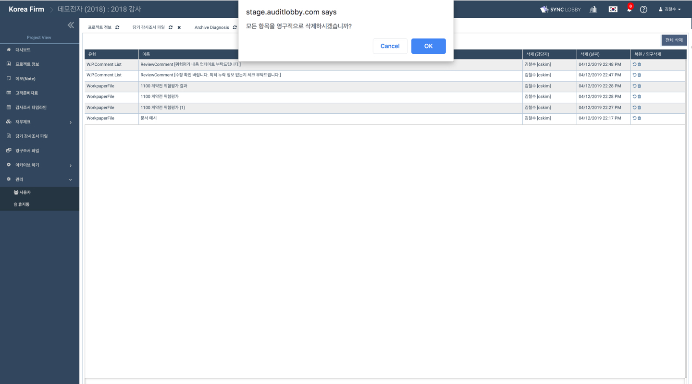

# \(ENG\)4-1. 아카이브 준비 진단

Project Home 화면의 왼쪽 메뉴 목록에서 '아카이브 하기' &gt; ‘아카이브 준비 진단’을 선택합니다. 아카이브 준비 진단 페이지에서 아카이브를 하기 위한 필수 조건이 모두 완료되었는지 확인합니다.

## 아카이브 필수 조건


자세히 보기 버튼을 눌러 상세 목록을 확인할 수 있습니다.


1. 열려있는 파일이 없어야 합니다. 
2. 수정된 사인오프가 있는 경우, 상위 팀원의 사인오프가 다시 필요합니다.
3. 모든 감사조서에 리뷰 사인오프가 있어야 합니다. 
4. 품질관리자에게 배정된 조서에  반드시 품질관리자\(QC\)의 사인오프가 있어야 합니다. 
5. 당기감사조서 또는 영구조서 중 Attention \(주의\) 상태로 설정된 조서가 없어야 합니다. 
6. 코멘트가 모두 삭제되어야 합니다. 
7. 타임라인 아이템이 모두 삭제되어야 합니다. 
8. 고객제공자료 목록이 모두 완료되어야 합니다. 
9. 고객제공자료 첨부파일이 모두 삭제되어야 합니다. 
10. 휴지통의 모든 파일이 삭제되어야 합니다. 

## 아카이브 선택 조건

1. 붉은색 \* 표시가 나타난 사인오프의 개수와 해당 사인오프가 있는 조서의 목록을 확인할 수 있습니다. 붉은색 \* 표시는 해당 사인오프 이후 조서가 수정되었음을 나타냅니다.  re-prepare, re-review를 통해 붉은색 \* 표시를 없앨 수 있지만 아카이브 필수 조건이 아닙니다.
2. 프리페어 사인오프가 없는 조서의 목록을 확인할 수 있습니다. 프리페어는 아카이브 필수 조건이 아닙니다. 
3. 프로젝트 책임자\(Engagement Partner\)의 리뷰가 없는 조서 목록을 확인할 수 있습니다. EP의 사인오프가 없어 프로젝트 팀원의 리뷰가 있으면 아카이브를 진행할 수 있습니다. 
4. 컨커링 파트너\(Concurring Partner\)의 리뷰가 없는 조서 목록을 확인할 수 있습니다. CP의 사인오프가 없어도 프로젝트 팀원의 리뷰가 있으면 아카이브를 진행할 수 있습니다. 

