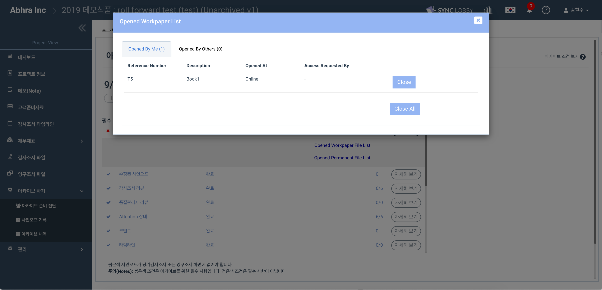

# \(Razia-Done\)4-1. Archive Diagnosis

From the menu list on the left side of the Project Home screen, **select 'Archive'&gt; 'Archive diagnosis'**. On the Archive Diagnosis page, verify that all prerequisites for archiving are complete.

## Archive Condition - Required for Archive


Click the Details button to see the detailed list. This required condition can be customized by Archive Manager of the organization.


1. Make sure there are no open files
2. If there is a modified sign-off, sign-off from the top team member is required again
3. All workpaper must have a review sign off
4. There must be a quality manager \(QC\) sign-off in the workpaper assigned to the quality manager
5. There should be no workpaper in the Workpaper file or Permanent file set to the state of Attention
6. All comments must be deleted
7. All timeline items must be deleted
8. The PBC list must be completed
9. All PBC attachments must be deleted
10. All files in the Trash Bin must be deleted
11. Final Issuance date should be set
12. Project should be in locked state

## Additional Information -  Not Required for Archive 

1. You can see the number of sign-offs marked with a red and a list of the records with corresponding sign-offs. _A_ red  indicates that the post has been modified since the sign-off. You can remove the red \* mark through re-prepare, re-review, but it is not an archive requirement
2. You can see the list of the workpapers without pre-pared sign-off. Prepare is not an archive prerequisite
3. You can see a list of records without reviews from the Engagement Partner. If there is no EP sign-off and you have a project team member's review, you can proceed with the archive
4. You can see a list of workpapers without reviews from Concurring Partners. If you do not have a CP sign-off, you can still archive if you have a project team member's review
5. You can see the Rationale records\(displayed when any modification is done to Audit files after final Issuance date\)  without description in Archive Diagnosis-&gt;Rationale screen,it is set as optional to archive
6. If any other team member with different role  review the audit file instead of assigned role, then you can proceed to archive

