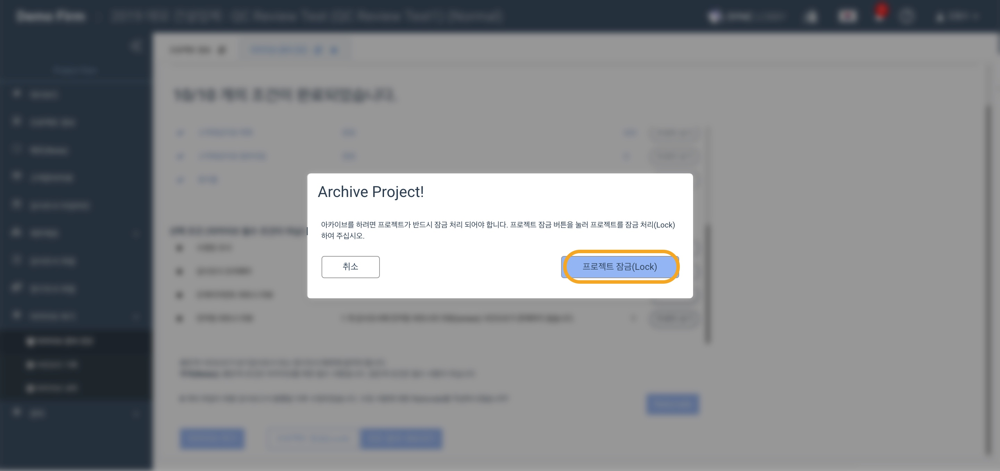

# 4-2. 아카이브 하기

## 요약보기  

1. 아카이브 하기
2. 메일의 링크를 통해 ZIP파일 다운로드 
3. 아카이브 압축파일이 생성되지 않은 경우  
4. 아카이브 압축파일의 구성  
5. 자동으로 Replica\(아카이브 사본\) 생성  

## 1. **아카이브 하기** 


프로젝트 아카이브는 프로젝트 내부에서 아카이브 권한이 있어야 가능합니다. [프로젝트 내부 권한 설정](../../setup/2./organize-audit-team.md#5)에서 아카이브 권한 설정 방법을 확인하실 수 있습니다.


* 아카이브 준비 진단의 필수 조건을 모두 만족하면 '아카이브 하기' 버튼이 나타납니다.
* 프로젝트 잠금 처리\(Lock\) 해야 아카이브를 진행할 수 있습니다.
* 아카이브 준비 진단 페이지 하단의 ‘아카이브 하기’ 버튼을 클릭합니다.

* 아카이브 하기 버튼을 누르면  본인 확인을 위해 이메일 주소 입력창이 나타납니다.  
* 본인의 이메일 주소를 입력한 뒤 ‘ARCHIVE’ 버튼을 클릭합니다.
* 아카이브 하기 버튼을 누르면 프로젝트 잠금 요청창이 나타납니다.
* 프로젝트 잠금\(Lock\)버튼을 클릭합니다.  

* 프로젝트 잠금은 아카이브 준비 진단 화면에 있는 프로젝트 잠금\(Lock\) / 잠금 해제\(Unlock\) 버튼으로 가능합니다. 이 버튼은 프로젝트 관리자 \(project admin\) 또는 프로젝트 아카이브 관리자\(project & archive admin\)인 경우 나타납니다. 
* 프로젝트를 잠그면 조서의 내용을 수정할 수 없습니다.
* 프로젝트를 잠그면 프로젝트 제목 옆에 주황색 자물쇠 아이콘이 나타납니다.
* 아카이브에 성공하면 '마이페이지' 화면으로 전환되며 성공 알림 메시지가 나타납니다. 

* 아카이브에 성공하면 '마이 페이지'화면으로 전환되며 성공 알림 메세지가 나타납니다.  


* **아카이브 압축파일은 어디에 사용되나요?** 
  * 아카이브 이후 일반 팀원은 프로젝트에 접근할 수 없습니다. 아카이브 압축파일을 통해 아카이브를 해제 하지 않고 내용을 확인할 수 있습니다. 
  * 아카이브 압축파일은 생성과 동시에 원격 저장소인 AWS S3 에 저장됩니다. 이후 다운로드 되는 모든 파일은 이 파일의 복제본으로써 진본성과 무결성을 확인할 수 있습니다. 
* **파일 용량이 큰 경우 압축에 시간이 걸려 이메일이 다소 늦게 도착할 수 있습니다.** 
* **간혹 용량이 매우 큰 프로젝트의 경우 압축파일이 생성되지 않을 수 있습니다. 하지만 아카이브는 정상적으로 진행됩니다.**



**아카이브에 성공하면 모든 팀원이 자동으로 해당 프로젝트에 비활성화 됩니다.** \(더이상 프로젝트를 열어 내용을 확인하거나 수정할 수 없습니다. \)


## 2. **메일의 링크를 통해 ZIP파일 다운로드** 

아카이브 이후 아카이브를 진행한 팀원의 이메일로 24시간 기한의 아카이브 압축파일 다운로드 링크가 도착합니다.  메일의 링크를 클릭하여 아카이브 압축파일을 다운로드 합니다.

24시간이 지나면 링크를 사용할 수 없게 되며, 압축파일이 필요한 경우 법인의 아카이브 관리자에게 요청하여 이용 권한을 허용 받아야 합니다. 

## 3. 아카이브 압축파일이 생성되지 않은 경우  

프로젝트의 용량이 750MB 이상인 경우 간혹 아카이브 압축파일이 생성되지 않을 수 있습니다. 이 경우 아래와 같은 이메일이 도착합니다. 


* 압축파일의 생성은 아카이브의 부가 기능입니다. 
* 압축파일 생성이 실패하더라도 프로젝트는 정상적으로 아카이브 됩니다. 


### 3-1. 아카이브된 프로젝트의 준비진단 화면에서 다시 압축파일을 생성합니다. 

법인의 아카이브 관리자에게 아래 사항을 요청합니다. 

* 압축파일을 생성하고자 하는 프로젝트 내부에서 사용자 활성화 
* \(배정되어 있지 않은 경우\) 해당 프로젝트에 사용자 배정 
* 사용자에게 아카이브 권한 부여 

이후 아카이브 준비진단 화면에서 다시 압축파일을 생성할 수 있습니다. 

## 4. 아카이브 압축파일의 구성  

아카이브 압축파일은 다음과 같이 구성되어 있습니다. 

1. 프로젝트 정보 
2. 프로젝트 팀원 정보 
3. 사인오프 기록 \(최종본\)
4. 사인오프 기록 \(상세본\)
5. 아카이브 기록
6. 당기감사조서 파일 \(폴더 형태\) 
7. 영구조서 파일 \(폴더 형태\) 

## 5. Replica\(아카이브 사본\) 생성  

* 감사 프로젝트를 아카이브 하면 자동으로 사본\(Replica\) 만들어집니다.
* 아카이브 사본에는 아카이브 진행 시 생성되는 압축파일이 포함되지 않습니다.

