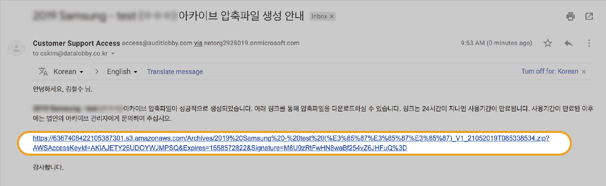

# \(Razia-Done\)4-2. Archive

## Summary 

1. Archive
2. Download ZIP file via link in a mail
3. In case that the archived zip is not created
4. Contents of Archive Compressed Files
5. Replica \(Copy of the Archived Project\) Project for reference

## 1. Archive 


Only the users who have archive authority are able to archive projects. You can find out the information of how to set the archive authority at the [Select the Project Access Type]().


* Prepare the archive When all of the diagnostic requirements are met, the 'Archive' button appears.
* The project must be locked to archive the project.
* Ready to archive Click the 'Archive' button at the bottom of the Diagnostics page.

* When you click the archive button, an email address input window appears to confirm your identity.
* Enter your email address and click the "ARCHIVE" button.
* If you click the 'Archive' button project lock window will appear.
* Click the Lock this Project button.

* If the archive is successful, it will switch to the "My Page" screen and a success notification will appear

* You can lock the project with the Lock this project button on the Archive Diagnosis screen. This button appears if you are a project administrator \(project admin\) or project & archive admin.
* If you lock the project, you cannot change the contents of the workpaper file.
* When you lock the project, an orange lock icon appears next to the project title.
* If the archive is successful, screen will be switched to the My Page screen and a success notification message will appear.

* Where are archive zip files used?
  * After the archive, general team members are blocked from accessing the project. Archive archive allows you to view the contents without unarchiving
  * Archives are stored on remote storage, AWS S3, at the same time that you create the archive. All subsequently downloaded files can be checked for completeness and integrity as a duplicate of this file
* **If the file size is large, it may take some time for the email to arrive late**
* **Sometimes a compressed file may not be created for very large projects. However, the archive will proceed normally**
* If the archive is successful, it will switch to the "My Page" screen and a success notification will appear.
* If the archive is successful, all team members are automatically **deactivated** for that project. \(You can no longer open the project to view or modify its contents.\)‌

## 2. Download ZIP file via link in mail  

After the archive, you will receive a 24-hour archive compressed file download link in the email of your archiving team. Click on the link in the mail to download the archive archive.‌

After 24 hours, the link will be unavailable. If you need a zip file, you'll need to ask the corporate archive manager to grant access.

## 3. If the archive archive file is not created  

If your project has a capacity of 750 MB or more, archive archives may not be generated at times. In this case, the following email will arrive.


* Creating a compressed file is an add-on to the archive
* If the creation of the archive fails, the project is successfully archived


### 

### 3-1. Prepare the archived project Create a compressed archive again from the Diagnostics screen. 

Ask your corporate archive manager for the following:‌

* Activate the user inside the project for which you want to create the archive \(If not assigned\)
* User assignment to the project
* Grant user archive privileges

You can then create the archive again from the Ready to archive diagnostic screen.‌

## 4. Contents of Archive Compressed Files  

An archive archive consists of the following:‌

1. Project information
2. Project member information
3. Sign-off history \(final version\)
4. Sign-off history \(Detail version\)
5. Archive history
6. Workpaper file \(folder\)
7. Permanent file \(folder\)

## 5. Replica \(Copy of the Archived Project\) Project for reference

* When you archive a project, a replica copy of the project is made 
* Replica project does not contain the compressed files that are created when the archive proceeds

