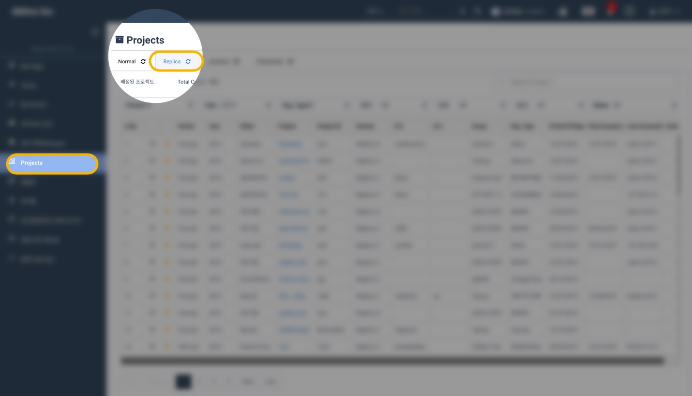
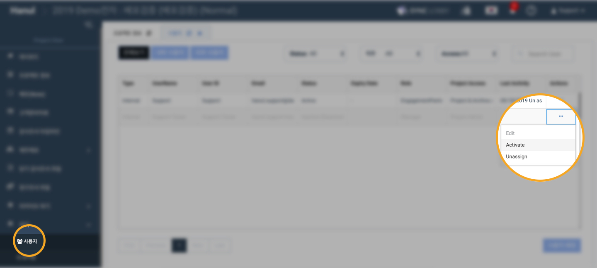
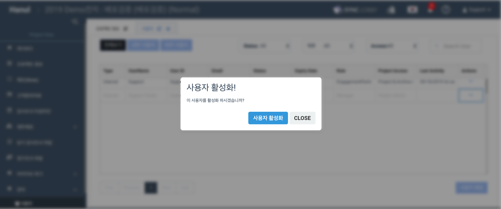
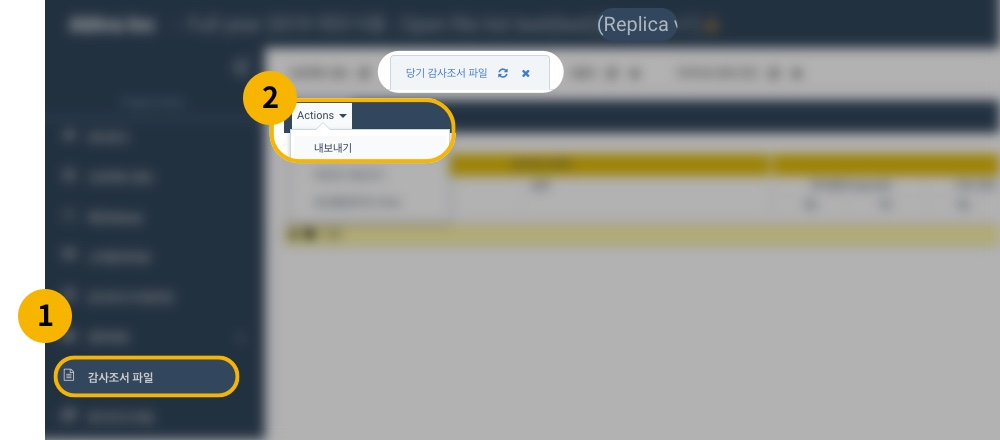
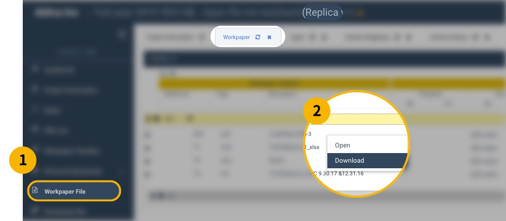
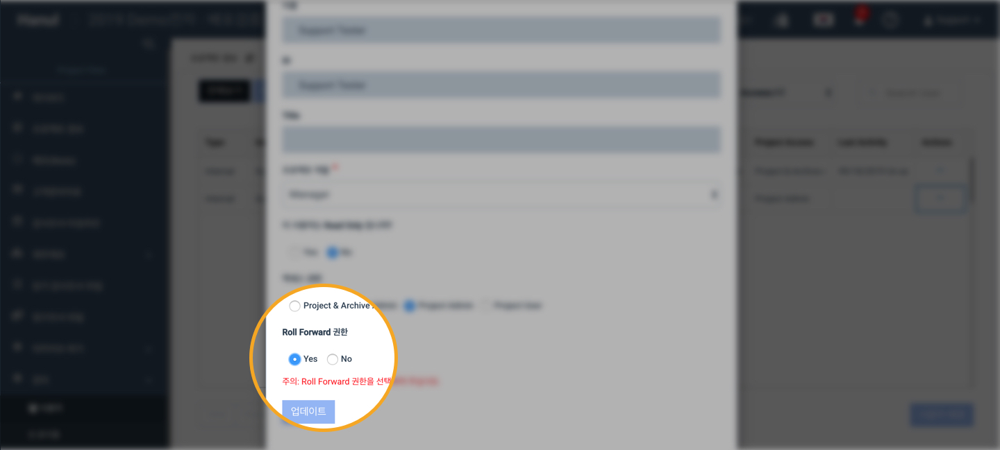

# \(Razia-Done\)4-3. Using Replicas \(Archive copies\)


프로젝트를 아카이브 하면 자동으로 '레플리카\(Replica\)' 라는 아카이브 사본이 생성됩니다. 이 아카이브 사본은 아카이브 프로젝트와 별개이며, 기존 감사팀원들의 편리한 자료 활용이 목적입니다.


## 1\) 아카이브 사본의 특성

* 아카이브 사본에서 기존 프로젝트의 조서를 다운받거나 열람할 수 있습니다. 
* 아카이브 사본을 롤 포워드 하여 새로운 프로젝트를 만들 수 있습니다. 
* 새로운 사용자를 추가하여 열람, 다운로드, 롤 포워드 권한을 부여할 수 있습니다. 
* 아카이브 사본의 조서를 수정할 수 없습니다. \(열람과 다운로드만 가능합니다.\) 
* 아카이브 사본에 가해진 수정은 아카이브된 프로젝트에 영향을 주지 않습니다. 
* 아카이브 사본이 생성될 때, 기존 프로젝트에서 프로젝트 및 아카이브 관리자였던 사용자, 그리고 프로젝트 관리자 이면서 롤 포워드 권한이 있었던 사용자 만 활성화 되고, 다른 사용자들은 모두 비활성화 처리 됩니다. 


이미 아카이브된 프로젝트에는 기존 감사팀원들의 접근이 불가능합니다.


## 2\) 아카이브 사본 찾기

프로젝트 목록 화면 상단의 'Replica' 탭을 선택하면 아카이브 사본의 전체 목록을 확인할 수 있습니다.

> 사용자의 권한에 따라 보여지는 목록에 차이가 있을 수 있습니다.

## 3\) 아카이브 사본에서 사용자의 권한 수정하기

아카이브 사본이 생성될 때, 아카이브 이전에 프로젝트 및 아카이브 관리자 였던 사용자, 롤포워드 권한을 가진 프로젝트 관리자 외 모든 사용자가 비활성화 됩니다.

따라서 비활성화 된 사용자가 아카이브 사본 이용을 원할 경우, 이미 활성화 된 사용자\(일반적으로 프로젝트 책임자\)가 해당 사용자를 활성화해야 합니다.

## 3\) 아카이브 사본에서 파일 다운받기


프로젝트에 배정되어 있고, 활성화 상태인 사용자인 경우 다운로드를 할 수 있습니다.


### 3-1\) 일괄 다운로드

### 3-2\) 개별 다운로드

## 5\) 아카이브 사본에서 롤포워드 허용하기

일반 프로젝트와 동일한 방법입니다. 관리 화면에서 수정하고자 하는 사용자를 선택한 후 롤 포워드 권한을 yes 로 변경하고 저장합니다.

## 6\) 기존 프로젝트 책임자가 퇴사한 경우

기존 프로젝트 책임자가 퇴사하여 다른 사용자를 활성화 하거나 롤 포워드를 허용할 사람이 없는 경우 품질관리실 또는 서포트 계정으로 문의하여 주십시오.

