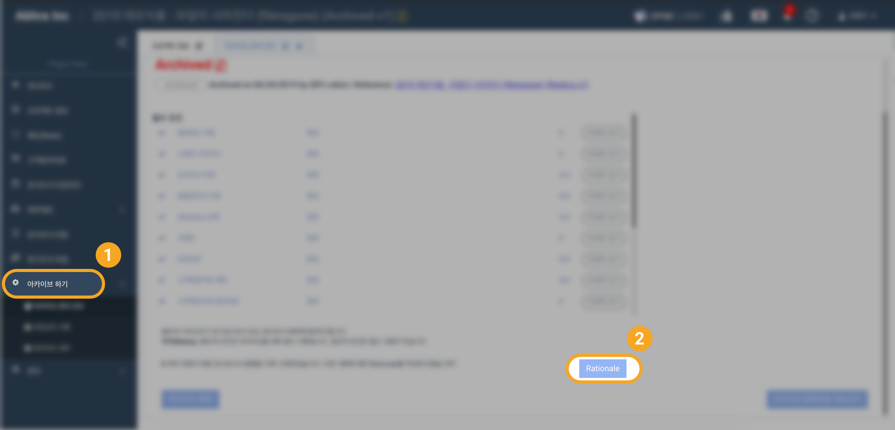
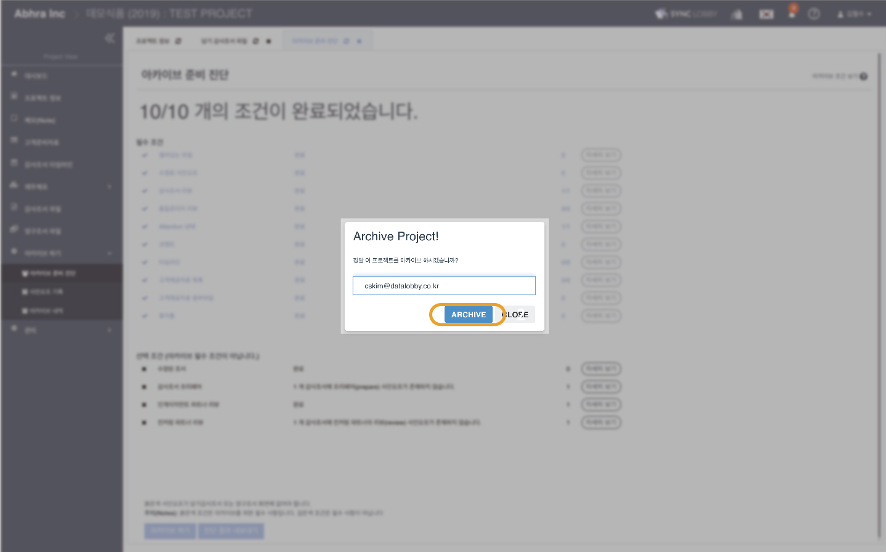
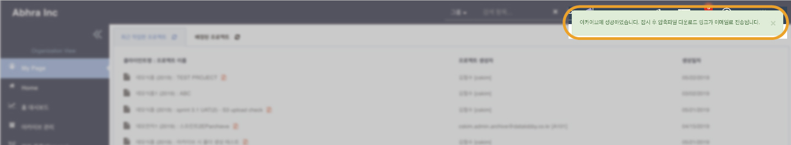

# \(ENG\)4-4. 다시 아카이브 하기 \(Re-archive\)

## 요약보기

1. 수정 후 다시 아카이브 준비 진단 조건 확인
2. Rationale\(조서 변경 사유서\)
3. 아카이브 하기
4. 이메일의 링크를 통해 ZIP 파일 다운로드  
5. 아카이브를 다시 진행한 경우의 압축파일 
6. 아카이브를 다시 진행한 경우 버전 변

## 1. 수정 후 다시 아카이브 준비 진단 조건 확인

프로젝트를 수정한 후, Project Home 화면의 왼쪽 메뉴 목록에서 '아카이브 하기' &gt; ‘아카이브 준비 진단’을 선택합니다. 아카이브 준비 진단 페이지에서 아카이브를 하기 위한 필수 조건이 모두 완료되었는지 확인합니다.

## 2. Rationale\(조서 변경 사유서\)

* 최종 감사보고서 발행일을 등록하면, 해당1일자 이후 수정된 감사조서에 대해 사유서를 작성할 수 있습니다.

## 3. **아카이브 하기**

아카이브 준비 진단 페이지 하단의 ‘아카이브 하기’ 버튼을 클릭합니다.

* 아카이브 하기 버튼을 누르면 본인 확인을 위해 이메일 입력창이 나타납니다. 
* 본인의 이메일 주소를 입력한 뒤 ‘ARCHIVE’ 버튼을 클릭합니다.

* 아카이브에 성공하면 알림 메시지가 나타납니다. 
* 아카이브가 진행되는 것과 별개로 압축파일이 생성되고, 이메일로 링크가 전송됩니다. 


간혹 프로젝트의 크기가 큰 경우 압축이 실패할 수 있지만 아카이브 성공 여부와는 무관합니다. 성공 메시지가 나타난 경우 아카이브는 파일 압축과 별개로 성공하였음을 알 수 있습니다.


## 4. **메일의 링크를 통해 ZIP파일 다운로드**

* 아카이브 이후 아카이브 된 프로젝트를 압축한 파일이 생성되고, 이메일로 다운로드 기한이 있는 링크가 전송됩니다. 
* 24시간 이내로 메일의 링크를 클릭하여 아카이브 압축파일을 다운로드 합니다.
* 링크가 만료된 경우 법인의 아카이브 관리자에게 문의하여 주십시오.  

## 5. 아카이브를 다시 진행한 경우의 압축파일

다시 아카이브를 진행하는 경우 수정사항이 반영된 압축파일이 새로 생성됩니다. 이 때 아카이브 기록에 아카이브 해제와 2차 아카이브 기록 및 담당자와 일자가 추가됩니다.

## 6. 아카이브를 다시 진행한 경우 버전 변경

* 아카이브를 해제한 후 다시 아카이브 하면 아카이브 사본 및 아카이브된 프로젝트가 새로운 버전으로 만들어집니다.

