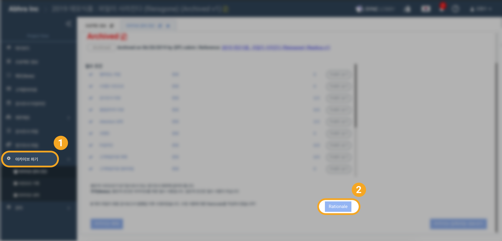
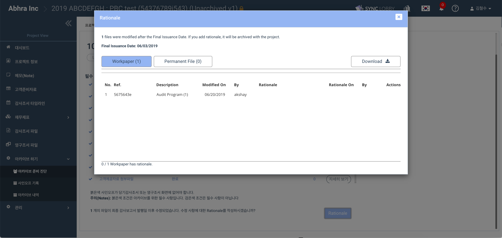
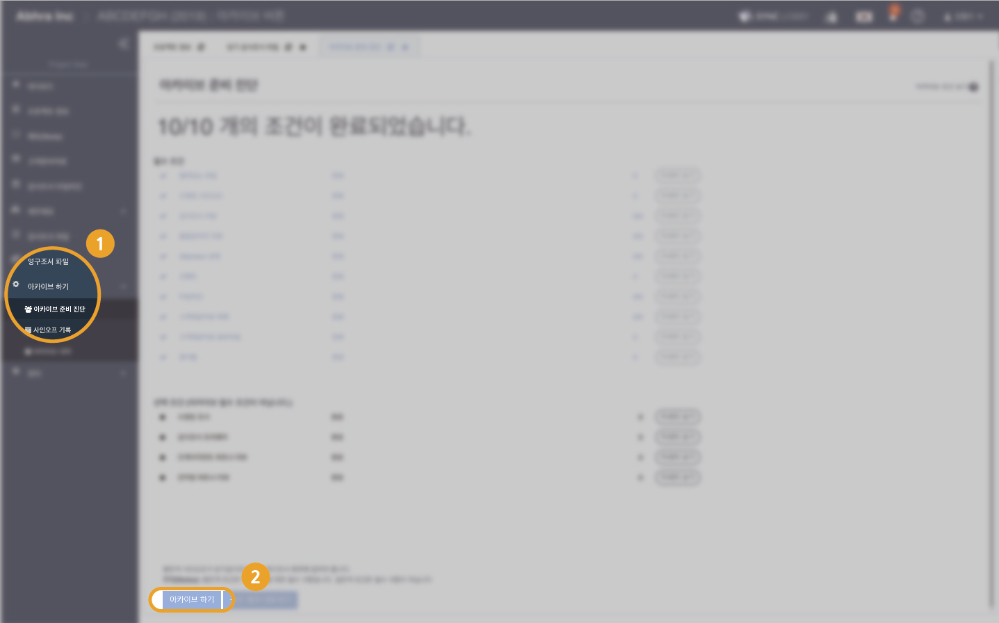
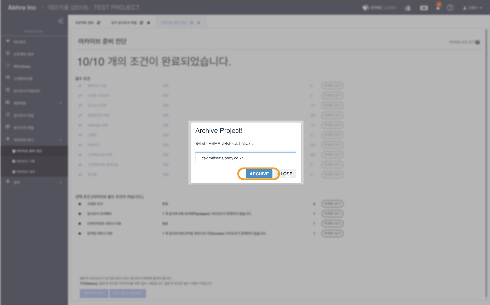
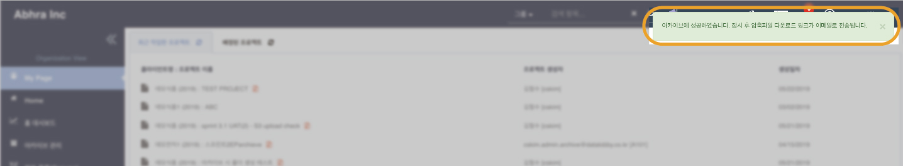
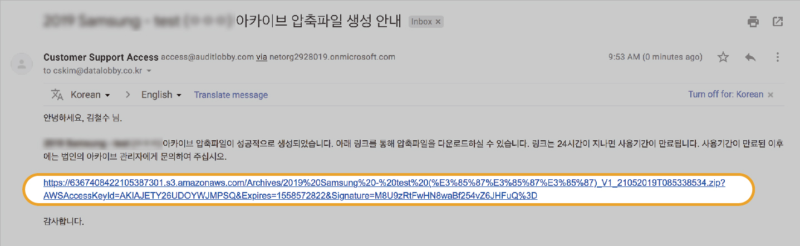
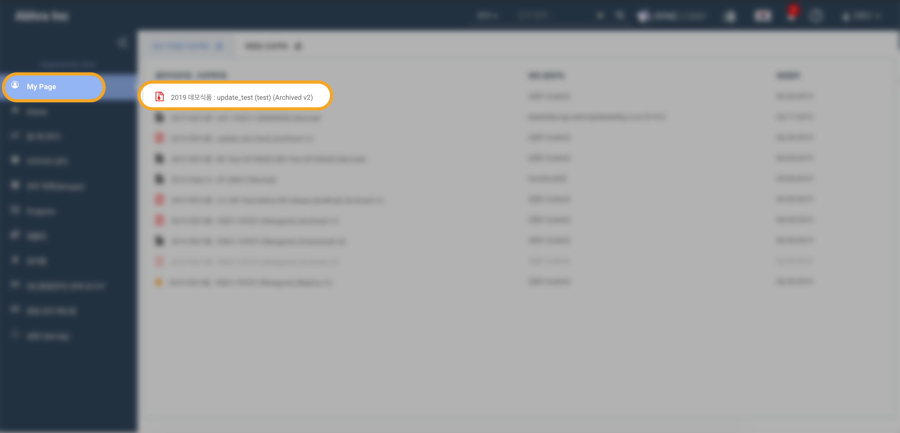

# \(Razia-Pending\)4-5. Re-archive

## Summary

1. After editing, check the archive diagnosis again
2. Document the rationale for re-archiving
3. Archive 
4. Download ZIP file via link in email 
5. Contents of the re-archived project
6. The versioning of the archived project

## 1. After editing, check the archive diagnosis again

After modifying the project, select 'Archive'&gt; 'Archive Ready Diagnosis' from the menu list on the left of the Project Home screen. On the Ready to Archive Diagnostics page, verify that all prerequisites for archiving are complete.

## 2. Document the rationale for re-archiving

## 3. Archive

Click the 'Archive' button at the bottom of the Archive diagnosis page.

* If you press the archive button, an e-mail input window appears to confirm your identity
* Enter your email address and click the "ARCHIVE" button

* If the archive is successful, a notification message appears
* Apart from the archive, a zip file is created and the link is sent by email


Rationale document upload feature is coming soon to provide the supporting document during rearchive



Sometimes, if the size of the project is large, the compression may fail, but it is not related to the success or failure of the archive. If you see a success message, you can see that the archive succeeded apart from the file compression.


## 4. Download ZIP file via link in email

* After archiving, a compressed file of the archived project will be created, and a link will be sent via email to download
* Within 24 hours, click on the link in the mail to download the archive archive
* If the link has expired, please contact the corporate archive manager

## 5. Contents of the zip file of the re-archived project

Upon the completion of re-archiving, a new archived ZIP file will be created that reflects your modifications. This includes the secondary archive record, and the users and sign-off date to the archive record.

## 6. The versioning of the archived project

* Re-archiving creates new versions of a archived copy and replica for the project.

