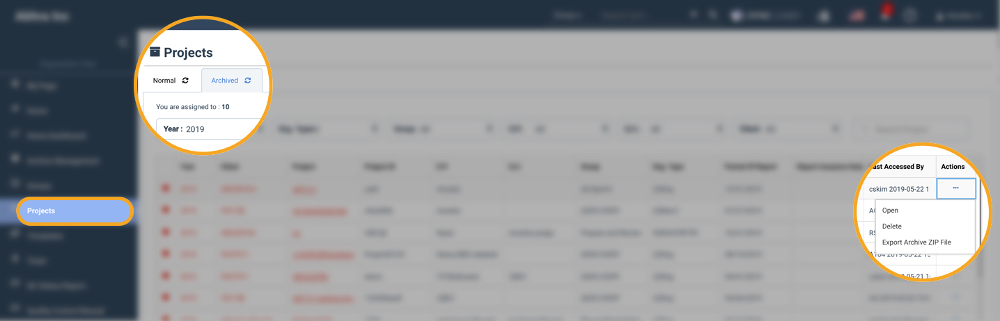

# 4-6. 아카이브 된 프로젝트 찾기

## 요약보기  

1. 아카이브된 프로젝트 찾기  
2. ZIP파일 다운로드 


이 페이지는 일반 사용자를 위한 안내입니다. 법인의 아카이브 관리자는 5. 아카이브된 프로젝트의 관리 \(관리자용\) 페이지를 이용하여 주십시오. 



아카이브 된 프로젝트는 아카이브를 해제하기 전 까지는 일체 수정이 불가능합니다. 아카이브를 해제하면 담당자와 일자가 기록으로 남습니다. 


## 1. 아카이브된 프로젝트 찾기  

아카이브 된 프로젝트는 일반 팀원의 접근이 차단됩니다. 아카이브 된 프로젝트의 내용을 확인해야 할 경우,  법인 아카이브 관리자에게 활성화 및 권한 설정을 요청해야 합니다. 

이하 내용은 활성화를 요청하기 전, 또는 요청 후 아카이브 상태의 프로젝트를 찾는 방법입니다. 

### **법인용 메뉴의 '프로젝트'  메뉴 사용하여 아카이브된 프로젝트 확인하기**  

1. 법인용 메뉴에서 '프로젝트'를 선택합니다. 
2. 프로젝트 화면의 상단에서 'Archived' 탭을 선택합니다. 
3. 아카이브 탭에서 연도를 확인합니다. \(기본 설정은 2019년입니다. 2018년에 진행된 프로젝트의 경우 나타나지 않습니다.\) 
4. 화면에 아카이브 된 프로젝트의 목록이 나타납니다. 

* 접근 권한이 없는 프로젝트는 회색으로 표시됩니다. 
* 접근 가능한 \(접근이 허용된\) 아카이브된 프로젝트는 붉은색으로 표시됩니다. 
* 접근이 허용된 프로젝트의 경우 제목 또는 우측 끝의 메뉴를 사용하여 열 수 있습니다. 

## 2. ZIP파일 다운로드

아래 조건을 충족하는 사용자는 아카이브 시 생성된 아카이브 압축 파일을 다운로드 할 수 있습니다. 

* 아카이브 된 프로젝트에 접근할 수 있도록 허용된 사용자 
* 아카이브 된 프로젝트에서 아카이브 권한을 가진 사용자 

### 압축파일 다운로드 방법  

* 아카이브 압축파일의 다운로드 권한이 허용된 경우 메뉴에  'Export Archive Zip File' 이라는 메뉴가 나타납니다. 
* 나타나지 않는 경우는 권한이 허용되지 않은 상황입니다. 관리자에게 다운로드 권한을 요청하시기 바랍니다.
* 다운로드가 허용된 사용자의 경우 아카이브 된 프로젝트 내부의 '아카이브 준비진단' 메뉴에서도 압축파일을 다운로드 할 수 있습니다. 

