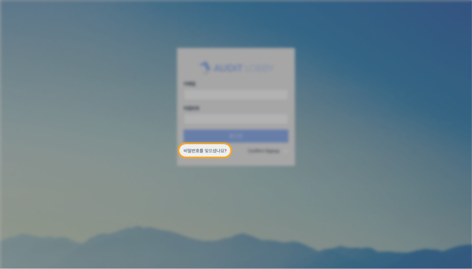
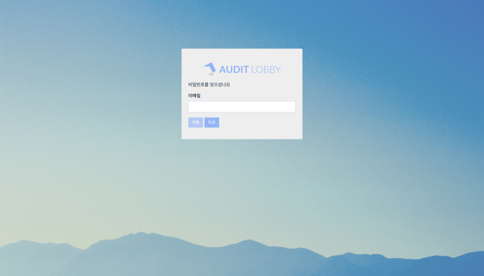
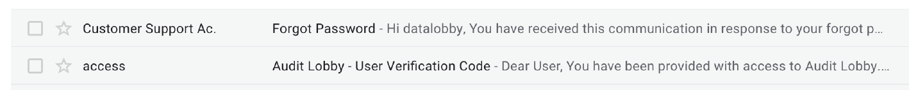
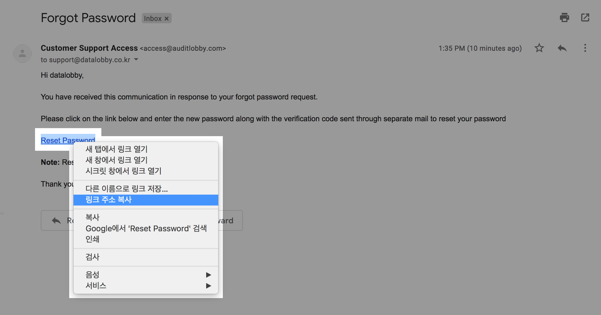
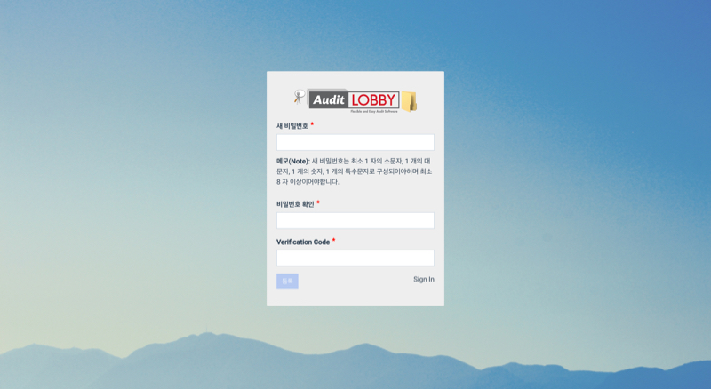

# \(ENG\)1-1. 비밀번호 재설정 하기

## Summary   

1. Use the Chrome browser to access your accounting firm's Audit Lobby
2. Click 'Forgot Password?' at the bottom of the login window
3. On the Forgot Password page, type the email address
4. The message 'The password reset link has been sent to the registered email' will appear on the screen
5. Two emails titled 'Forgot Password' and 'Audit Lobby - User Verification Code' will be sent to the registered e-mail address
6. Open an e-mail titled 'Forgot Password' and click on the 'Reset Password' link
7. When the screen switches to Audit LOBBY, enter a new password on the reset password page
8. Open the 'Audit Lobby - User Verification Code' email to check the verification code and enter it on Audit Lobby
9. Click 'Submit' button to complete
10. You can log in with the new password

## 1. **Use the Chrome browser to access your accounting firm's Audit LOBBY**

> * For enterprise Audit LOBBY users, please access the accounting firm's separately established Audit LOBBY address \(ex. ABC accounting firm -&gt; abc.auditlobby.com\)
> * If you are using the Audit LOBBY Pro version, please access kr.auditlobby.com

## 2. **Click 'Forgot Password?' at the bottom of the login window**

## 3. **On the Forgot Password page, type the email address**

## 4. **The message 'The password reset link has been sent to the registered email' will appear on the screen**

## 5. **Two emails titled 'Forgot Password' and 'Audit Lobby - User Verification Code' will be sent to the registered e-mail address**

## 6. **Open an email titled 'Forgot Password' and click on the 'Reset Password' link**

Open an email titled 'Forgot Password' and click on the 'Reset Password' link to go to the Audit LOBBY password reset page. 

> If the password reset page does not appear when you click the link, the email system of the accounting firm may be blocking external links.
>
> In this case, proceed as follows.

### 6-1. Right click 'Reset Password' to copy the link address

Depending on your Internet browser, it may be labeled 'Copy Link' or 'Copy URL'. 

### 6-2. Paste the copied address into the address bar of the Chrome browser

## 7. **When the screen switches to Audit LOBBY, enter a new password on the reset password page**

## 8. **Open the 'Audit Lobby - User Verification Code' email to check the verification code and enter it on Audit LOBBY**

## 9. **Click 'Submit' to complete**

## 10. **You can log in with the new password**

