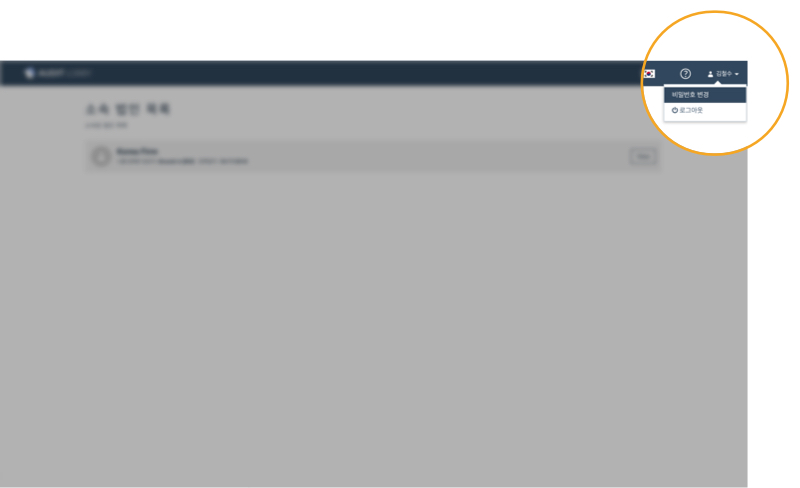

# 1-2. 인증코드 만료시 재발급 받기

## 요약보기

1. 로그인 화면의 'Confirm Signup' 을 클릭합니다. 
2. 이메일을 입력하고, 인증코드 입력 부분에 '000000' 을 입력합니다. 
3. 이메일에서 새로운 인증코드를 확인합니다.  
4. 'Confirm Signup' 화면에 이메일과 새로운 인증코드 \(숫자 여섯자리\)를 입력합니다.  
5. 로그인 창에 이메일과 임시 비밀번호를 입력하여 로그인합니다. 
   1. 임시 비밀번호를 가지고 있는 경우 임시비밀번호를 이용하여 로그인합니다. 
   2. 임시 비밀번호가 없는 경우 '비밀번호를 잊으셨나요\(Forgot password\)'를 선택하여 비밀번호를 설정할 수 있습니다.  
6. 임시 비밀번호를 변경합니다.  


임시 비밀번호 이메일을 분실 또는 삭제하신 경우 '비밀번호 재설정'을 통해 임시 비밀번호 없이 새로 비밀번호를 설정하실 수 있습니다. \(안내문서 5-2번 항목을 참고하여 주십시오.\) 


## 1. 로그인 화면의 'Confirm Signup' 을 클릭합니다. 

1. **크롬 브라우저**로 인터넷을 엽니다. 
2. **Professional Version 사용 고객**의 경우 https://**kr.**auditlobby.com 으로 접속합니다.
3. **Enterprise Version 사용 고객**의 경우 ****https://**회계법인이름.**auditlobby.com으로 접속합니다. 

   \(ex. ganada 회계법인의 경우 ganada.auditlobby.com\)

4. 로그인 창 우측 하단의 **‘Confirm Signup’** 를 클릭합니다.

## 2. 이메일을 입력하고, 인증코드 입력 부분에 '000000' 을 입력합니다. 

1. 이메일 입력란에 이메일을 입력합니다. 
2. 인증코드 입력란에는 기간이 만료된 인증코드 또는 000000을 입력합니다. 
3. 'Verify' 버튼을 누르면 알림창이 나타납니다. 
4. '확인'을 누릅니다.    

## 3. 이메일에서 새로운 인증코드를 확인합니다.  

이메일에서 여섯자리 숫자로 구성된 새로운 인증코드를 확인합니다. 

## 4. 'Confirm Signup' 화면에 이메일과 새로운 인증코드 \(숫자 여섯자리\)를 입력합니다. 

1. ‘Confirm sign up’ 화면에 이메일과 **새로 받은 인증코드** \(숫자 여섯자리\)를 입력합니다. 
2. **Verify**를 눌러 인증을 진행합니다. 
3. 인증이 성공하면 화면 우측 상단에 **‘Your user account has been verified successfully.**’ 라는 문구가 나타나며 로그인 화면으로 전환됩니다.

> _이 부분부터 초기 로그인 및 인증 방법과 동일하게 진행됩니다._

## 5. 로그인 창에 이메일과 임시 비밀번호를 입력하여 로그인합니다. 

### 5-1. 임시 비밀번호를 가지고 있는 경우 

* 로그인 화면에 이메일 주소와 임시 비밀번호를 입력하여 로그인 합니다. 
* 임시 비밀번호는 **첫 인증코드 전송 메일과 함께 전송되었던 것을 그대로** 사용합니다. 

### 5-2. 임시 비밀번호를 분실 또는 삭제한 경우 

1. 로그인 창 하단의 '비밀번호를 잊으셨나요\(Forgot password\)'를 누릅니다. 
2. 이메일 주소를 입력하여 비밀번호 재설정 링크와 비밀번호 재설정 인증코드를 발급받습니다. 
3. 이메일에서 비밀번호 재설정 링크를 클릭하여 비밀번호 재설정 화면으로 이동합니다. 
4. 비밀번호를 재설정 합니다. 

## 6. 임시 비밀번호를 변경합니다. 

로그인이 성공하면 화면 우측 상단의 사용자 이름을 클릭하여 **비밀번호를 변경**합니다.

> 주의: 비밀번호는 알파벳 소문자, 대문자, 특수문자, 숫자를 모두 포함하여 8자리 이상이어야 합니다.

