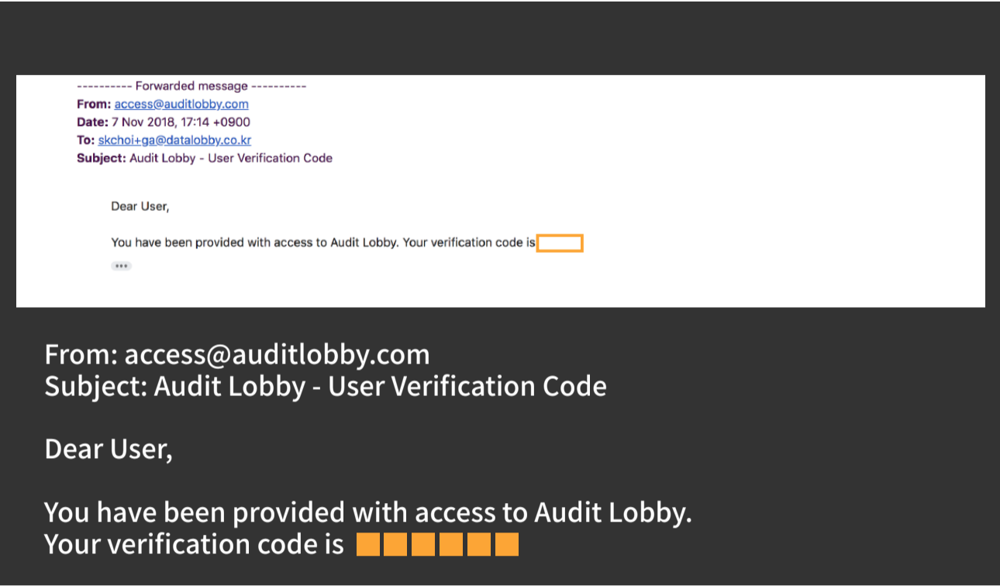
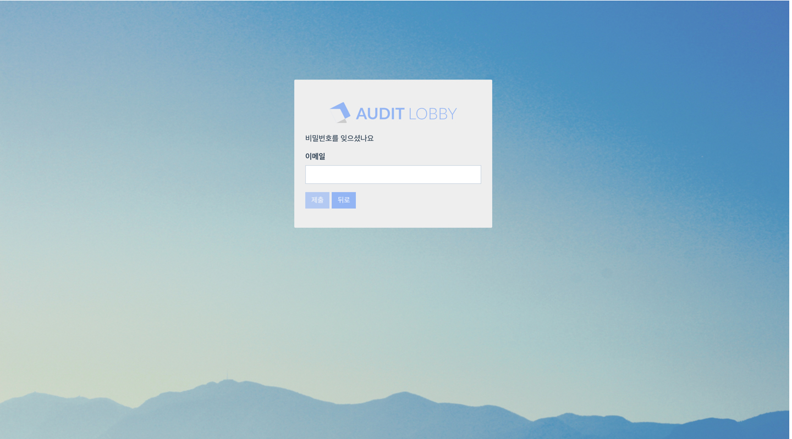

# \(ENG\)1-2. Reissue a new verification code

## Summary

1. Click 'Confirm Signup' on the login screen
2. Enter email and enter '000000' in the verification code field
3. Check your email for a new verification code
4. Enter email and a new verification code\(six digits\) on the 'Confirm Signup' screen
5. Enter your email and the temporary password in the login window to log in
   1. If you have a temporary password, log in using the temporary password
   2. If you do not have a temporary password, you can set the password by clicking 'Forgot password'
6. Change the temporary password


If you have lost or deleted your temporary password email, you can set a new password without a temporary password by clicking 'Reset Password'. \(Article 5-2 on [1-2]()\)


## 1. **Click 'Confirm Signup' on the login screen**

1. Open the Internet with a Chrome browser
2. If you are a Professional Version user, access [https://kr.auditlobby.com](https://kr.auditlobby.com)
3. If you are an Enterprise Version user, access https://\(the firm's name\).auditlobby.com

    \(ex. ABC accounting firm -&gt; abc.auditlobby.com\)

4. Click 'Confirm Signup' on the login screen

## 2. **Enter email and enter '000000' in the verification code field**

1. Enter email in the Email field
2. Enter an expired verification code or 000000 in the Verification Code field
3. Click the 'Verify' button and you will see a notification window
4. Click 'OK'

## 3. **Check your email for a new verification code**

Check your email for a new six digits verification code.

## 4. **Enter email and a new verification code\(six digits\) on the 'Confirm Signup' screen**

1. Enter email and a new verification code\(six digits\) on the 'Confirm Signup' screen
2. Click the 'Verify' button to proceed the verification process
3. If the verification was successful, the message 'Your user account has been verified successfully.' will appear in the upper right corner of the screen and the screen will switch to the login screen

> From this point, the process goes the same way as you initially login and verify.

## 5. **Enter your email and the temporary password in the login window to log in.**

### 5-1. **If you have a temporary password**

* Enter your email and the temporary password in the login window to log in
* Use the temporary password that was sent with the first verification code email

### 5-2. If you have lost or deleted the temporary password 

1. Click 'Forgot password' at the bottom of the login window
2. Enter your email address to get a password reset link and password reset verification code
3. Click the reset password link in the email to go to the reset password screen
4. Reset the password

## 6. **Change the temporary password.**

After logging in, click the user name in the upper right corner of the screen to change the password.

> Notice: A password must be at least 8 digits, including all lowercase letters, uppercase letters, special characters, and numbers.

