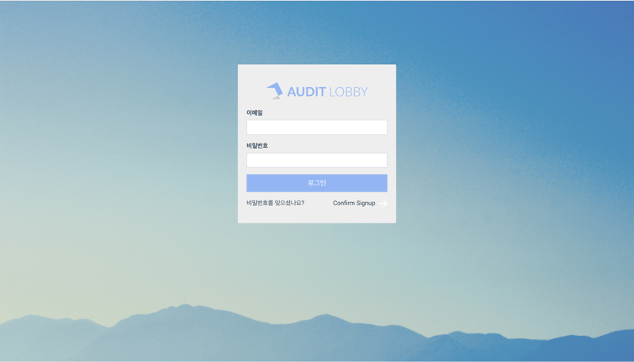
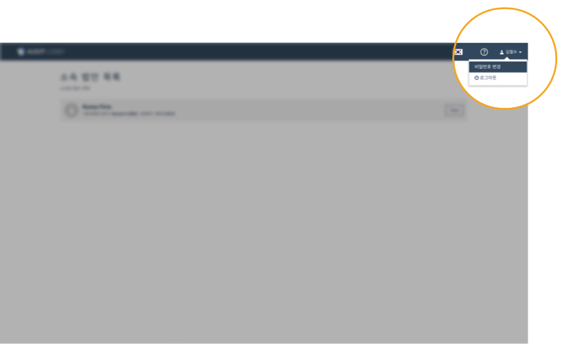

# \(ENG\)1. Account Creation

## Summary   

1. **'Verification Code'** and **'Temporary Password'** e-mail will arrive in your mail address at access@auditlobby.com \(Total of 2 e-mails will arrive\)
2. Access **Audit LOBBY**
   1. **Please be sure to access the Chrome browser**
   2. For **enterprise Audit LOBBY users**, please access the accounting firm's separately established Audit LOBBY address \(ex. ABC accounting firm -&gt; abc.auditlobby.com\)
   3. If you are using the Audit LOBBY Pro version, please access kr.auditlobby.com
3. Press **'Confirm Signup'** in the bottom right of the center-screen pop-up window
4. Enter **the email address** and **the verification code** \(Please enter the verification code instead of the temporary password\) Press the **'Verify'** button to switch to the login page after the authentication process
5. Log in using your email address and **the temporary password** when the verification process is complete
6. Select the user name in the upper right corner of the screen and click **'Change Password'** in the submenu
7. After entering the temporary password in the current password, set a new password \(the password must be at least 8 characters long, including all uppercase, lowercase, special characters, numbers, etc\)

## 1. Check the 'Verification Code' and 'Temporary Password' mail

When an Audit LOBBY administrator registers a new user, **'Verification Code'** and **'Temporary Password'** mail will be sent to the user's mail \(a total of 2 emails will arrive\)\)

## 2. Access Audit LOBBY

### Notice

* Please access using **the Chrome browser**
* For enterprise Audit LOBBY users, please access the accounting firm's separately established Audit LOBBY address which is **\(the firm's name\).auditlobby.com** \(ex. ABC accounting firm -&gt; abc.auditlobby.com\)
* If you are using Audit LOBBY Korea, please access kr.auditlobby.com
* If you are using Audit LOBBY US, please access us.auditlobby.com
* If you are using Audit LOBBY India, please access ind.auditlobby.com

## 3. Press Confirm Signup in the bottom right of the pop-up

## 4. Enter the email address and the verification code

Enter the email address and the verification code and press the Verify button to switch back to the login page. 

## 5. On the login page, enter the temporary password and log in

## 6. After logging in, click on the user name in the upper right corner of the screen to click on 'Change Password'

## 7. Enter the temporary password in 'Current Password', set a new password and press 'Submit' button


The password must be at least 8 characters long, including all uppercase, lowercase, special characters, numbers.


