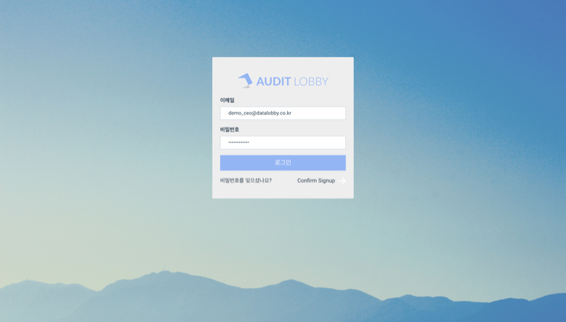

# 1. 계정 등록하기

## 요약보기   

1. &lt;access@auditlobby.com&gt;의 메일 주소로 '**Verification code**'와 '**임시 비밀번호**' 메일이 사용자의 메일로 도착합니다.  \(총 2개의 메일이 도착합니다. \) 
2. **어딧로비**에 접속합니다. 
   1. **반드시 크롬 브라우저로 접속하여주십시오.** 
   2. **엔터프라이즈 어딧로비 이용자**의 경우 ****회계법인 별도로 설정된 어딧로비 주소를 통해 접속하여 주십시오. \(ex. ganada 회계법인의 경우 ganada.auditlobby.com\)  
   3. **어딧로비 프로버전 이용자**의 경우 kr.auditlobby.com으로 접속하여 주십시오.  
3. 화면 중앙 팝업창 우측 하단에 있는 '**Confirm Signup**' 을 누릅니다.
4. **이메일 주소**와 **verification code**를 입력합니다. \(임시 비밀번호가 아닌 'verification code'를 입력하여 주십시오.\)  'Verify' 버튼을 누르면 인증과정을 거쳐 로그인 화면으로 전환됩니다. 
5. 인증과정이 완료되면 ****이메일 주소와 **임시 비밀번호**를 사용하여 ****로그인합니다.
6. 화면 우측 상단의 사용자 명을 선택한 후 하위 메뉴에서 '**비밀번호 변경**' 을 클릭합니다.
7. 현재 비밀번호에 임시 비밀번호를 입력한 후, 새로운 비밀번호를 설정합니다. \(비밀번호는 대문자, 소문자, 특수문자, 숫자 등을 모두 포함한 8글자 이상이어야 합니다.\)

## 1. '인증코드' 와 '임시 비밀번호' 메일을 확인합니다.  

어딧로비 관리자가 새로운 사용자를 등록하면, &lt;access@auditlobby.com&gt;라는 메일 주소에서 '**Verification code**'와 '**임시 비밀번호**' 메일이 사용자의 메일로 전송됩니다. \(총 2개의 메일이 도착합니다. \) 

## 2. 어딧로비에 접속합니다. 

### 주의사항  

* **크롬 브라우저**를 이용하여 접속하여 주십시오. 
* 엔터프라이즈 서비스를 이용하는 회계법인 소속 사용자는 **\(회계법인이름\).auditlobby.com** 으로 접속하여 주십시오. \(예시: 가나다 회계법인인 경우, ganada.auditlobby.com\)
* 한국 어딧로비 서비스를 이용하는 사용자는 kr.auditlobby.com으로 접속하여 주십시오. 

## 3. 화면 중앙 팝업창 우측 하단의 Confirm Signup을 누릅니다.   

## 4. 초대받은 이메일 주소와, 인증코드를 입력합니다. 

이메일 주소와 인증코드를 입력하고 Verify 버튼을 누르면 다시 로그인 화면으로 전환됩니다.  

## 5. 로그인 화면에서 임시 비밀번호를 입력하고 로그인 합니다. 

## 6. 로그인 이후 화면 우측 상단의 사용자 이름을 눌러 '비밀번호 변경' 을 클릭합니다.  

## 7. '현재 비밀번호' 에 임시 비밀번호를 입력한 후, 새로운 비밀번호를 설정하고 '확인' 버튼을 누릅니다.  

### 주의사항

비밀번호는 대문자, 소문자, 특수문자, 숫자 등을 모두 포함하여 8글자 이상이어야 합니다. 

