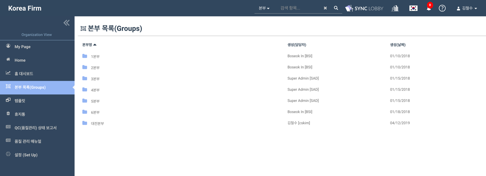
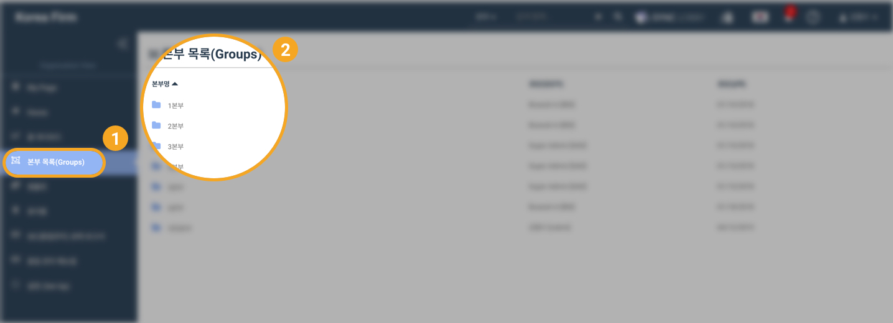
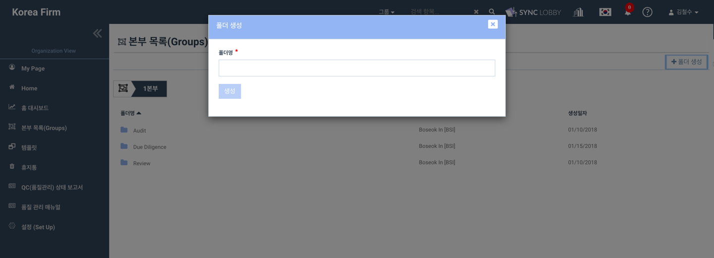

# \(ENG\)7. Cabinet Creation

1. Click the 'Groups' button from the left menu column of the Organization View
2. You will see the list of groups that you are assigned to
3. Click the group that you want to work with
4. Create a new cabinet by clicking the 'Create Cabinet' button at the top right of the page

By using the cabinet function you can make folders and organize the projects as you work with your PC.

