# \(ENG\)9. 프로젝트 생성


프로젝트 생성 안내는 다음 상황이 이미 준비된 것을 가정하여 진행됩니다.

1. 사용자\(user\), 본부\(group\), 클라이언트\(고객사, client\) 가 이미 법인에 등록되어 있습니다. 
2. 사용자와 클라이언트가 프로젝트가 등록된 본부에 배정되어 있습니다.  


사용자 등록, 본부 설정, 고객 등록 등의 사전 설정에 대한 가이드는 A. 어딧로비 기본 설정 가이드 &gt; 1~7 번 항목을 통해 확인하실 수 있습니다.

프로젝트 생성은 크게 두 단계로 나눠집니다.

> * 9-1. 프로젝트 생성 \(Create Project\) 
> * 9-2. 템플릿 생성 \(Choose Template\)

## 9-1. 프로젝트 생성\(Create Project\)

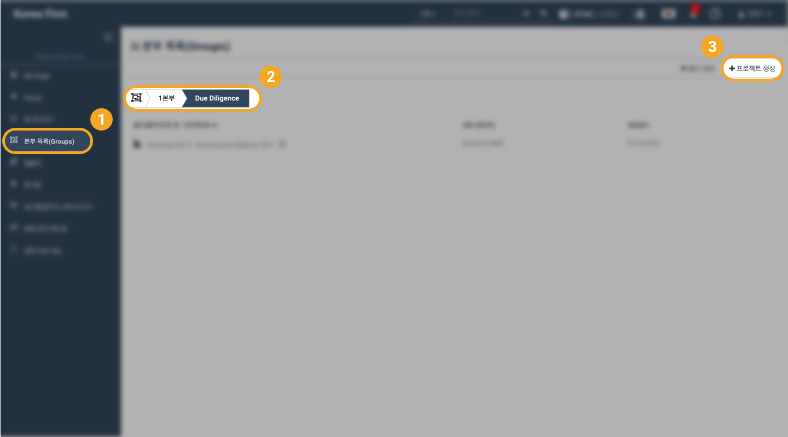

1. 법인용 화면 \(Organization View\)의 왼쪽 메뉴 목록에서 '본부 목록 \(Groups\)'을 선택합니다. 
2. 프로젝트를 구성할 본부와 폴더를 선택합니다. 1. 본부가 만들어지지 않은 경우 먼저 본부를 생성하고 본부에 사용자를 배정해 주십시오. [\(본부 등록 가이드\)](x.-group-1.md) 2. 폴더가 없는 경우 화면 우측 상단의 Create Cabinet 버튼을 눌러 폴더를 만듭니다.

   > 본부 안에 폴더가 최소 하나 이상 있어야 프로젝트를 만들 수 있습니다.

3. 폴더 안에 프로젝트를 만들기 위해 화면 우측 상단의 '프로젝트 생성 \(Create Project\)' 버튼을 누릅니다. 
4. 프로젝트 생성 팝업창에서 프로젝트 세부 정보를 입력합니다.  

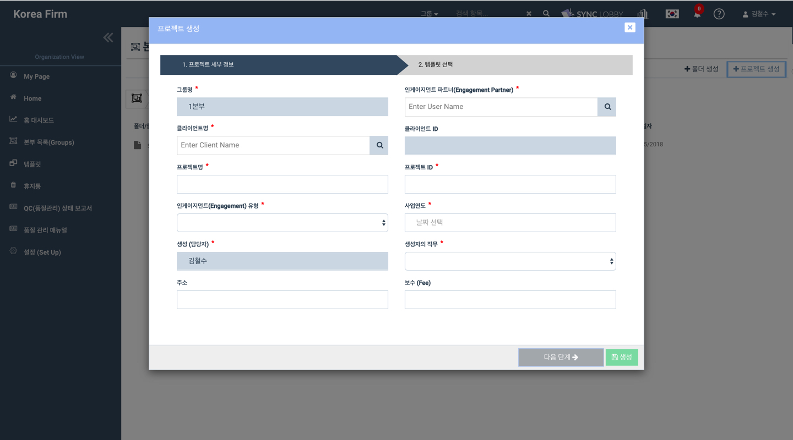

다음 항목의 설정이 필요합니다.

### **1. 그룹명** \(Group Name\) & **프로젝트 책임자 \(Engagement Partner\) 설정**

프로젝트가 생성된 본부가 자동으로 선택됩니다. 본부 명을 확인하신 후 잘못된 경우 창을 닫고 적절한 본부로 이동하여 프로젝트를 생성하여 주십시오.

그룹명 오른쪽의 '인게이지먼트 파트너\(Engagement Partner\)'는 프로젝트 책임자를 선택하는 부분입니다. 입력창을 클릭하고 프로젝트 책임자의 이름을 **입력하기 시작하면** 아래쪽에 프로젝트 책임자로 지정할 수 있는 사용자의 목록이 나타납니다. 목록에서 해당 프로젝트 책임자를 선택할 수 있습니다.

인게이지먼트 파트너 입력창에 **사용자의 이름을 입력**하기 시작하면 아래에 자동완성 목록이 나타납니다. 해당하는 사용자의 이름을 **선택**합니다.


반드시 목록에 나타난 이름을 클릭하여 주시기 바랍니다. 직접 입력하신 이름의 경우 프로그램이 적절한 사용자로 받아들이지 않을 수 있습니다.



주의: 돋보기 모양 아이콘은 별도의 역할을 하지 않습니다. 입력창에 사용자의 이름을 입력하여 주시기 바랍니다.


### 2. **클라이언트명 설정**

> **클라이언트 ID**는 클라이언트 명에 따라 자동 입력됩니다.

클라이언트 입력창에 **클라이언트명을 입력**하기 시작하면 아래에 자동완성 목록이 나타납니다. 해당하는 클라이언트의 이름을 **선택**합니다.

주의: 돋보기 모양 아이콘은 별도의 역할을 하지 않습니다. 입력창에 클라이언트의 이름을 입력하여 주시기 바랍니다.

### 3. **프로젝트명**과 **프로젝트 ID 설정**

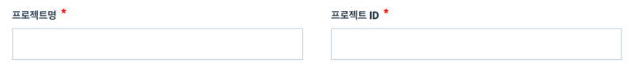

1. 인게이지먼트 유형 \(Engagement Type\) 과 사업연도 \(Period of Report\)를 설정합니다.  

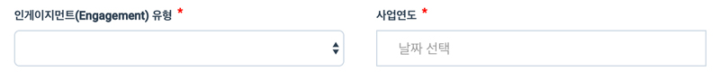

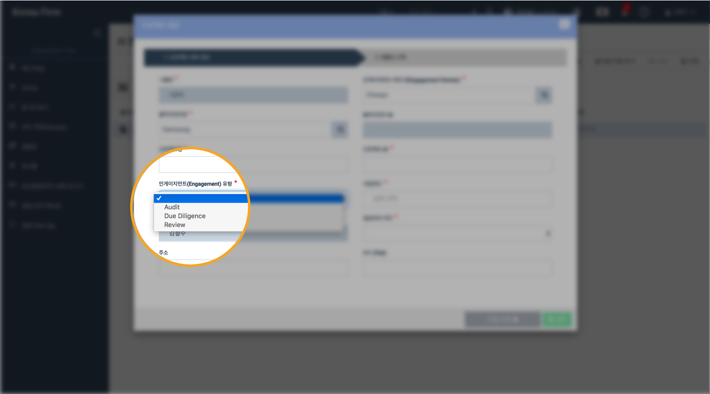

프로젝트 타입\(Engagement Type\)을 설정합니다. 입력창을 클릭하면 소속 회계법인에 등록된 프로젝트 타입 목록이 나타납니다. 프로젝트에 해당하는 프로젝트 타입을 선택합니다.

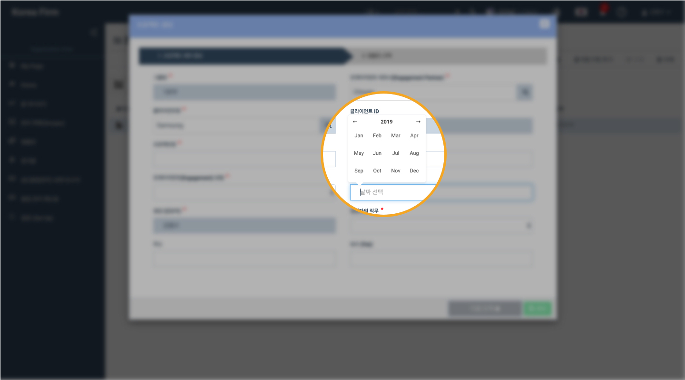

사업연도 \(Period of Report\)를 설정합니다. 입력창을 클릭하면 달력이 나타납니다. 프로젝트에 해당하는 날짜를 선택합니다. 일반적으로 결산일을 기준으로 작성합니다. \(예: 2019년 감사 프로젝트인 경우 2019년 12월 31일을 입력\)

### 4. 생성자의 직무 설정

프로젝트를 생성한 사람의 역할을 설정하는 부분입니다.

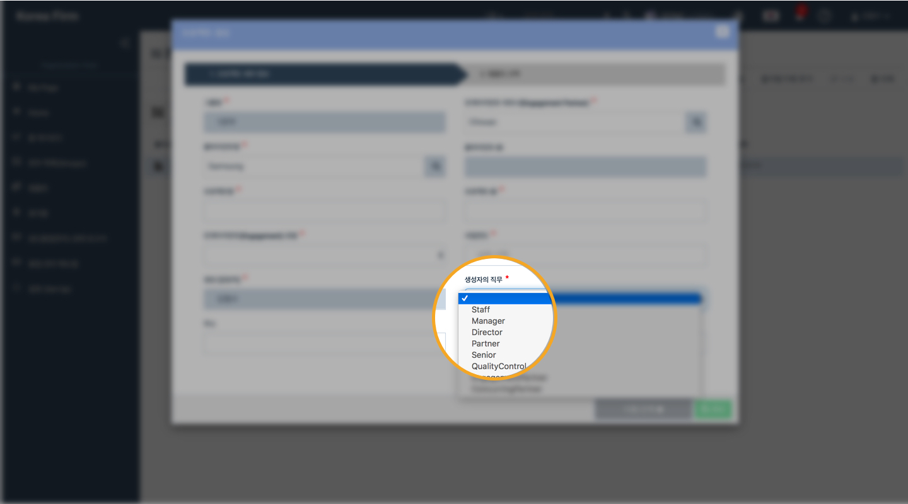

생성\(담당자\)의 이름은 자동으로 입력됩니다. '생성자의 직무' 입력창을 선택하면 프로젝트 내에서 사용되는 직무 목록이 나타납니다.

* Staff, Senior, Manager, Director, Partner 간 권한의 차이는 없습니다. 
* 프로젝트 책임자인 경우 Engagement Partner 로 설정합니다. 
* 컨커링 파트너의 경우 Concurring Partner 로 설정합니다. 
* 품질관리자인 경우 Quality Control 로 설정합니다. 

### 5. 주소와 보수 설정

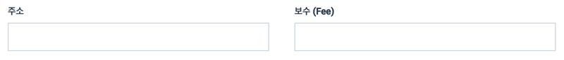

1. 프로젝트 대상에 해당하는 주소를 입력합니다. 
2. 보수를 입력합니다. 단위는 한화 '원' 입니다. \(단위 업데이트 준비중입니다. \)
3. 주소와 보수는 필수 입력 사항이 아닙니다. 
4. 주소와 보수는 차후 프로젝트 정보 창에서 수정할 수 있습니다. 

## 9-2. 템플릿 선택 \(Choose Template\)

프로젝트 세부 정보 탭에서 우측 하단 '다음 단계' 버튼을 누르면 템플릿 선택 단계로 넘어갑니다.

> '다음 단계' 버튼이 활성화 되지 않을 경우 입력되지 않은 필수 항목이 있을 수 있습니다. 입력하신 항목을 다시 한 번 확인해 주시기 바랍니다.
>
> 필수 입력 항목이 모두 작성되었는데도 '다음 단계' 버튼이 활성화 되지 않을 경우, 프로젝트 생성 화면을 닫고 다시 열어 한 번 더 시도해주시기 바랍니다.

회계법인에서 자체적으로 등록한 템플릿 \(서식, Template\)또는 데이터로비에서 제공하는 서식을 이용해 프로젝트의 감사조서 구조를 손쉽게 구성할 수 있습니다.

### 9-2-1. 비어있는 상태로 프로젝트를 시작하려면 '템플릿 사용 안함'을 선택합니다.

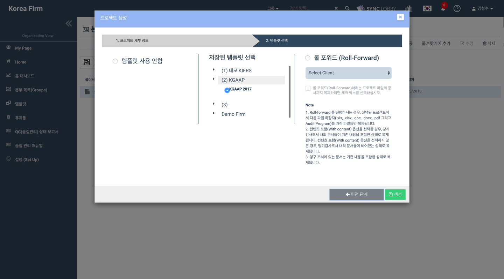

### 9-2-2. 사전에 저장된 공용 템플릿을 사용하려면 '저장된 템플릿 선택'을 사용합니다.

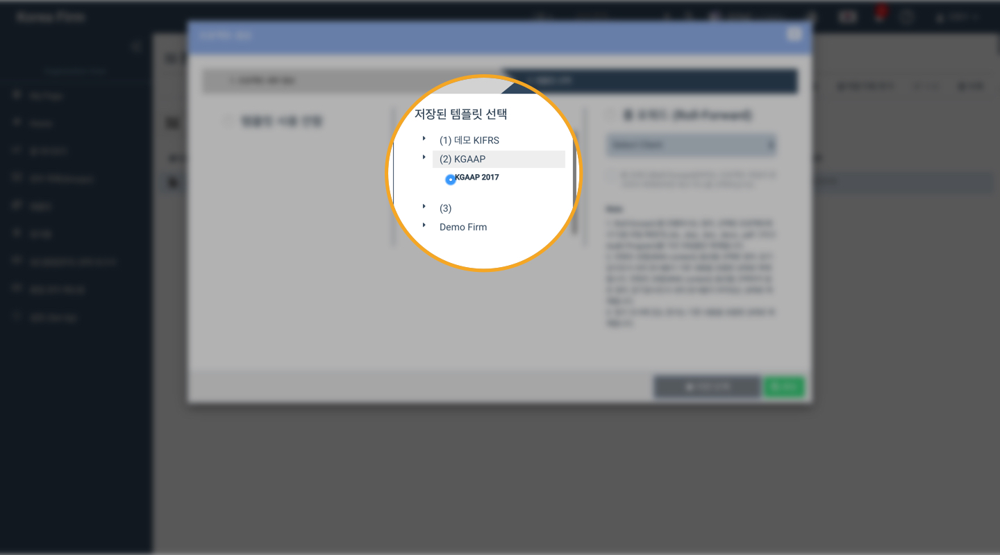

### 9-2-3. 기존 프로젝트를 복사하려면 '롤 포워드'를 사용합니다.

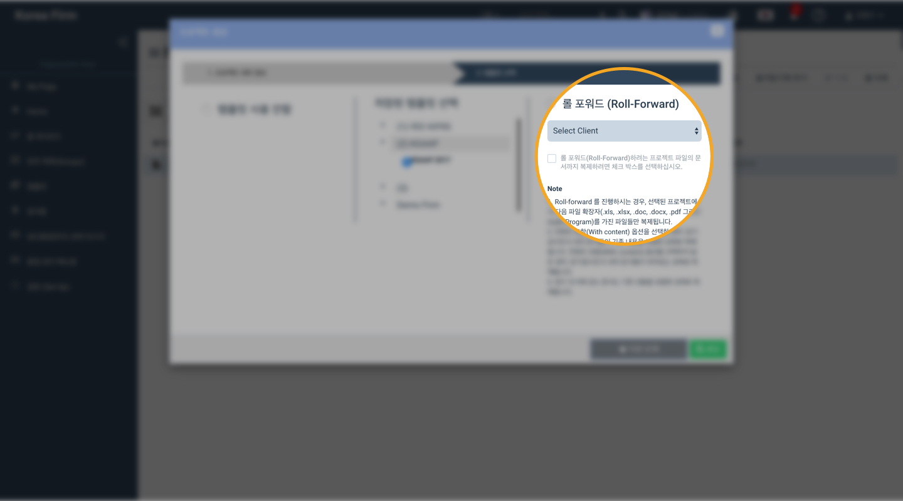

기존 프로젝트 중 복사 권한 \(롤 포워드 권한\)을 가지고 있는 프로젝트의 목록이 나타납니다. 프로젝트를 선택하면 동일한 조서 구성이 갖춰진 프로젝트를 생성할 수 있습니다.

