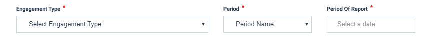
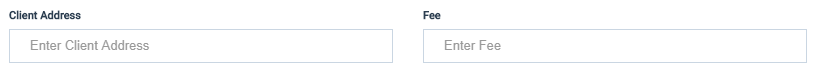
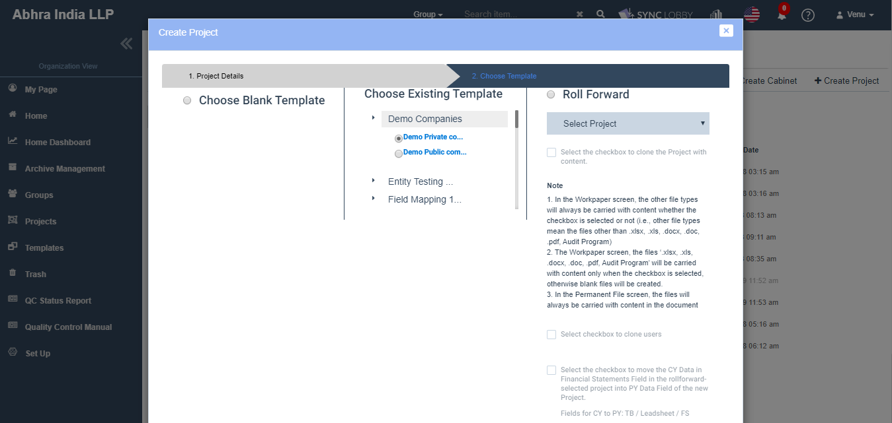
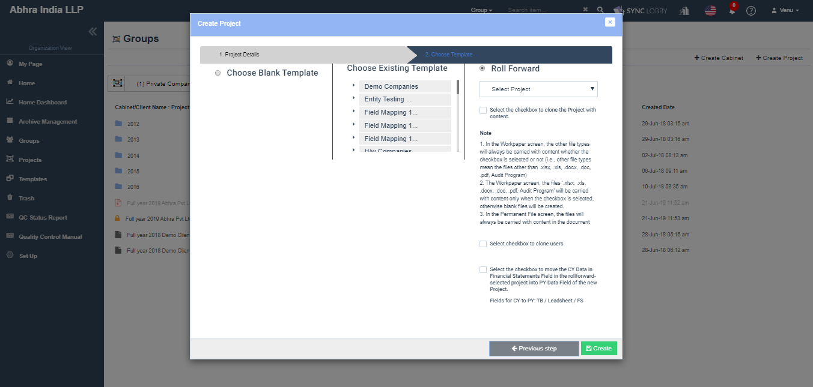

# \(Venu/Pending\)9. Project Creation


The Project creation guide has been provided considering that the following steps are completed.

1. The users, groups, and clients had already added to the firm
2. The users and clients had assigned to the group in which you wish to create a project.


The user guide regarding user registration, group registration, and client registration, can be found in the article [Set Up](../guide-by-function/).

Project Creation is divided into two steps.

> * 9-1. Project Details
> * 9-2. Choose Template

## 9-1. Project Details

1. Click the 'Groups' option on the left menu menu of the Organization View.
2. Double-click the group and the cabinet where you wish to create a project.
   1. If a group is not created yet, create a group first and assign the user to the group [\(How to Create a Group\)](../guide-by-function/groups-set-up-greater-than-groups.md)
   2. If there is no cabinet exists, click the 'Create Cabinet' button at the top right of the page to create a cabinet.

      > There must be at least one cabinet existed in the group to create a project.
3. Click the 'Create Project' button at the top right of the page.
4. The 'Create Project' dialog will be opened.
5. Enter all the details of the project in the Create Project dialog.

### You need to set the following:

### **9-1-1. Set the Group Name and the Engagement Partner**

The name of the current group would automatically displayed in the '**Group Name**' field and it can't be changed. Check the group name and if it is not the right one, go to the right group and create a new project again.

The '**Engagement Partner**' field next to the group name, is a place where you can search & select the engagement partner. Click the field and enter the partner name to find his/her name on the user list. Select the name only from the list.

When you start typing the name in the Engagement Partner input window, an autocomplete list will appear below. Select the corresponding user's name.


Please ensure to select the name only from the list. The name you entered may not be accepted by the application and might think it's an invalid user.



Attention: The magnifying glass icon doesn't have any significance. Please enter user name in the input box.


### **9-1-**2. Set Client Name  ****

When you start typing the name in the Client Name input window, an autocomplete list will appear below. Select the corresponding client's name. 

> The Client ID gets filled automatically according to the client's name.


Attention: The magnifying glass icon doesn't have any significance. Please enter client name in the input box.


### **9-1-**3. Set Project Name and Project ID

### **9-1-**4. Set Engagement Type, Period and Period Of Report

**Set the Engagement Type:** Click the 'Engagement Type' drop-down, a list of engagement types created in your accounting firm will appear. Select the Engagement Type that corresponds to the project.

**Set the Period:** Click the 'Period' drop-down field, a list of options will appear. Select the period corresponding to your project.

**Set the Period of Report:** Click the input box, a calendar will appear. Select the date corresponding to your project. It is usually your period end date. \(E.g. December 31, 2019 for audit projects in 2019\)

### **9-1-**5. Set Creator's Role 

This is used to assign the role to the person who creates the project.

1. The Creator's Role field will auto-set as 'Engagement Partner' when the creator name is entered in the 'Engagement Partner' field.
2. Click the "Creator's Role" drop-down field, a list of options will appear. Select the role corresponding to your project.
   * There is no difference in authority between Staff, Senior, Manager, Director, and Partner.
   * Set to Engagement Partner if the project creator is a project owner.
   * Set to Concurring Partner if the project creator is a concurring partner.
   * Set to Quality Control if the project creator is a quality manager.

### **9-1-**6. Set Client Address and Fee

1. Enter the Client Address.
2. Enter the Fee. 
3. Address and Fee are optional fields. 
4. The address and fee can be modified later in the project information dialog.

## 9-2. Choose Template

In the Project Details tab, click the 'Next step' button at the bottom-right to move to the template selection step.

> If the 'Next step' button is not activated, there may be mandatory fields that are not entered. Please check your entry again.
>
> If the 'Next step' button is not activated even though all mandatory fields have been filled out, please close the project creation screen and reopen it.

You can easily configure the audit document structure of the project by using the Existing Template created by the accounting firm, or Roll Forward features.

### 9-2-1. Select 'Choose Blank Template' to start with empty project.

> On choosing this option, the Workpaper File and Permanent File screens would be empty.

### 9-2-2. Select 'Choose Existing Template' to use an existing template.

> Upon creating the project, all the folders and files of the selected template will be copied into the ‘Workpaper File’ screen of Project View.

* The 'Choose Existing Template' section displays the list of Template Folders of organization.
* Clicking any Template Folder displays the list of Template sub-folders of it.
* Select the corresponding template sub-folder.
* Upon creating the project, all the folders and files of selected template will be copied into the ‘Workpaper File’ screen of Project View.

### 9-2-3. Use 'Roll-Forward' to copy the existing project.

A list of existing projects with copy permission \(Roll Forward Permission\) appears. Selecting a project allows you to create a project with the same structure.

* Selecting the 'Roll Forward' option enables the ‘Select Project’ dropdown field which shows the list of Normal, Replica, Unarchived projects \(all versions\) of current group.
* Files of 'Permanent File' screen always carry over with content into the cloned project.
* The file types except ‘xlsx, xls, docx, doc, pdf, Audit Program’ always get carried over with the content into Workpaper File screen, Irrespective of ‘Select the checkbox to clone the Project with content’ checkbox selection.
* The Trial balance, Lead Sheet, Flux Analytics, Final Analytics, FS Set Up, Consolidating, Financial Statements data will always be carried to the new project.
  * You can check or uncheck the checkbox named ‘Select the checkbox to move the existing FS data to previou part’.
  * If the above is selected, then the current year data will be moved to previous year data on the Trial Balance screen \(ex. Cur period = Prev period, Prev period = Prev 1 period and so on\).
  * If the above is NOT selected, then the current year data will be displayed in the same column column only on the Trial Balance screen \(ex. Cur period = Current period, Prev period = Prev  period and so on\).
* If the ‘Select checkbox to clone users’ checkbox is selected, then the users will be carried over to the new project.


Archived project won’t be displayed here.

In the 'Roll Forward' drop-down, you can view only the projects to which the 'Roll Forward Permission' is set with 'Yes'.


