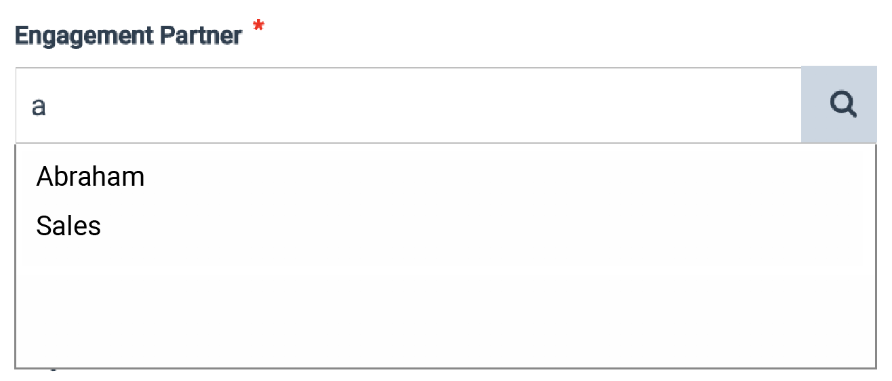
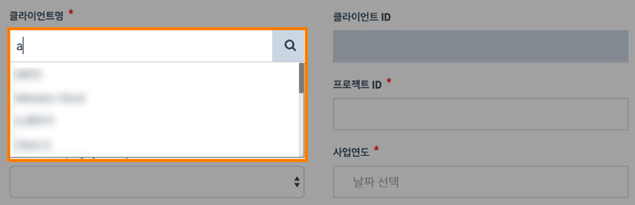

# \(Venu/Pending\)9. Project Creation


The Project creation guide has been provided considering that the following steps are completed.

1. The users, groups, and clients had already added to the firm
2. The users and clients had assigned to the group in which you wish to create a project.


The user guide regarding user registration, group registration, and client registration, can be found in the article [Set Up](../guide-by-function/).

Project Creation is divided into two steps.

> * 9-1. Project Details
> * 9-2. Choose Template

## 9-1. Project Details

1. Click the 'Groups' option on the left menu menu of the Organization View.
2. Click the group and the folder where you want to create a new project
   1. If a group is not created yet, create a group first and assign the user to the group [\(How to Create a Group\)](x.-group-1.md)
   2. If there is not a folder yet, click the 'Create Cabinet' button at the top right of the page to make a folder

      > There has to be at least one folder in the group to make a project.
3. To make a project in the folder, click the 'Create Project' button at the top right of the page
4. Enter all the details about the project in the Create Project pop-up window

### You need to set the followings:

### **9-1-1. Set the Group Name and the Engagement Partner**

The group that the you created a new project in would be automatically selected. Check the group name and if it not the right one, go to the right group and create a new project again.

The 'Engagement Partner' field on the right to the group name is where you can assign the project manager. Click the field and enter the project manager name to find his/her name on the user list. Select the the name on the list.

When you start typing your name in the Engagement Partner input window, an autocomplete list will appear below. Select the corresponding user's name.


Please be sure to click on the name shown in the list. The name you enter may not be accepted by the program as the proper user.



Attention: The magnifying glass icon does not play a separate role. Please enter your name in the input box. 


### **9-1-**2. Set Client Name  ****

> The client ID is entered automatically according to the client name.

When you start typing your name in the Engagement Partner input window, an autocomplete list will appear below. Select the corresponding user's name. 


Attention: The magnifying glass icon does not play a separate role. Please enter your name in the input box. 


### **9-1-**3. Set Project Name and Project ID

### **9-1-**4. Set Engagement Type and Year of Report

Set the Engagement Type. Click the input window and a list of project types registered in your accounting firm will appear. Select the Engagement Type that corresponds to the project.

Set the Period of Report. Click the input box and the calendar will appear. Select the date corresponding to your project. It is usually based on the settlement date. \(E.g. December 31, 2019 for audit projects in 2019\)

### **9-1-**5. Set Creator's Role 

This part sets the role of the person who created the project.

The name of the creation \(person in charge\) is automatically entered. Selecting the 'Creator's Jobs' input box displays a list of jobs used within the project. 

* There is no difference in authority between Staff, Senior, Manager, Director, and Partner
* Set to Engagement Partner if you are project owner
* Set it as Concurring Partner for conkering partners
* If you are a quality manager, set it to Quality Control

### **9-1-**6. Set Client Address and Fee

1. Enter the client address
2. Enter the fee. The unit is Korean Won \(We are preparing for unit update.\) 
3. Address and fee are not required 
4. The address and fee can be modified later in the project information window

## 9-2. Choosing a Template

In the Project Details tab, press the 'Next Step' button at the bottom right to move to the template selection step.

> If the 'Next Step' button is not activated, there may be required items that are not entered. Please check your entry again. 
>
> If the 'Next Step' button is not activated even though all required fields have been filled out, please close the project creation screen and reopen it.

You can easily configure the audit document structure of the project by using a template registered by the accounting firm or a template provided by the data lobby.

### 9-2-1. Select 'Choose Blank Template' to start with empty state.

### 9-2-2. Select 'Choose Existing Template' to Use Existing Public Template.

### 9-2-3. Use 'Roll-Forward' to Copy Existing Project.

A list of existing projects with copy permission \(rollforward permission\) appears. Selecting a project allows you to create a project with the same composition of records. 

