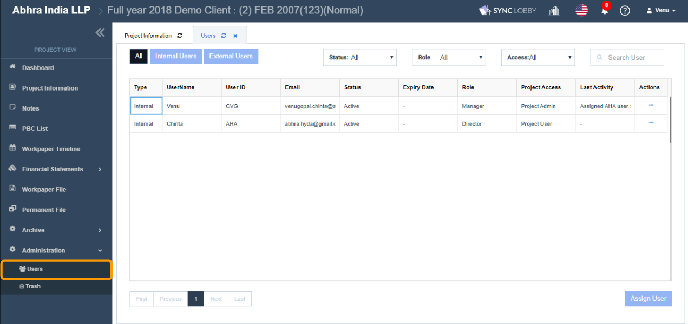
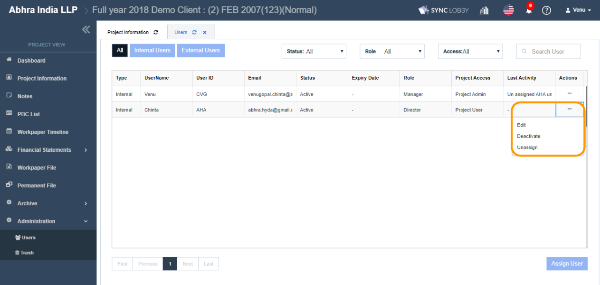

# \(Venu/Done\)10-2. Managing a Team \(Edit / Unassign\)

## 1. **Click the 'Administration &gt; Users' option on the left navigation menu of the Project View.**

## 2. Edit, Deactivate/ Activate, Unassign a user in the project 

* Click the three dots button for the user that you wish to manage.
* You can view the following action items.
  * Edit
  * Deactivate/ Activate
  * Unassign
* **Edit** is used to update the Project Role, Read Only, Project Access Type, Roll Forward Permissions.
* **Deactivate** is used to Inactive the user. After deactivate:
  * The user status turns to Inactive from Active.
  * The user record appears with a grayed-out color.
  * The Inactive user can view the project in the Organization View, but cannot visit, as it would be grayed-out to him/her.
* **Activate** is used to Active the user.
  * The user status turns to Active from Inactive.
  * The user record appears in a normal color.
  * The Active user can view and visit the project in the Organization View.
* **Unassign** is used to remove the user from the project.
  * The removed user record will be disappeared from the grid.
  * The removed user cannot view this project in the Organization View.

