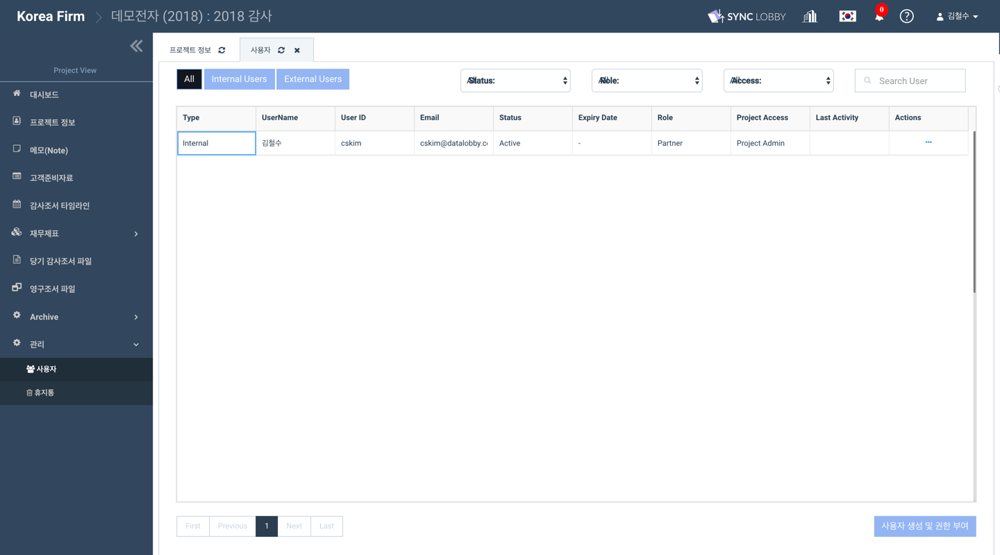
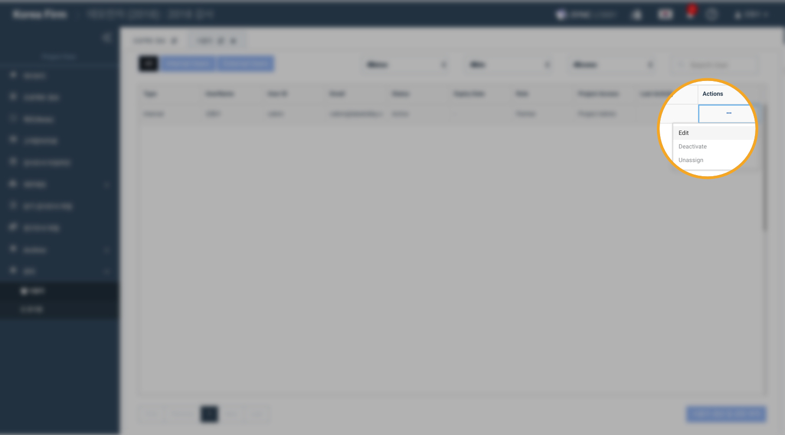

# \(ENG\)10-2. Managing a Team \(Edit / Unassign\)

## 1. **Click the 'Administration' &gt; 'Users' button from the left menu column of the Project View**

## 2. Edit / Unassign a user in the project 

1. Click the 'Edit' button to edit the user's position or authority in the project
2. Click the 'Unassign' button to unassign the user from the project

