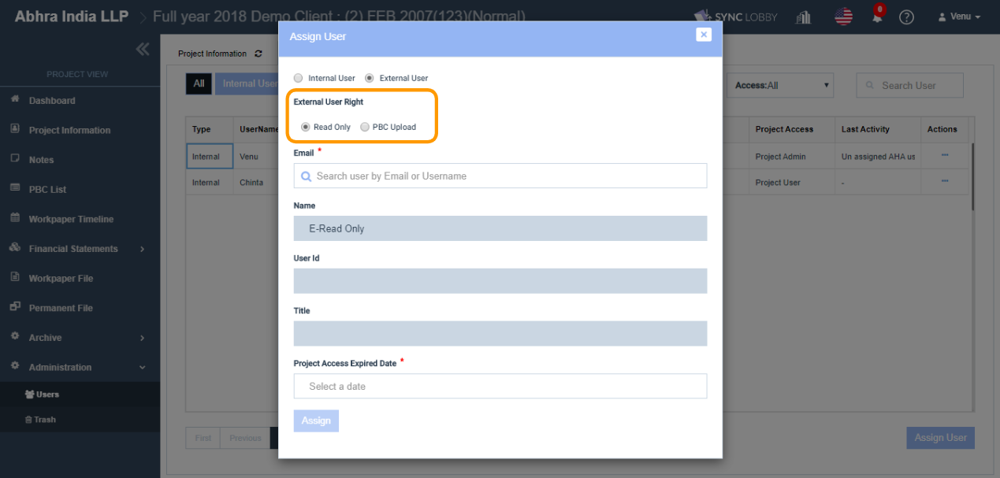

# \(Venu/Done\)10-4. Assigning an External User to a Project

## 1. Select the 'External User' option in 'Assign User' dialog

1. Click the 'Administration' option on the left navigation menu of the Project View.
2. Click the 'Users' option under 'Administration'.
3. The 'Users' screen will be opened.
4. Click the 'Assign User' button at the bottom-right of the screen.
5. Select the 'External User' radio button.

## 2. Set the 'External User Right'

The 'External User Right' can be set to either **Read Only** or **PBC Upload**.

### 2.1. Read Only option

* If you wish any external user to view all screens, but do not wish to perform any operations, then set the 'External User Right' field to 'Read Only' option.
* Everything will be in a read only mode for these users.
* The user cannot have access to ‘Archive Diagnosis, Archive, Project Lock/ Unlock, Users \(CRUD\), Comments \(CRUD\), Prepare & Review WP file’.

### 2.2. PBC Upload option

* An External User who is set to ‘PBC Upload’ can **view only** the ‘PBC List’ screen after visiting the project.
* These users can “create, edit, delete” the PBC records and upload auditor requested documents on the PBC List screen.

## 3. Set the user Email

1.  ****Since the 'External User' option is selected, the 'Email' field contains only external users.
2. Click 'Email' field, search and select the user that you wish to assign.

   > If the user's email address is not on the list, please check the following.
   >
   > 1. Does the user assigned to the firm?
   > 2. Does the user assigned to the current group?
   >
   > You can verify the above two on the 'Organization View &gt; Set Up' screen.

3. The Name, User Id and the Title would be entered automatically according to the Email taken.

## 4. Set the 'Project Access Expired Date'

* If you wish the external user access the project up to a specific period of time, you can set the expiry date in the 'Project Access Expired Date' field.
* Past dates won’t be allowed in the Project Access Expired Date field \(it accepts only the current or future date\).
* These users cannot access the project when the current date exceeds the 'Project Access Expired Date'.

