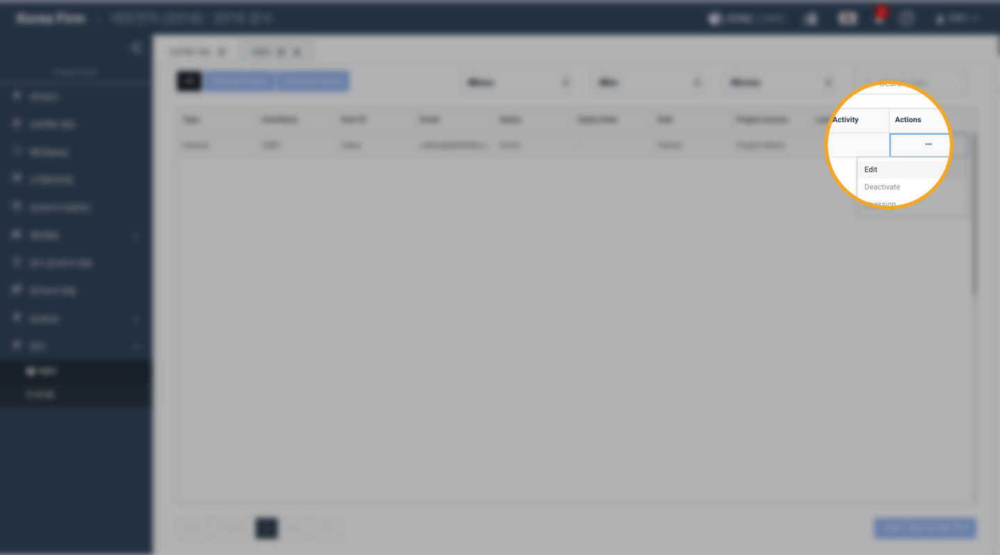
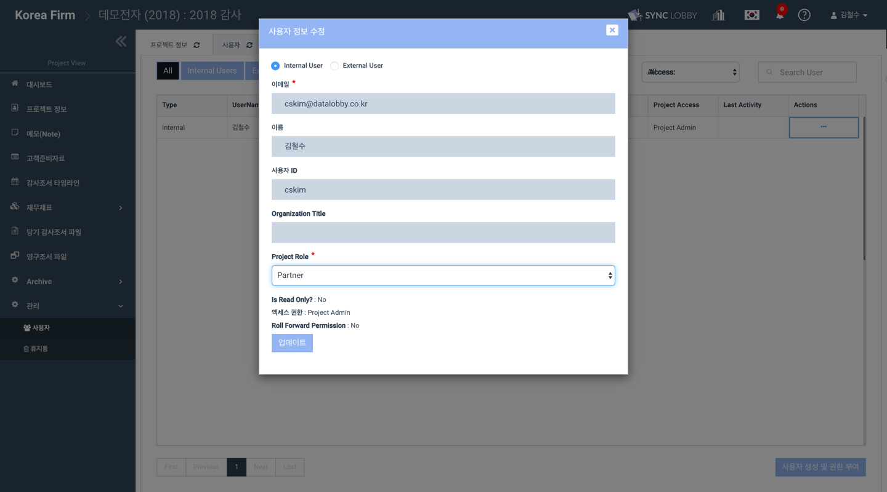

# 10-5. 프로젝트 책임자 수정하기

프로젝트 생성 시 지정한 프로젝트 책임자\(Engagement Partner\)를 변경하는 방법을 알려드립니다.  

### 1. 프로젝트 뷰 \(Project View\) &gt; 관리\(Administration\) 메뉴 &gt; '사용자'

1. 프로젝트 책임자를 수정할 프로젝트를 선택합니다.  
2. 왼쪽 메뉴 목록에서 가장 아래쪽의 '관리\(Administration\)'를 선택합니다. 
3. '관리' 메뉴에서 '사용자\(Users\)'를 선택합니다.  
4. 프로젝트 책임자로 지정할 사용자를 선택한 후, 우측 끝의 연필모양 '수정' 아이콘을 누릅니다.  

### 2. '직무' 수정   

1. 해당 사용자의 우측 끝에서 연필 모양 '수정' 아이콘을 눌러 '사용자 정보 수정' 창을 엽니다.   
2. '직책\(Role\)' 부분을 클릭하여 'Engagment Partner'를 선택합니다. 
3. '업데이트' 버튼을 눌러 프로젝트에 반영합니다.  


한 프로젝트에 프로젝트 책임자를 복수로 설정할 수 있습니다.  



하나의 프로젝트에는 반드시 최소한 한 명의 프로젝트 책임자가 존재해야 합니다.  


