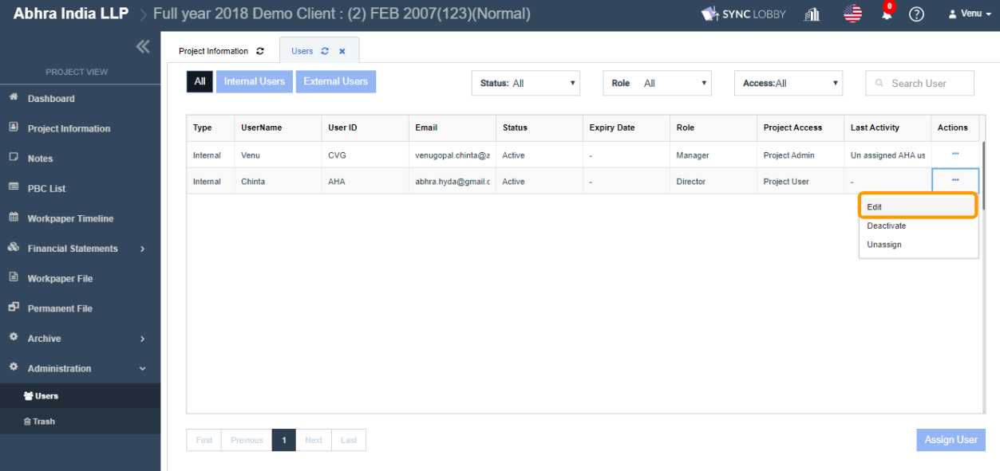
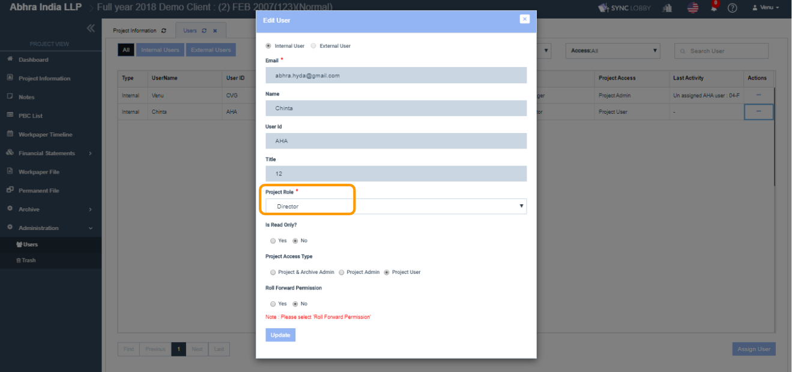
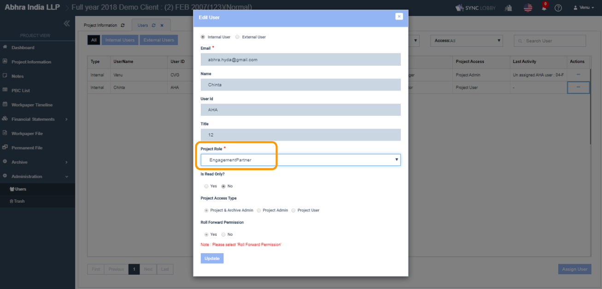

# \(Venu/Done\)10-5. Editing an Engagement Partner

## 1. Project View &gt; Administration &gt; Users screen

1. Visit the project that you wish to change the engagement partner.
2. Click the 'Administration' option on the left navigation menu of the Project View.
3. Click the 'Users' option under 'Administration'.
4. Select the user whom you want to assign as an engagement partner and click three dots \(...\) button on the right end.

## 2. Edit the Project Role

1. Click the 'Edit' option.
2. Click the 'Project Role' field and select 'Engagement Partner'.
3. Click the 'Update' buttoin to reflect the change.


You can assign multiple engagement partners to a project.



A project must have at least one Engagement Partner. 



Engagement Partner Role can be set to only Super Admin and Group Admin users.



When a user is assigned to the 'Engagement Partner' role, then by default, the higher permissions like below set to the user and **cannot be changed at all**.

* Read Only = No
* Project Access Type = Project & Archive Admin
* Roll Forward Permission = Yes


