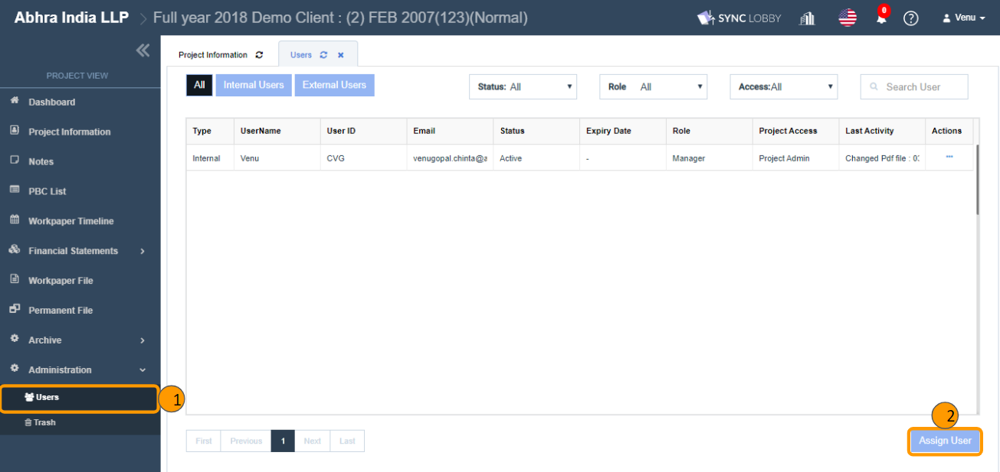
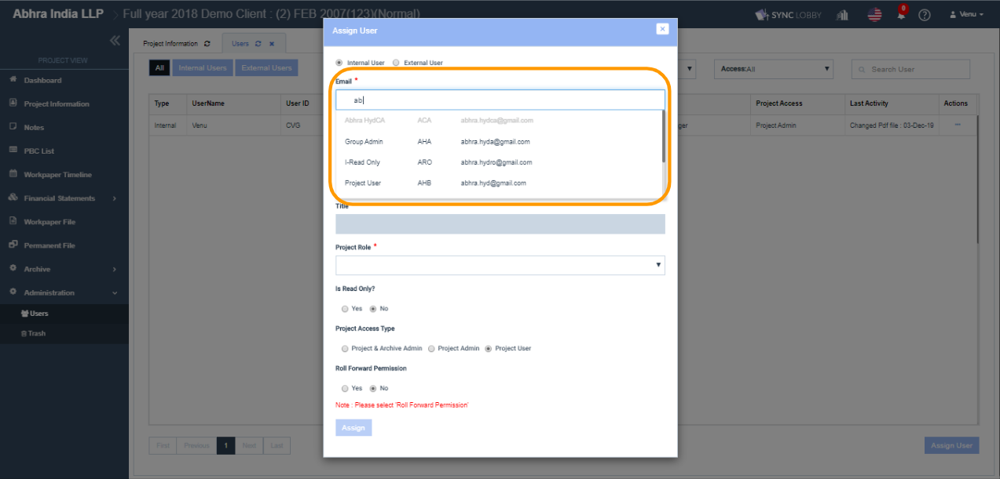
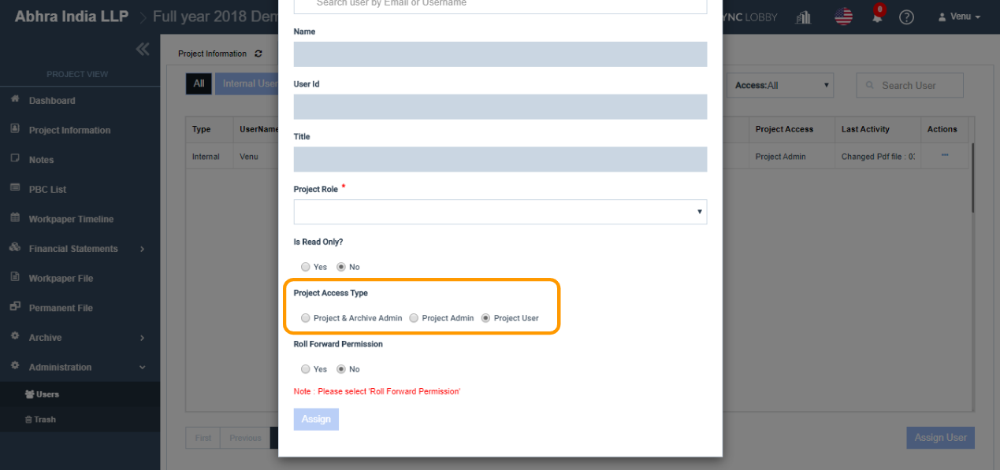

# \(Venu/Done\)10-1. Organizing a Project Team

## Summary

* The 'Administration &gt; Users' feature allows admin users to manage the project users.
* By default, the project creator, and the user who keeps as an ‘Engagement Partner’ during the project creation will be auto-assigned to the project with admin privileges.
* The users who all are assigned on this screen can access the respective project and others cannot access.
* Whereas this restriction is not applicable to Super Admin, i.e., Super Admins can visit any project irrespective of their assignment on the ‘Administration &gt; Users’ screen.


You cannot find the users who are not assigned to the group on the 'Assign User' window for the project. Check if the user is assigned to the group on the Organization View &gt; 'Set Up' page.  


## 1. Assign a New User

1. Click the 'Administration' option on the left navigation menu of the Project View.
2. Click the 'Users' option under 'Administration'.
3. The 'Users' screen will be opened.
4. Click the 'Assign User' button at the bottom-right of the screen.

## 2. Select the User Email  

1.  Select whether the user is an 'Internal User' or an 'External User'.

   > Internal users are the primary users of the application who do an audit for the firm. External users are the secondary users of accounting who are In charge of PBC or inspects the auditing.

2. Click 'Email' field, search and select the user that you wish to assign.

   > If the user's email address is not on the list, please check the following.
   >
   > 1. Does the user assigned to the firm?
   > 2. Does the user assigned to the current group?
   >
   > You can verify the above two on the 'Organization View &gt; Set Up' screen.

3. The Name, User Id and the Title would be entered automatically according to the Email selected.

## 3. Select the Role in the Project

The 'Project Role' is about selecting the role\(position\) of the user in the project. There are 8 different roles in a project.

* Staff
* Senior
* Manager
* Director
* Partner
* Engagement Partner
* Concurring Partner
* Quality Control

Staff, Senior, Manager, Director, and Partner are just names of different positions. The actual differences in the level of authority in the project on Audit LOBBY would be designated in the 'Project Access Type' field.

By assigning someone as Engagement Partner, Concurring Partner or Quality Control can affect project access type permissions or archive conditions. Please be attentive when selecting them.

When a user is assigned to the 'Engagement Partner' role, then by default, the higher permissions like below set to the user and cannot be changed at all.

* Read Only = No
* Project Access Type = Project & Archive Admin
* Roll Forward Permission = Yes


Engagement Partner Role can be set to only Super Admin and Group Admin users.


## 4. Select the Read Only Option

* The users with Read Only option set to 'Yes' cannot edit any document in the project.
* For the regular accountant of the project, please set the 'Read Only' option to 'No'.
* If you wish to let a user view the content in the project, but do not want him/her to edit, set the Read-Only option to 'Yes'.

## 5. Select the Project Access Type

The Project Access Type is a drop-down field, where you set the level of authority in the project.

#### 5-1. Project & Archive Admin 

* The user who is set with the 'Project & Archive Admin' will have complete control over the project.
* The user gets the project manager authority
* The user gets the authority to archive the project.
* The user has more crucial permissions within the project and can do anything within the project. The major permissions are:
  * Archive the project.
  * Assign, Edit, Deactivate/ Activate, Unassign the user.
  * Edit the Project Information.
  * Lock/ Unlock the project.
  * Permanent delete the trashed items.
  * Force close the opened workpaper or permanent files.
  * Delete the Review Comments on behalf of other users.

#### 5-2. Project Admin

* The user gets the project manager authority.
* The user cannot archive the project.
* The major permissions are:
  * Archive the project.
  * Assign, Edit, Deactivate/ Activate, Unassign the user.
  * Edit the Project Information.
  * Lock/ Unlock the project.
  * Permanent delete the trashed items.
  * Force close the opened workpaper or permanent files.
  * Delete the Review Comments on behalf of other users.

#### 5-3. Project User 

* The Project User doesn’t have access to any of the above permissions.
* The user can create and edit a workpaper.
* The user can sign off a workpaper.
* The user cannot archive the project.

## 6. Select the Project Roll Forward Permission Option

The 'Roll Forward Permission' field is about giving permission to replicate the current project when creating a new project.

* The ‘Roll Forward Permission’ can be set with ‘Yes’ or ‘No’.
* The users who are set to 'Yes' option only can view & select the current project in the ‘Roll Forward’ drop-down on the ‘Step 2 of Create Project dialog’ for the replication.
* The users who are set to 'No' option cannot see the current project in the ‘Roll Forward’ drop-down on the ‘Step 2 of Create Project dialog’.


Users with 'User Access' organization access right cannot create a project, though you set their Roll Forward Permission to Yes, they still cannot create a new project nor forward this project.


