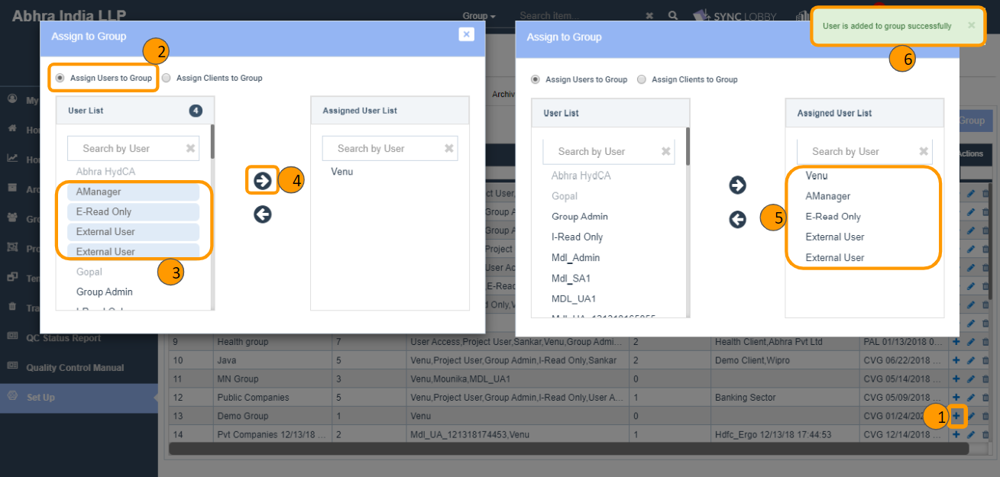

# \(Venu/Done\)5-1. Assigning / Unassigning User to/from a Group

## Assigning a User to a Group

1. Click the 'Set Up' button on the left navigation menu of the Organization View.
2. Click the 'Groups' tab at the top of the 'Set Up' page.
3. Find the group that you wish to assign users to it.
4. Click the three dots button of the group at far right of the screen.
5. Click the 'Add Users/Clients to Group' option.

1. Click 'Assign Users to Group'
2. Search for the user in the search box on the left.
3. Click the user from the searched results and click the right arrow.

> You will see the user on the right side of the dialog and a success message in the top-right corner of the screen.
>
> Unassigning users or clients can also be done by clicking the 'Add Users/Clients to Group' option.

## Unassigning a User from a Group   

1. Click the 'Set Up' button from the left navigation menu of the Organization View.
2. Click the 'Groups' tab at the top of the 'Set Up' page.
3. Find the group that you wish to unassign users from it.
4. Click the three dots button of the group at far right of the screen.
5. Click the 'Add Users/Clients to Group' option.
6. Click 'Assign Users to Group'.
7. Click the user name in the 'Assigned User List' on the right side of the dialog and remove by clicking the left arrow.
8. You will see a success message in the top-right corner of the screen. 

