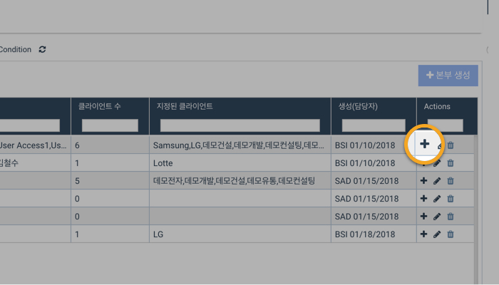
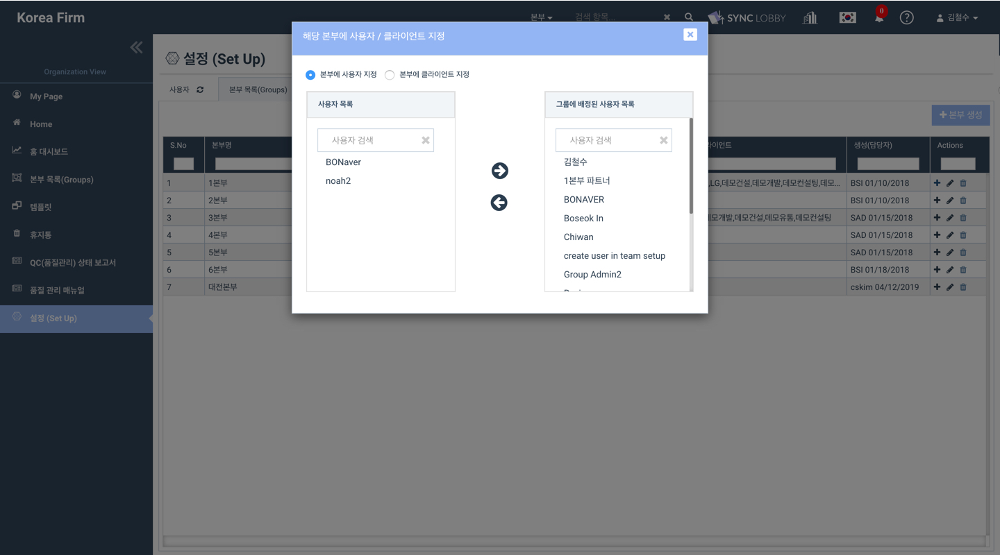
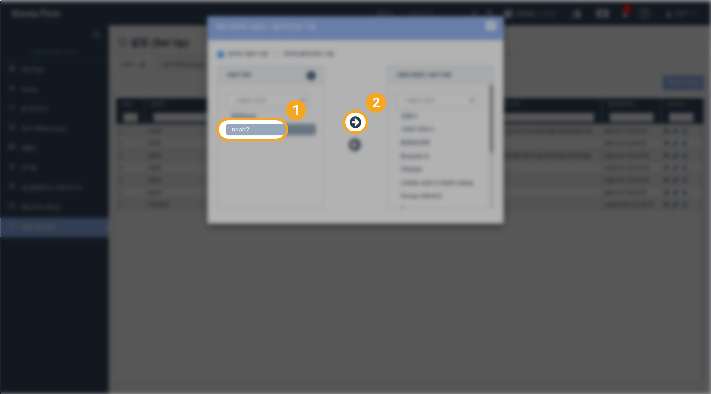
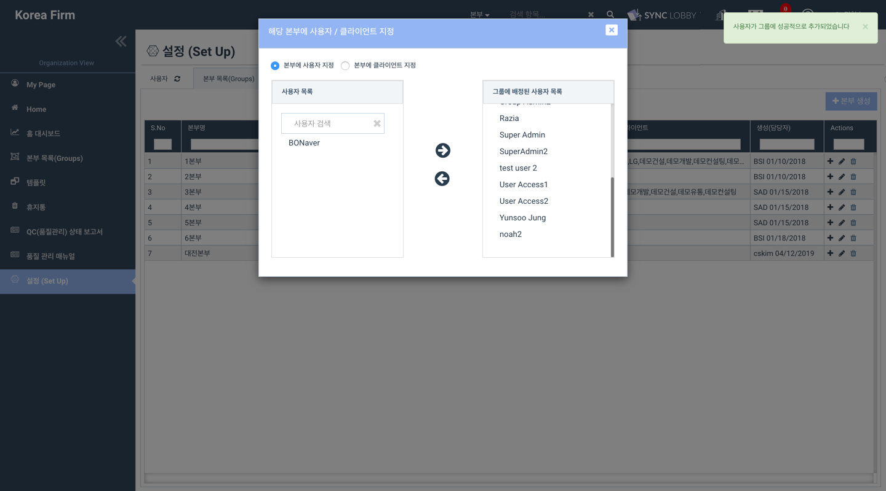

# \(ENG\)5-1. Assigning / Unassigning User to/from a Group

## 본부\(Group\)에 사용자 / 고객 등록하기

1. Organization Home 화면의 왼쪽 메뉴 목록에서 '설정\(Set Up\)'을 선택합니다.
2. '설정\(Set Up\)' 화면의 상단에서 '본부\(Group\)' 탭을 선택합니다. 
3. 해당 본부 목록 오른쪽 끝에서 '+' 버튼을 누릅니다. 

## 본부\(Group\)에서 사용자 / 고객 제외하기 

1. Organization Home 화면의 왼쪽 메뉴 목록에서 '설정\(Set Up\)'을 선택합니다.
2. '설정\(Set Up\)' 화면의 상단에서 '본부\(Group\)' 탭을 선택합니다.
3. 해당 본부 목록의 오른쪽 끝에서 '+' 버튼을 누릅니다.
4. 사용자를 그룹에서 제거할 경우 'Assigned Users to Group'을 선택합니다.
5. 고객을 그룹에서 제거할 경우 'Assign Clients to Group'을 선택합니다.
6. 왼쪽의 '할당된 사용자\(또는 고객\)' 목록에서 사용자 또는 고객을 선택한 후 화살표 버튼을 눌러 그룹에서 제거합니다. 
7. 화면 우측 상단에 제거 완료 메시지가 나타납니다. 

## Assigning a User to a Group

1. Click the 'Set Up' button from the left menu column of the Organization View
2. Click the 'Groups' tab at the top of the 'Set Up' page
3. Click the '+' icon on the right side of the group

##  

## Unassigning a User from a Group   

1. Click the 'Set Up' button from the left menu column of the Organization View
2. Click the 'Groups' tab at the top of the 'Set Up' page
3. Click the '+' icon on the right side of the group
4. Click 'Assigned Users to Group'
5. Click the user name in the Assigned User List on the right side of the window and remove by clicking the left arrow
6. You will see a success message in the upper right corner of the screen 

