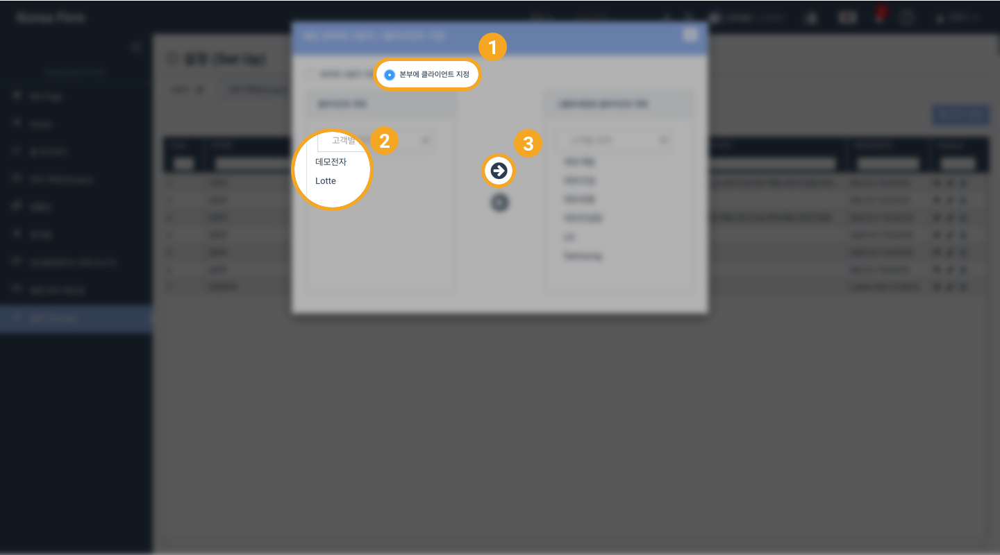
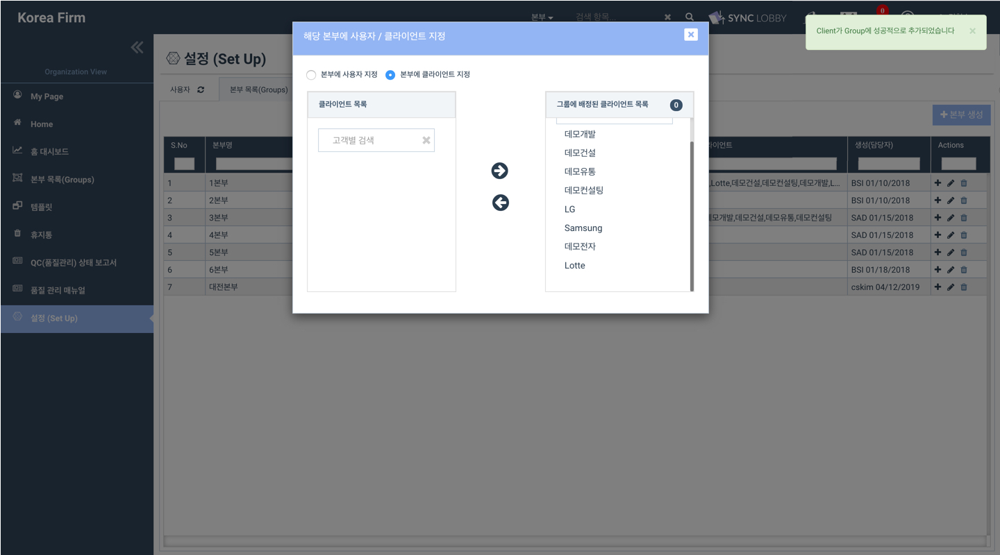

# \(ENG\)5-2. Assigning / Unassigning Client to/from a Group

1. Click 'Assign Clients to Group'
2. Search for the client name in the search box on the left
3. Click the client name and click the right arrow

You will see the client name on the right side of the window and a success message in the upper right corner of the screen.    

> Unassigning users or clients can also be done by clicking the '+' button.

## Unassigning a Client from a Group   

1. Click the 'Set Up' button from the left menu column of the Organization View
2. Click the 'Groups' tab at the top of the 'Set Up' page
3. Click the '+' icon on the right side of the group
4. Click 'Assigned Clients to Group'
5. Click the client name in the Assigned Client List on the right side of the window and remove by clicking the left arrow
6. You will see a success message in the upper right corner of the screen

