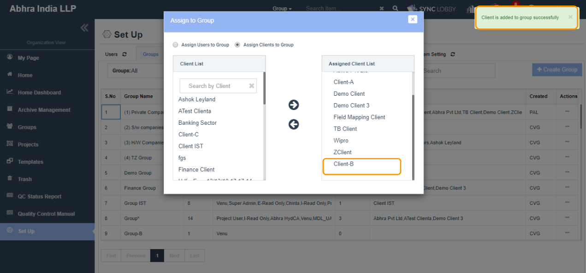

# \(Venu/Done\)5-2. Assigning / Unassigning Client to/from a Group

## Assigning a Client to a Group 

1. Click the 'Set Up' button on the left navigation menu of the Organization View.
2. Click the 'Groups' tab at the top of the 'Set Up' page.
3. Find the group that you wish to assign clients to it.
4. Click the three dots button of the group at far right of the screen.
5. Click the 'Add Users/Clients to Group' option.

1. Click 'Assign Clients to Group'.
2. Search for the client name in the search box on the left.
3. Click the client name and click the right arrow.

You will see the client name on the right side of the dialog and a success message in the top-right corner of the screen.    

> You will see the user on the right side of the dialog and a success message in the top-right corner of the screen.

## Unassigning a Client from a Group   

1. Click the 'Set Up' button on the left navigation menu of the Organization View.
2. Click the 'Groups' tab at the top of the 'Set Up' page.
3. Find the group that you wish to unassign client from it.
4. Click the three dots button of the group at far right of the screen.
5. Click the 'Add Users/Clients to Group' option.
6. Click 'Assign Clients to Group'.
7. Select the client name in the 'Assigned Client List' on the right side of the dialog and remove by clicking the left arrow.
8. You will see a success message in the top-right corner of the screen.

