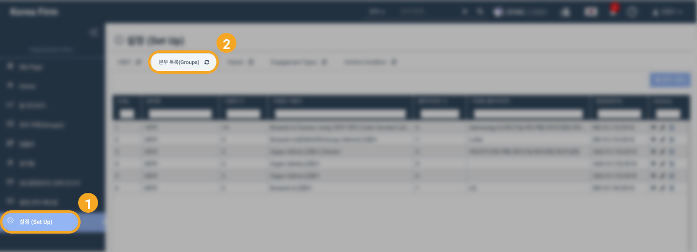

# \(ENG\)5-2. 클라이언트를 본부에 추가/제외하기

1. 클라이언트\(고객사\)를 그룹에 등록할 경우 '본부에 클라이언트 지정'을 선택합니다.
2. 왼쪽 창에서 고객사 명을 검색합니다. 
3. 고객사를 클릭하여 선택한 다음 오른쪽 방향 화살표를 누릅니다. 

화면 우측 상단에 등록 성공 메시지가 나타납니다.

> 사용자 또는 고객을 본부에서 제외하는 기능은 '+' 버튼을 통해 사용하실 수 있습니다.

