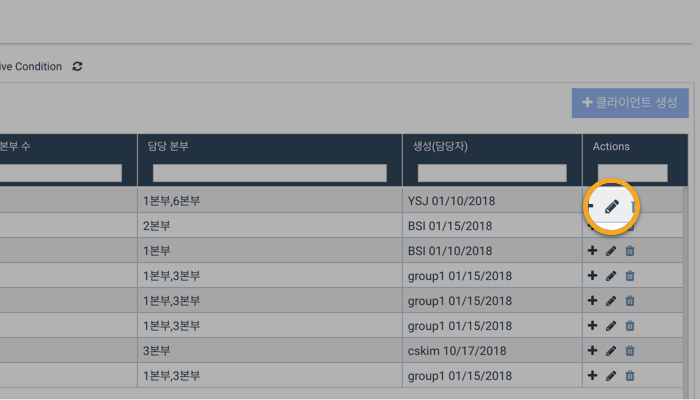
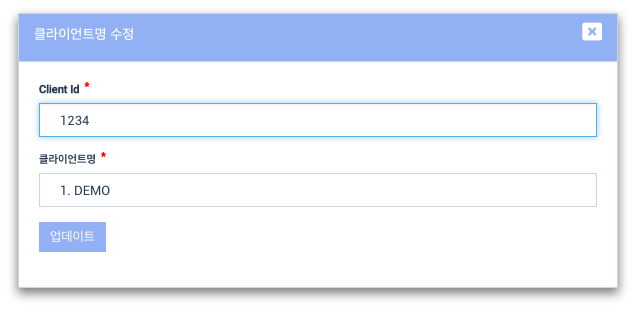

# \(ENG\)3-1. 클라이언트 ID 수정하기

## 1. 법인용 화면\(Organization View\) &gt; 설정\(Set Up\) &gt; 클라이언트

1. 법인용 화면\(Organization View\)에서 '설정\(Set Up\)' 메뉴를 선택합니다.  
2. '설정' 메뉴의 상단 탭 중에서 '클라이언트' 를 선택합니다. 
3. 수정하고자 하는 클라이언트의 우측 끝에서 '수정' 버튼 \(연필모양 아이콘\) 을 누릅니다.  

## 2. 클라이언트 ID를 입력합니다.

## 3. 업데이트를 눌러 반영합니다.

