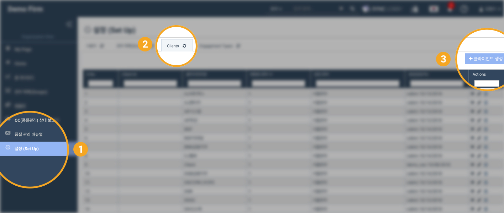
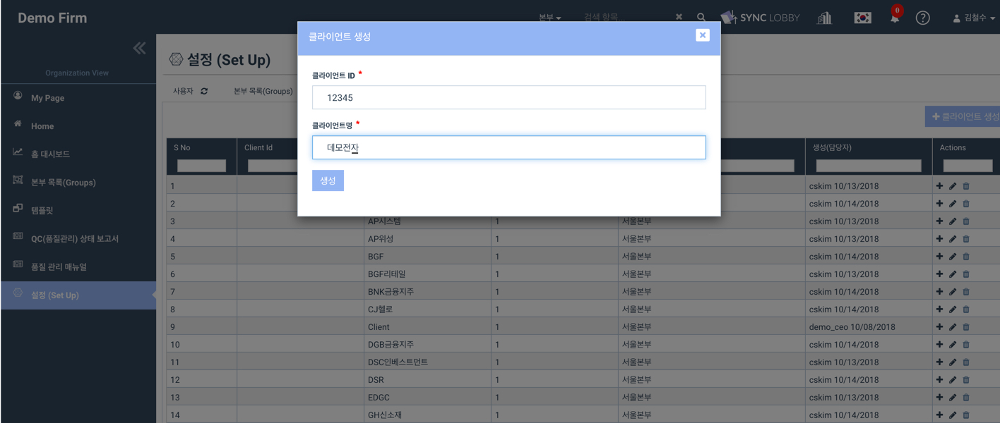
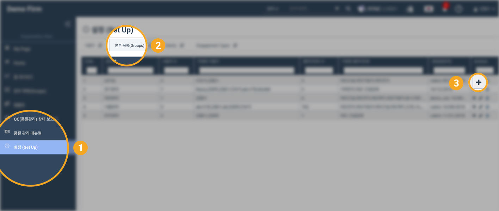
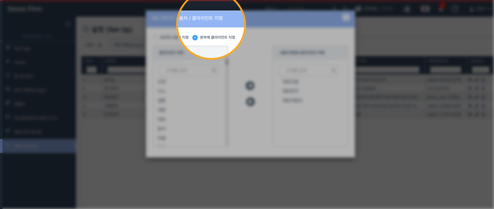
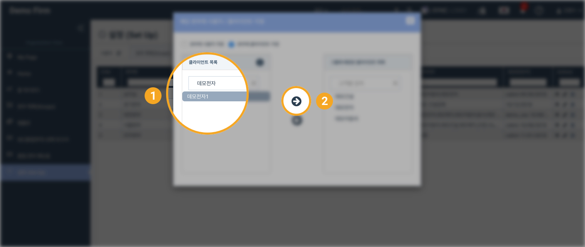
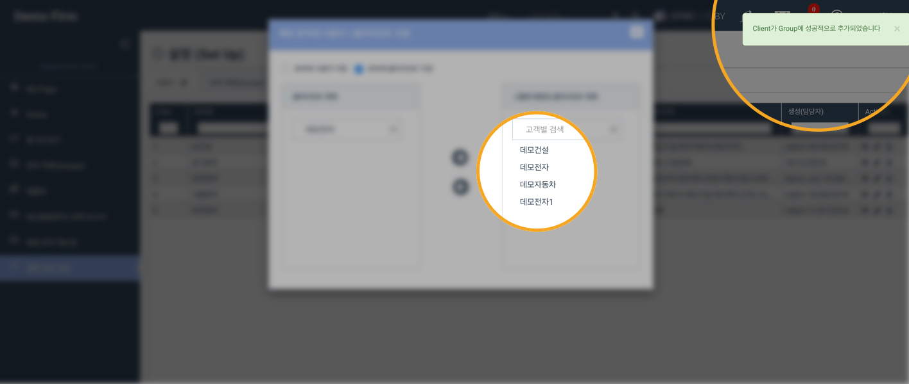
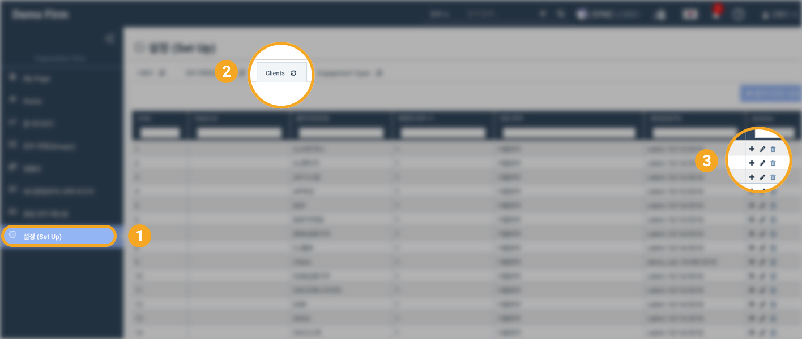

# \(ENG\)3. Client Registration / Edit / Delete

## Client Registration / Edit / Delete in the Organization View

## Summary  

### 1. Create a client

1. Click the 'Set Up' button from the left menu column of the Organization View
2. Click the 'Clients' tab at the top of the 'Set Up' page
3. Click the 'Create Client' button at the top right of the page
4. Enter the client name and ID
5. Click the 'Create' button
6. Client registration will get started and a red progress bar will show at the top of the screen. Wait for it to be done

### 2. Assign the client to the Group

1. If you do not assign the registered client to the group, the client will not be on the list when you create a project. Make sure that the client is assigned to the appropriate group

## View Details

## 1. Create a Client

1. Click the 'Set Up' button from the left menu column of the Organization View
2. Click the 'Clients' tab at the top of the 'Set Up' page
3. Click the 'Create Client' button at the top right of the page

1. Enter the Client ID
2. Enter the Client name

> Enter a Client ID that follows the naming rules of the firm, but if there is no rule just enter a random ID.

## 2. Assign the client to the group

When you create a project, only clients that are assigned to the group to you are assigned appear in the list. Therefore, clients must be assigned to appropriate groups.

1. Click the 'Set Up' button from the left menu column of the Organization View
2. Click the 'Groups' tab at the top of the 'Set Up' page
3. Click the group that you want to assign the client to and click the '+' icon on the right

1. If the above window shows, click 'Assign Clients to Group' at the top

1. Search for the name of the registered client in the search box under the client list 
2. Click the name of the client in the search results
3. Click the right arrow

1. When the client is assigned, you will see the name of the client on the right side of the window
2. You will see a success message in the upper right corner of the screen

## 3. Edit / Delete Client 

You can edit the ID and name of the registered client or delete the client. 

1. Click the 'Set Up' button from the left menu column of the Organization View
2. Click the 'Clients' tab at the top of the 'Set Up' page
3. Click the pencil icon on the right side of the client and edit the ID and name
4. Click the trash bin icon on the right side of the client to delete the client

